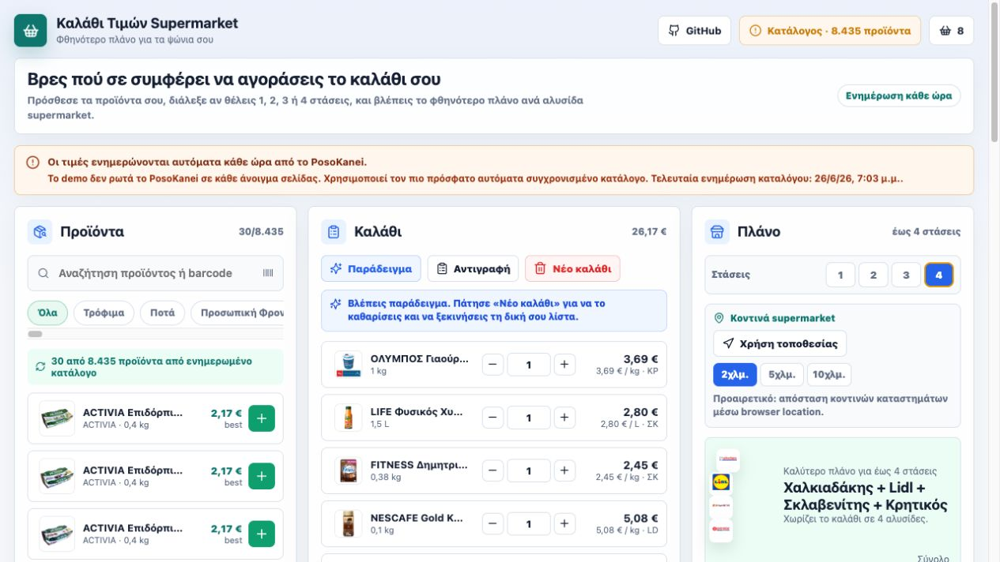
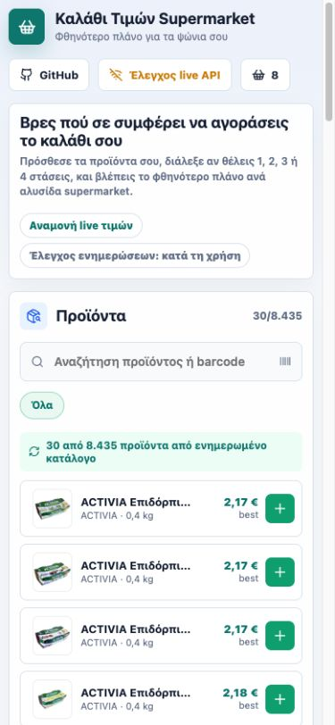
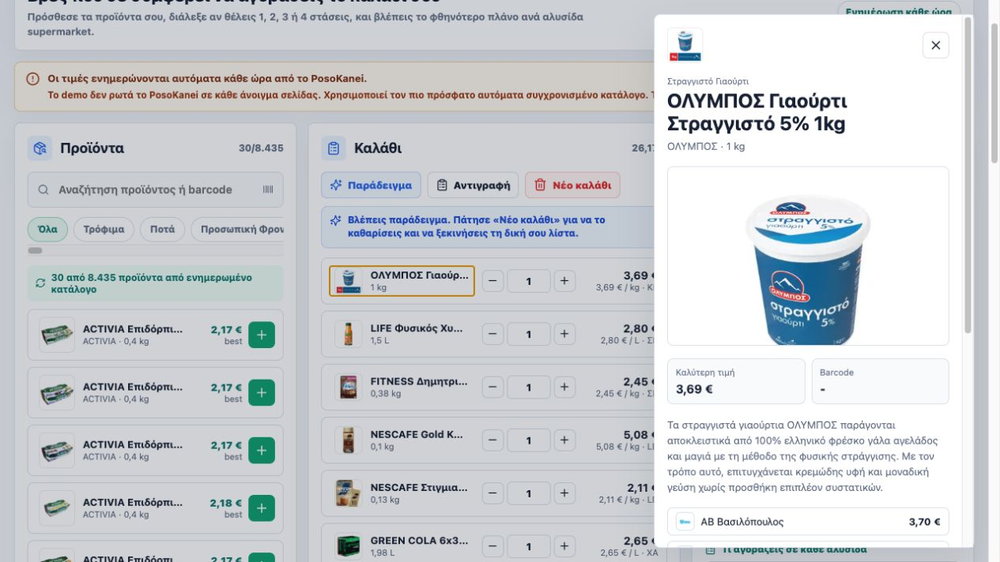

# Καλάθι Τιμών Supermarket

A React app for building a supermarket basket from the PosoKanei catalog and ranking Greek supermarket chains by the total cost of the selected groceries.

The app is inspired by [posokanei.gov.gr](https://posokanei.gov.gr/), which compares supermarket product prices in Greece. The workflow is basket-first: choose the exact products you want, adjust quantities, decide whether you can make `1`, `2`, `3`, or `4` supermarket stops, then see the cheapest complete plan.

This is an unofficial app. It is not affiliated with PosoKanei or any supermarket chain.

Live app: [agenticspiros.com/demo/posokanei-basket](https://agenticspiros.com/demo/posokanei-basket/)

Source code: [github.com/spirosrap/posokanei-basket-demo](https://github.com/spirosrap/posokanei-basket-demo)



## Ελληνικά

Το **Καλάθι Τιμών Supermarket** σε βοηθά να φτιάξεις μια λίστα με προϊόντα supermarket και να δεις πού συμφέρει να τα αγοράσεις συνολικά.

Η βασική ιδέα είναι απλή:

- Διαλέγεις προϊόντα από τον κατάλογο του PosoKanei.
- Προσθέτεις τις ποσότητες που θέλεις στο καλάθι.
- Επιλέγεις πόσες στάσεις είσαι διατεθειμένος να κάνεις: `1`, `2`, `3` ή `4` αλυσίδες.
- Η εφαρμογή βρίσκει το φθηνότερο πλήρες πλάνο για τη λίστα σου.
- Αν επιλέξεις περισσότερες από μία στάσεις, σου δείχνει τι αγοράζεις από κάθε αλυσίδα.

Για παράδειγμα, αν θέλεις να πας μόνο σε ένα supermarket, η εφαρμογή ταξινομεί τις αλυσίδες από τη φθηνότερη έως την ακριβότερη για ολόκληρο το καλάθι. Αν αντέχεις δύο ή τρεις στάσεις, υπολογίζει αν συμφέρει να χωριστεί η λίστα σε περισσότερες αλυσίδες.

Η εφαρμογή ανοίγει με καλάθι παραδείγματος, ώστε να φαίνεται αμέσως γιατί έχει νόημα η σύγκριση `1`, `2`, `3` ή `4` στάσεων. Το παράδειγμα επιλέγεται από προϊόντα που υπάρχουν σε όλες τις βασικές ελληνικές αλυσίδες, ώστε να φαίνονται αρκετές επιλογές και στο σενάριο της μίας στάσης. Ο χρήστης μπορεί να πατήσει καθαρισμό και να ξεκινήσει δική του λίστα χωρίς να χρειάζεται να καταλάβει κάποιο ξεχωριστό demo mode.

Ο κώδικας είναι δημόσιος στο GitHub: [github.com/spirosrap/posokanei-basket-demo](https://github.com/spirosrap/posokanei-basket-demo). Η εφαρμογή έχει και σύνδεσμο `GitHub` στην κορυφή της σελίδας, ώστε όποιος τη δοκιμάζει να μπορεί να δει άμεσα το repository.

Η εφαρμογή προσπαθεί πρώτα να διαβάσει live προϊόντα, φωτογραφίες και τιμές μέσω μικρού PHP proxy, επειδή το επίσημο API δεν επιτρέπει απευθείας browser requests από τρίτα domains. Αν ο proxy μπλοκαριστεί, ο ίδιος PHP endpoint απαντά από τον πιο πρόσφατο συγχρονισμένο κατάλογο, σε μικρές σελίδες αποτελεσμάτων, ώστε ο browser να μη φορτώνει ολόκληρο το αρχείο. Οι φωτογραφίες προϊόντων περνούν επίσης από same-origin proxy, για να εμφανίζονται σταθερά σε Safari και σε browsers που μπλοκάρουν ή απορρίπτουν τα direct image requests.

Τα λογότυπα των αλυσίδων διαβάζονται από τα retailer metadata του PosoKanei και περνούν από το ίδιο same-origin proxy, ώστε το πλάνο να δείχνει πραγματικά supermarket logos αντί για αρχικά γραμμάτων. Για λίγες αλυσίδες υπάρχουν fallback logo URLs από επίσημες ή δημόσιες πηγές, αν η upstream εικόνα δεν φορτώσει.

Προαιρετικά, ο χρήστης μπορεί να πατήσει «Χρήση τοποθεσίας» για να δει κοντινά υποκαταστήματα και αποστάσεις τύπου `57 μ. μακριά` δίπλα στις αλυσίδες. Η τοποθεσία ζητείται από τον browser μόνο μετά από ενέργεια του χρήστη, το app τη στέλνει στο δικό του `api/branches.php` endpoint με `no-store` cache, και το endpoint αναζητά supermarket στο OpenStreetMap/Overpass. Οι αποστάσεις είναι ευθεία γραμμή και βοηθητικές, όχι πλοήγηση με διαδρομή/κίνηση.

Με ενεργή την τοποθεσία, το πλάνο δεν δείχνει μόνο ποια αλυσίδα είναι φθηνότερη. Δείχνει και αν υπάρχει κοντινό υποκατάστημα για την αλυσίδα που σε ενδιαφέρει, ώστε να μπορείς να αποφασίσεις αν αξίζει μία, δύο ή περισσότερες στάσεις. Ο χρήστης μπορεί να αλλάξει ακτίνα αναζήτησης (`2χλμ.`, `5χλμ.`, `10χλμ.`), να δει κοντινά υποκαταστήματα ανά αλυσίδα, και να ανοίξει σύνδεσμο χάρτη.

Στις 2026-06-23 ο upstream API είναι προσβάσιμος από ορισμένα περιβάλλοντα, αλλά ο Plesk server του demo παίρνει `HTTP 403` από `api.posokanei.gov.gr`. Δοκιμάστηκαν επίσης Vercel Node/Edge και Cloudflare Worker, και μπλοκαρίστηκαν με `HTTP 403`. Γι' αυτό το live demo χρησιμοποιεί αυτόματα ανανεωμένο κατάλογο από περιβάλλον που μπορεί να φτάσει το API, δείχνει την ώρα τελευταίας ενημέρωσης στην κορυφή, και σερβίρει αναζήτηση/σελίδες προϊόντων από PHP fallback.

Σημαντική λεπτομέρεια: το block δεν φαίνεται να είναι θέμα συσκευής ή MAC address. Ένας δημόσιος API server συνήθως δεν βλέπει MAC addresses. Ακόμα και συσκευές στο ίδιο τοπικό δίκτυο μπορούν να φαίνονται διαφορετικές προς το upstream λόγω διαφορετικού public egress IP, VPN/split tunnel, IPv4/IPv6 διαδρομής, CDN/WAF κανόνων ή TLS/client fingerprint. Γι' αυτό το refresh script υποστηρίζει trusted SSH runner: το κατέβασμα γίνεται από περιβάλλον που επιτρέπεται, ενώ τα deployment credentials μένουν τοπικά.

## What It Does

- Search or filter products by category or barcode.
- Start with an illustrative example basket, chosen from products available across all major Greek chains, that can be cleared in one click.
- Add products to a basket.
- Adjust quantities with steppers, including `kg` products.
- Rank supermarket chains by total basket price.
- Show coverage and missing-item counts per chain.
- Highlight the cheapest complete one-stop basket.
- Optimize the basket for up to `1`, `2`, `3`, or `4` supermarket stops.
- Show which products to buy from each chain in a multi-stop plan.
- Show savings compared with the most expensive complete basket.
- Separate partial baskets from chains where you can buy everything.
- Open product detail with barcode, unit, description, a large product photo, and per-chain prices.
- Load official product photos through a same-origin image proxy with fallback handling.
- Show supermarket chain logos in rankings, multi-stop plans, and product price rows.
- Optionally request browser location and show nearby supermarket branches.
- Show nearest-branch distance labels, such as `57 μ. μακριά`, next to chains when location is enabled.
- Show a selected chain's nearby branch list with map links.
- Link from the app header to the public GitHub repository.
- Browse/search the official catalog with pagination instead of a fixed sample list.
- Show the last product/price update check in the UI.
- Provide scheduler-friendly update and snapshot refresh scripts.

## Nearby Branches and Location

The app can optionally include proximity in the buying decision. This is useful when
the cheapest basket is split across multiple chains, but the user also wants to know
whether those chains have realistic nearby branches.

How it works:

- The user clicks `Χρήση τοποθεσίας`; the app does not request location on page load.
- The browser asks for geolocation permission.
- The user can choose a branch search radius of `2χλμ.`, `5χλμ.`, or `10χλμ.`.
- The app sends the approved latitude, longitude, and radius to the same-origin
  `api/branches.php` endpoint.
- `api/branches.php` uses `Cache-Control: no-store` and queries OpenStreetMap
  Overpass for nearby `shop=supermarket` places.
- The frontend matches nearby stores to supported chains by retailer name, brand,
  operator, and known Greek/Latin aliases.
- Rankings and multi-stop plans show nearest-branch labels like `57 μ. μακριά`.
- Selecting a chain shows nearby branches for that chain with Google Maps links.

Important limitations:

- Distances are straight-line estimates, not driving/walking route distance.
- Branch data comes from OpenStreetMap, so coverage and naming can vary by area.
- Proximity is a decision aid; the price ranking remains based on the PosoKanei
  product catalogue and basket calculation.

## Live Target

The app is built to run as a subpath deployment:

```text
https://agenticspiros.com/demo/posokanei-basket/
```

The production React build uses the absolute subpath base `/demo/posokanei-basket/` in `vite.config.js`, so Safari and other browsers load the correct JS/CSS even if the URL is opened without relying on relative asset resolution. `index.html` is served with no-store cache headers, while hashed JS/CSS assets can be cached immutably. The live catalog, product images, retailer logos, update status, and optional nearby-branch lookup use small PHP endpoints under `public/api/`, so production hosting must be able to execute PHP for the same-origin proxy calls.

## Screenshots

Desktop, with a four-stop optimized basket:


Mobile:



Product detail, with a larger image for checking the exact product:



## Local Development

Requirements:

- Node.js 26+
- npm 11+

Install and run:

```bash
npm install
npm run dev
```

Open:

```text
http://127.0.0.1:5173/
```

## Build

```bash
npm run build
```

The static output is written to:

```text
dist/
```

## Validation

Core checks:

```bash
npm run lint
npm run build
npm audit --omit=dev
```

Browser QA covers:

- Desktop first viewport.
- Mobile 390px viewport.
- No horizontal overflow on mobile.
- No browser console errors.
- Product add flow.
- Quantity update flow.
- Product detail drawer open/close.
- Large product image in the detail drawer.
- Basket and catalog product thumbnails through the image proxy.
- Supermarket chain logos in desktop, mobile, and product-detail views.
- Optional location control in desktop and mobile layouts.
- Fake-geolocation QA for nearest-branch labels and selected-chain branch lists.
- Loading the official catalog.
- Live search for `γάλα`, including product photos.
- Adding an official live product to the basket and recalculating the plan.
- Update-status endpoint and scheduled-check script.

## PosoKanei API Discovery

The official PosoKanei web app is a Flutter application. Its compiled bundle references these backend routes:

- `POST https://api.posokanei.gov.gr/products/search`
- `GET https://api.posokanei.gov.gr/products/{id}?sort_retailers=asc&countries=GR&include_tax=true`
- `GET https://api.posokanei.gov.gr/products/barcode/{barcode}?countries=GR&include_tax=true`
- `GET https://api.posokanei.gov.gr/meta/categories`
- `GET https://api.posokanei.gov.gr/meta/categories/tree?include_counts=true&include_hidden=false`
- `GET https://api.posokanei.gov.gr/meta/retailers?countries=GR`
- `GET https://api.posokanei.gov.gr/meta/stats`

During development on 2026-06-18:

- `GET /meta/stats` returned live catalog counts around `8.8k` total products and `8.7k` active products.
- `GET /products?page=1&page_size=2&countries=GR` returned official product records with `image_url`, `price_stats`, `retailer_prices`, and category metadata.
- `POST /products/search` with `{ "title": "γάλα", "countries": ["GR"] }` returned `271` milk-related products.
- Product images are served from URLs like `https://api.posokanei.gov.gr/images/product/<id>?v=<version>`.

The official API does not allow `https://agenticspiros.com` as a browser CORS origin, so direct `fetch()` calls from a static frontend are blocked. The app handles this with:

- A same-origin PHP proxy in `public/api/posokanei.php`.
- A cached update-status endpoint in `public/api/update-status.php`.
- A live catalog adapter in `src/posokaneiApi.js`.
- A server-side snapshot fallback that returns paginated/search JSON from `data/catalog.json` plus lightweight metadata from `data/catalog-meta.json`. This snapshot is script-built from PosoKanei API responses; it is not AI-generated.
- Snapshot stats are reconciled against the actual `catalog.json` product count so stale metadata does not show a different catalogue size from search results.
- A product-image proxy mode in `public/api/posokanei.php?resource=image`, used by thumbnails and the detail drawer.
- A retailer-logo proxy mode in `public/api/posokanei.php?resource=retailer-image`, used by rankings, route cards, and product detail price rows.
- A nearby-branch endpoint in `public/api/branches.php`, which accepts browser-approved coordinates and queries OpenStreetMap/Overpass for nearby `shop=supermarket` locations.
- A visible catalog and update-check status in the UI.
- Graceful fallback/status when the live proxy or upstream API fails.

Current production note, checked on 2026-06-23:

- `https://api.posokanei.gov.gr/meta/stats` returns `200` from allowed development/refresh environments.
- `https://agenticspiros.com/demo/posokanei-basket/api/posokanei.php?resource=stats` returns `200` with `source: "snapshot"` because the PHP endpoint now falls back to the refreshed catalogue when upstream rejects the Plesk server request.
- Vercel Node, Vercel Edge, and Cloudflare Worker probes also returned upstream `403`.
- The live app therefore uses `data/catalog.json` and `data/catalog-meta.json`, refreshed by an external scheduled sync from PosoKanei API data, and displays an amber notice with the latest catalogue update time.
- If a scheduled refresh attempt fails, `data/refresh-status.json` records the failed attempt time and reason. The UI then shows both the last successful catalogue update and the latest failed attempt, so stale data is visible instead of silent.
- The refresh script can also fetch through an SSH runner by setting `POSOKANEI_REFRESH_HOST`. This is useful when the deployment server or primary machine is blocked but another trusted environment can reach the public API.
- `data/catalog-meta.json` describes the last successful snapshot. `data/refresh-status.json` describes the last refresh attempt. Those timestamps can differ, and the UI is designed to make that distinction visible.

Why this can happen even on the same local network:

- Internet APIs generally cannot see a device MAC address; they see public egress, protocol, and request/client characteristics.
- Two machines on the same LAN can still use different public egress routes because of VPNs, split tunneling, IPv4 vs IPv6 routing, gateway rules, or ISP/CDN routing.
- WAF/CDN rules can also react differently to TLS/client fingerprints, for example macOS SecureTransport/LibreSSL versus Linux OpenSSL, even when the request path is the same.
- The workaround intentionally keeps upload credentials local: the SSH runner only builds the catalogue JSON, then the local refresh script pulls those files back and uploads them.

## Data Model

Products are normalized into this shape:

```js
{
  id: "milk-1l",
  gtin: "5201054020902",
  name: "Γάλα φρέσκο πλήρες 1L",
  brand: "Δέλτα",
  category: "Γαλακτοκομικά",
  unit: "τεμ.",
  unitQuantity: "1 L",
  imageUrl: "https://api.posokanei.gov.gr/images/product/...",
  prices: {
    sklavenitis: 1.74,
    ab_vasilopoulos: 1.82,
    lidl: 1.57
  }
}
```

Basket rankings are computed locally in `src/pricing.js`.

## Product/Price Update Checks

The app includes a lightweight update checker:

- `public/api/update-status.php` samples `meta/stats` plus a few representative product searches, fingerprints the result, and caches the status for 30 minutes.
- `npm run check:updates` calls the deployed endpoint with `?refresh=1` and writes the latest status to `.cache/posokanei-update-status.json`.
- `npm run catalog:snapshot` builds `public/data/catalog.json` and `public/data/catalog-meta.json` from PosoKanei API responses, creating a same-origin fallback catalogue used when the hosted PHP proxy is blocked by the upstream API.
- `npm run live:refresh` builds a fresh script-created snapshot into `dist/data/catalog.json`, writes `dist/data/catalog-meta.json`, uploads the data files to the live FTP path, and verifies the public `catalog`, `metadata`, and `refresh-status` timestamps.
- When `npm run live:refresh` fails because the upstream API returns an error, it uploads `dist/data/refresh-status.json` with `status: "failed"` so the deployed UI can show the latest failed attempt.
- `npm run live:install-refresh` optionally installs a local hourly scheduler for environments that support macOS LaunchAgents.
- The UI reads `api/update-status.php` and shows the catalogue freshness in the amber status notice.
- Product images are requested through `api/posokanei.php?resource=image&id=<product-id>&v=<version>` so the browser sees same-origin image URLs. The proxy caches successful image responses and can fall back to an image-resizing proxy if the direct upstream image request is rejected.
- Retailer logos are requested through `api/posokanei.php?resource=retailer-image&id=<retailer-id>` and use the same fallback strategy.

For a cron job:

```bash
*/30 * * * * cd /path/to/posokanei-basket-demo && npm run check:updates
```

To refresh the fallback catalogue before deploying:

```bash
npm run catalog:snapshot
npm run build
```

To refresh only the live demo snapshot from an environment that can reach the API, configure `.env.local` from `.env.example`, then run:

```bash
npm run live:refresh
```

The refresh script reads deployment settings from environment variables or `.env.local`. Use either `FTP_PASS` or `FTP_KEYCHAIN_SERVICE` for FTP authentication.

If the current machine cannot reach `api.posokanei.gov.gr`, set `POSOKANEI_REFRESH_HOST` to a trusted SSH host that can reach it. The remote host only builds `catalog.json` and `catalog-meta.json`; upload credentials stay local.

To install the hourly refresh job on macOS:

```bash
npm run live:install-refresh
```

The installer prints the scheduler and log paths for the local machine.

For Plesk Scheduled Tasks, a simple curl check is enough only when the Plesk server can reach the upstream API:

```bash
curl -fsS 'https://agenticspiros.com/demo/posokanei-basket/api/update-status.php?refresh=1' >/dev/null
```

When Plesk is upstream-blocked, schedule `npm run live:refresh` on a machine, GitHub runner, or serverless worker that can reach `https://api.posokanei.gov.gr`.

## Deployment

See [DEPLOYMENT.md](DEPLOYMENT.md) for the Plesk/HostEurope upload path and
static artifact notes.

Short version:

```bash
npm run build
curl --ftp-create-dirs -T dist/index.html ftp://agenticspiros.com/demo/posokanei-basket/index.html
curl --ftp-create-dirs -T dist/api/posokanei.php ftp://agenticspiros.com/demo/posokanei-basket/api/posokanei.php
curl --ftp-create-dirs -T dist/api/update-status.php ftp://agenticspiros.com/demo/posokanei-basket/api/update-status.php
curl --ftp-create-dirs -T dist/data/catalog.json ftp://agenticspiros.com/demo/posokanei-basket/data/catalog.json
```

## Limitations

- The live API adapter is best-effort because the PosoKanei API does not appear to have public documentation.
- As of 2026-06-23, request-time production proxies tested on Plesk, Vercel, and Cloudflare are upstream-blocked with `HTTP 403`; the live demo uses the latest script-built `data/catalog.json` snapshot from PosoKanei API data and shows that state in the UI. This means generated by the refresh script, not AI-generated.
- The UI paginates the official catalog; it does not render all 8k+ products at once.
- The app can compare one-store baskets and multi-stop plans up to four chains.
- Multi-stop plans optimize product price only; optional branch proximity is shown as context, but the optimizer does not yet include travel time, parking, delivery fees, or route distance.
- It does not handle delivery fees, loyalty cards, geographic availability, substitutions, coupons, or in-store stock.
- Production use should add caching, API rate limiting, error telemetry, and an explicit policy check for upstream API usage.

## License

MIT
