# Καλάθι Τιμών Supermarket

## Ελληνικά

**Ζωντανή εφαρμογή:** [kalathitimon.com](https://kalathitimon.com/)

**Συμβατό mirror:** [agenticspiros.com/demo/posokanei-basket](https://agenticspiros.com/demo/posokanei-basket/)

**Κώδικας:** [github.com/spirosrap/posokanei-basket-demo](https://github.com/spirosrap/posokanei-basket-demo)

**Τρέχουσα έκδοση:** `v0.32.4`

> Πρόκειται για ανεπίσημη εφαρμογή. Δεν συνδέεται επίσημα με το PosoKanei ή με κάποια αλυσίδα supermarket.

Το **Καλάθι Τιμών Supermarket** σε βοηθά να φτιάξεις μια λίστα με προϊόντα supermarket και να δεις πού συμφέρει να τα αγοράσεις συνολικά.

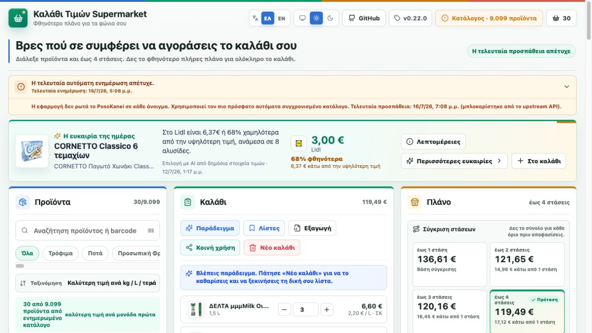

Η βασική ιδέα είναι απλή:

- Διαλέγεις προϊόντα από τον κατάλογο του PosoKanei.
- Προσθέτεις τις ποσότητες που θέλεις στο καλάθι.
- Επιλέγεις πόσες στάσεις είσαι διατεθειμένος να κάνεις: `1`, `2`, `3` ή `4` αλυσίδες.
- Η εφαρμογή βρίσκει το φθηνότερο πλήρες πλάνο για τη λίστα σου.
- Αν επιλέξεις περισσότερες από μία στάσεις, σου δείχνει τι αγοράζεις από κάθε αλυσίδα.
- Όταν μια τιμή έχει αλλάξει αισθητά σε πρόσφατο συγχρονισμό, δείχνει το ποσοστό και την προηγούμενη τιμή για τη συγκεκριμένη αλυσίδα.
- Μπορείς να παρακολουθείς προϊόντα και να ορίζεις προαιρετική τιμή-στόχο, ώστε να βλέπεις ποια έφτασαν το ποσό που σε ενδιαφέρει.
- Από τις λεπτομέρειες οποιουδήποτε προϊόντος μπορείς να δεις λίγες, αυστηρά ταιριασμένες εναλλακτικές και να συγκρίνεις τιμή μονάδας, χαρακτηριστικά και μέγεθος συσκευασίας.
- Τα κρίσιμα αρχεία παραδίδονται προ-συμπιεσμένα και οι επόμενες μεταβάσεις μεταξύ αρχικής, ευκαιριών και αλλαγών τιμών χρησιμοποιούν ένα ασφαλές cached app shell.

Για παράδειγμα, αν θέλεις να πας μόνο σε ένα supermarket, η εφαρμογή ταξινομεί τις αλυσίδες από τη φθηνότερη έως την ακριβότερη για ολόκληρο το καλάθι. Αν αντέχεις δύο ή τρεις στάσεις, υπολογίζει αν συμφέρει να χωριστεί η λίστα σε περισσότερες αλυσίδες.

Η εφαρμογή ανοίγει με καλάθι παραδείγματος, ώστε να φαίνεται αμέσως γιατί έχει νόημα η σύγκριση `1`, `2`, `3` ή `4` στάσεων. Το παράδειγμα είναι πιο ρεαλιστικό εβδομαδιαίο καλάθι ελληνικής οικογένειας, με γάλα, γιαούρτι, τυριά, αυγά, κοτόπουλο, ζυμαρικά, όσπρια, χυμούς, νερά, καθαριστικά και χαρτικά. Τα προϊόντα έχουν επιλεγεί ώστε να υπάρχουν αρκετές πλήρεις επιλογές και στο σενάριο της μίας στάσης, αλλά και να φαίνεται καθαρά πότε συμφέρει να μοιραστεί η λίστα σε δύο, τρεις ή τέσσερις αλυσίδες. Ο χρήστης μπορεί να πατήσει καθαρισμό και να ξεκινήσει δική του λίστα χωρίς να χρειάζεται να καταλάβει κάποιο ξεχωριστό demo mode.

### Σύγκριση στάσεων και πρακτική πρόταση

Η έκδοση `v0.6.0` εμφανίζει ταυτόχρονα το φθηνότερο πλήρες σύνολο για όριο `1`, `2`, `3` και `4` στάσεων. Κάθε επιλογή δείχνει την πραγματική τιμή των προϊόντων και την οικονομία σε σχέση με μία στάση. Τα όρια σημαίνουν «έως»: αν το ίδιο φθηνότερο πλάνο χρειάζεται λιγότερες αλυσίδες, ο optimizer δεν προσθέτει άσκοπη στάση. Ο χρήστης επιλέγει οποιοδήποτε αποτέλεσμα και το αναλυτικό πλάνο, το καλάθι και η αντιγραφή λίστας ενημερώνονται αμέσως.

Για πιο ρεαλιστική απόφαση, ο χρήστης μπορεί να επιλέξει πόση εξοικονόμηση χρειάζεται για να αξίζει κάθε επιπλέον supermarket: `0 €`, `2 €`, `5 €` ή `10 €`. Για παράδειγμα, με επιλογή `5 €`, μία ακόμη στάση προτείνεται μόνο αν η χαμηλότερη τιμή των προϊόντων καλύπτει πάνω από `5 €` επιπλέον χρόνου, καυσίμων ή εισιτηρίων. Η «Πρακτική πρόταση» δείχνει καθαρά τον αριθμό επιπλέον στάσεων και τον σχετικό υπολογισμό. Η εκτίμηση δεν αλλάζει ποτέ το σύνολο αγορών, δεν αποτελεί τιμή του PosoKanei και δεν αποστέλλεται σε κοινόχρηστους συνδέσμους. Η εκτίμηση και το επιλεγμένο όριο στάσεων αποθηκεύονται μόνο τοπικά στον browser.

Η έκδοση `v0.6.1` μετονομάζει και επεξηγεί αυτό το εργαλείο ως «Πότε αξίζει άλλη στάση;», ώστε η χρησιμότητά του να γίνεται άμεσα κατανοητή πριν ο χρήστης επιλέξει ποσό.

Η έκδοση `v0.6.2` κάνει την ενεργή τοποθεσία πραγματικό φίλτρο διαθεσιμότητας: οι τιμές, η κατάταξη, τα πλάνα στάσεων, οι καλύτερες τιμές προϊόντων και η καθημερινή πρόταση χρησιμοποιούν μόνο αλυσίδες με αναγνωρισμένο κοντινό υποκατάστημα μέσα στην επιλεγμένη ακτίνα.

Η έκδοση `v0.7.0` μετατρέπει το αποτέλεσμα σε πρακτικό εργαλείο αγορών: κάθε προϊόν του επιλεγμένου πλάνου έχει checkbox, η πρόοδος αποθηκεύεται τοπικά για το συγκεκριμένο πλάνο και, όταν είναι ενεργή η τοποθεσία, δημιουργείται κοινή διαδρομή προς τα πλησιέστερα υποκαταστήματα όλων των στάσεων.

Η έκδοση `v0.8.0` προσθέτει λειτουργία αγορών για χρήση μέσα στα καταστήματα: εμφανίζει το ποσό που απομένει, πρόοδο ανά αλυσίδα, γρήγορη ολοκλήρωση ολόκληρης στάσης και προβολή μόνο των προϊόντων που δεν έχουν αγοραστεί. Όταν ολοκληρωθεί μία αλυσίδα, αφαιρείται αυτόματα από τη διαδρομή των υπόλοιπων στάσεων.

Η έκδοση `v0.9.0` προσθέτει επαναχρησιμοποιούμενες αποθηκευμένες λίστες. Ο χρήστης μπορεί να δώσει όνομα στο τρέχον καλάθι, να το ανοίξει ξανά αργότερα και να πάρει νέο υπολογισμό με τις διαθέσιμες τιμές του πιο πρόσφατου καταλόγου.

Η έκδοση `v0.10.0` ανασχεδιάζει την καθημερινή χρήση της εφαρμογής. Στο κινητό, τα «Προϊόντα», «Καλάθι» και «Πλάνο» λειτουργούν ως τρεις άμεσες προβολές με σταθερό επιλογέα, αντί να εμφανίζονται διαδοχικά σε μία πολύ μεγάλη σελίδα. Σε desktop και mobile βελτιώνονται η οπτική ιεραρχία, η πυκνότητα, η ανάγνωση ονομάτων προϊόντων, οι ομάδες ενεργειών, τα σύνολα και οι καταστάσεις εστίασης.

Η έκδοση `v0.11.0` εστιάζει στην ταχύτερη κατανόηση και χρήση. Στο κινητό συμπτύσσονται η κεφαλίδα, η εισαγωγή και η καθημερινή ευκαιρία, ώστε ο επιλογέας «Προϊόντα / Καλάθι / Πλάνο» και το πραγματικό αποτέλεσμα να εμφανίζονται ήδη στην πρώτη οθόνη. Το πλήθος προϊόντων μένει δίπλα στον τίτλο, οι δευτερεύουσες ενέργειες του καλαθιού γίνονται πιο συμπαγείς και κάθε κύρια ενότητα αποκτά ξεχωριστή χρωματική ταυτότητα. Στο πλάνο, η πρακτική πρόταση εμφανίζεται πριν από τις προαιρετικές ρυθμίσεις τοποθεσίας και αλυσίδων.

Η έκδοση `v0.12.0` αντικαθιστά τη δυσνόητη αριθμητική εκτίμηση ανά στάση με τέσσερις κατανοητές προτεραιότητες: «Χαμηλότερη τιμή», «Μικρή παράκαμψη», «Ισορροπία» και «Λιγότερες στάσεις». Η πρακτική πρόταση δείχνει πλέον το συνολικό ποσοστό κέρδους, το κέρδος ανά επιπλέον supermarket και προσφέρει άμεσο κουμπί εφαρμογής του προτεινόμενου πλάνου.

Η έκδοση `v0.13.0` εξηγεί από πού προκύπτει η εξοικονόμηση του επιλεγμένου πλάνου. Συγκρίνει κάθε προϊόν με το φθηνότερο πλήρες καλάθι μίας στάσης, προβάλλει τα προϊόντα που συνεισφέρουν περισσότερο στο κέρδος και συμφωνεί το άθροισμά τους με τη συνολική οικονομία. Αν κάποιο προϊόν κοστίζει περισσότερο στο πλάνο πολλών στάσεων, εμφανίζει ξεχωριστά αυτό το αντιστάθμισμα ώστε το αποτέλεσμα να παραμένει διαφανές.

Η έκδοση `v0.14.0` ανανεώνει ολόκληρη την οπτική εμπειρία χωρίς να αλλάζει τιμές ή υπολογισμούς. Μπλε, πράσινες, κεχριμπαρένιες και κοραλλί λεπτομέρειες δίνουν ξεχωριστή ταυτότητα στην πλοήγηση, στο καλάθι, στο πλάνο και στις ευκαιρίες. Οι φωτογραφίες προϊόντων, τα αποτελέσματα και οι ενεργές επιλογές αποκτούν καθαρότερο βάθος και πιο άμεση ανάδραση, ενώ οι διακριτικές κινήσεις απενεργοποιούνται αυτόματα όταν ο χρήστης έχει ενεργό το `reduced motion`.

Η έκδοση `v0.14.1` κάνει όλες τις ποσότητες ακεραίους αριθμούς προϊόντων ή συσκευασιών. Τα κουμπιά αυξομείωσης αλλάζουν πλέον την ποσότητα κατά `1`, ακόμη και όταν η μονάδα του καταλόγου είναι `kg`. Παλιές αποθηκευμένες λίστες ή κοινόχρηστοι σύνδεσμοι με δεκαδικές ποσότητες κανονικοποιούνται αυτόματα στον πλησιέστερο ακέραιο.

Η έκδοση `v0.14.2` ξεχωρίζει τη διαθεσιμότητα ενός προϊόντος από την κάλυψη του επιλεγμένου πλάνου. Αν, για παράδειγμα, ένα προϊόν δεν πωλείται από την αλυσίδα του πλάνου μίας στάσης αλλά υπάρχει σε άλλη αλυσίδα του υπολογισμού, το καλάθι δείχνει πλέον την καλύτερη διαθέσιμη τιμή, την αλυσίδα και πόσες στάσεις χρειάζονται για πλήρες καλάθι. Δεν εμφανίζει πια την παραπλανητική ένδειξη «έλλειψη», η οποία μπορούσε να εκληφθεί ως πληροφορία αποθέματος. Το PosoKanei παρέχει τιμές καταλόγου, όχι ζωντανό απόθεμα ανά υποκατάστημα.

Η έκδοση `v0.14.3` επιταχύνει σημαντικά τις φωτογραφίες προϊόντων. Τα αποτελέσματα αναζήτησης ζητούν πλέον μικρές, συμπιεσμένες εικόνες WebP αντί για τις πλήρεις αρχικές φωτογραφίες, οι πρώτες ορατές εικόνες έχουν προτεραιότητα και οι υπόλοιπες φορτώνονται μόνο όταν χρειάζονται. Η λεπτομερής προβολή διατηρεί ξεχωριστή εικόνα υψηλότερης ανάλυσης. Μέχρι να ολοκληρωθεί η λήψη, εμφανίζεται το έγχρωμο σύμβολο του προϊόντος αντί για κενό πλαίσιο, ενώ οι versioned εικόνες αποθηκεύονται μακροχρόνια στην cache του browser.

Η έκδοση `v0.15.0` προσθέτει ολοκληρωμένη εξαγωγή της λίστας ως απλό κείμενο. Το κείμενο περιλαμβάνει checklist προϊόντων και ποσοτήτων, επιλεγμένο όριο στάσεων, πλήρες πλάνο ανά supermarket με τιμές και σύνολα, καθώς και σύνδεσμο που ανοίγει ξανά το καλάθι. Αν το επιλεγμένο όριο δεν καλύπτει όλη τη λίστα, εξηγείται καθαρά και εξάγεται το πρώτο διαθέσιμο πλήρες πλάνο. Ο χρήστης μπορεί να αντιγράψει το κείμενο, να ανοίξει το native share sheet ή να κατεβάσει αρχείο `.txt` συμβατό με Windows Notepad και macOS TextEdit.

Η έκδοση `v0.16.0` προσθέτει φορητή εξαγωγή και εισαγωγή σε JSON. Το versioned αρχείο κρατά μόνο κωδικούς προϊόντων, ακέραιες ποσότητες, όριο στάσεων, επιλεγμένες αλυσίδες και την εκτίμηση κόστους επιπλέον στάσης. Δεν κρατά τοποθεσία ή τιμές. Κατά τη φόρτωση, η εφαρμογή ελέγχει αυστηρά το αρχείο, αναζητά τους κωδικούς στον τρέχοντα κατάλογο και υπολογίζει ξανά όλες τις τιμές και τα πλάνα. Έτσι ένα καλάθι μπορεί να αποθηκευτεί, να σταλεί ή να μεταφερθεί σε άλλον browser χωρίς να μεταφέρει παλιές τιμές.

Η έκδοση `v0.17.0` αντικαθιστά αυτόματα τον μεγάλο σύνδεσμο καλαθιού με έναν σύντομο σύνδεσμο του ίδιου του hosting στα παράθυρα κοινής χρήσης και εξαγωγής κειμένου. Η υπηρεσία σύντμησης φιλοξενείται μαζί με την εφαρμογή, δεν απαιτεί API key ή συνδρομή, δεν αποστέλλει το καλάθι σε τρίτη υπηρεσία και επιστρέφει αμέσως στον πλήρη σύνδεσμο αν δεν είναι διαθέσιμη. Η σύντμηση γίνεται μόνο όταν ο χρήστης ανοίξει ένα από αυτά τα παράθυρα.

Η έκδοση `v0.17.1` ταξινομεί κάθε αναζήτηση προϊόντος από τη χαμηλότερη προς την υψηλότερη καλύτερη διαθέσιμη τιμή. Η βασική ταξινόμηση εφαρμόζεται πριν από τη σελιδοποίηση του καταλόγου, ώστε τα φθηνότερα αποτελέσματα να εμφανίζονται πραγματικά πρώτα. Στη συνέχεια, η σειρά των φορτωμένων αποτελεσμάτων προσαρμόζεται στις αλυσίδες που έχει επιλέξει ο χρήστης ή επιτρέπονται από το ενεργό φίλτρο τοποθεσίας. Προϊόντα χωρίς διαθέσιμη τιμή σε αυτές τις αλυσίδες εμφανίζονται τελευταία.

Η έκδοση `v0.18.0` μεταφέρει την κύρια εφαρμογή στο αποκλειστικό [kalathitimon.com](https://kalathitimon.com/). Η εφαρμογή, τα PHP API, οι εικόνες, οι ευκαιρίες και οι σύντομοι σύνδεσμοι λειτουργούν πλέον από τη ρίζα του νέου domain με HTTPS, ενώ το παλιό `/demo/posokanei-basket/` παραμένει ως συμβατό mirror. Ο ωριαίος συγχρονισμός δημοσιεύει ατομικά τον ίδιο ελεγμένο κατάλογο και στους δύο προορισμούς, ώστε παλιοί σύνδεσμοι να συνεχίσουν να ανοίγουν χωρίς να χωρίζεται η πηγή τιμών.

Η έκδοση `v0.19.0` προσθέτει επιλογή ταξινόμησης προϊόντων με βάση τη χαμηλότερη τιμή συσκευασίας, την καλύτερη συγκρίσιμη τιμή ανά `kg`, `L` ή τεμάχιο, ή το όνομα. Έτσι ο χρήστης μπορεί είτε να βρει το μικρότερο άμεσο κόστος είτε να συγκρίνει δίκαια διαφορετικά μεγέθη συσκευασίας. Η ταξινόμηση εφαρμόζεται στον κατάλογο πριν από τη σελιδοποίηση και επανελέγχεται στον browser με τις ενεργές αλυσίδες ή το φίλτρο τοποθεσίας. Κάθε αποτέλεσμα δείχνει πλέον και την καλύτερη τιμή μονάδας. Το κουμπί προσθήκης λειτουργεί ως γρήγορη προσθήκη χωρίς να ανοίγει τις λεπτομέρειες και, όταν το προϊόν βρίσκεται ήδη στο καλάθι, εμφανίζει πάνω του την τρέχουσα ποσότητα. Η επιλογή ταξινόμησης αποθηκεύεται μόνο στον browser.

Η έκδοση `v0.20.0` εστιάζει στην ταχύτητα και την ανθεκτικότητα. Η πρώτη οθόνη παίρνει στοιχεία καταλόγου, αλυσίδες, κατηγορίες, αρχικά προϊόντα και προϊόντα καλαθιού με ένα ενιαίο snapshot-first request, χωρίς να περιμένει τον γνωστά μπλοκαρισμένο request-time proxy. Ένας νέος συμπαγής runtime κατάλογος κρατά ακριβώς τα πεδία που χρειάζονται οι υπολογισμοί και μειώνει το JSON από περίπου `17 MB` σε `6,7 MB`, ενώ ο πλήρης δημόσιος κατάλογος παραμένει διαθέσιμος. Οι επαναλαμβανόμενες αναζητήσεις χρησιμοποιούν σύντομη browser cache, οι ταυτόχρονες ίδιες κλήσεις ενοποιούνται και παλιότερες αργές απαντήσεις δεν μπορούν να αντικαταστήσουν νεότερα αποτελέσματα. Η πληκτρολόγηση μένει άμεση με τοπικό πεδίο αναζήτησης και καθυστέρηση μόλις `180 ms` πριν από το request, οι αρχικές εικόνες υψηλής προτεραιότητας μειώνονται σε τέσσερις και σταθερά skeletons αποφεύγουν τα απότομα άλματα διάταξης. Ο χειροκίνητος και ο ωριαίος συγχρονισμός μοιράζονται πλέον lock, ώστε δύο refreshes να μην μπορούν να δημοσιεύσουν ταυτόχρονα διαφορετικές γενιές αρχείων, ενώ ο έλεγχος περιμένει περιορισμένα μέχρι να συμφωνήσουν όλα τα δημόσια timestamps. Σε ενδεικτικό PHP benchmark της έκδοσης, μία ταξινομημένη σελίδα 30 προϊόντων ολοκληρώθηκε σε περίπου `0,22 s` και αναζήτηση σε περίπου `0,14 s`· οι πραγματικοί χρόνοι εξαρτώνται από hosting και δίκτυο.

Η έκδοση `v0.21.0` αφαιρεί το PHP από την κρίσιμη διαδρομή της πρώτης οθόνης. Ένα στατικό startup catalogue περίπου `200 KB` (`~31 KB` με Brotli) αρχίζει να κατεβαίνει απευθείας από το `<head>` και περιέχει τα metadata, τις τρεις αρχικές ταξινομήσεις και τα προϊόντα του παραδείγματος. Συνήθως είναι ήδη διαθέσιμο όταν ξεκινήσει το React, ενώ το προηγούμενο PHP bootstrap παραμένει ασφαλές fallback. Αφού σταθεροποιηθεί η οθόνη, ένας Web Worker φορτώνει χαμηλής προτεραιότητας τον compact runtime κατάλογο και εκτελεί τις επόμενες αναζητήσεις, τα φίλτρα, την ταξινόμηση και τη σελιδοποίηση τοπικά, χωρίς νέο network round trip. Η καθυστέρηση πληκτρολόγησης παραμένει `180 ms`, αλλά ο warmed-up υπολογισμός ολοκληρώνεται συνήθως σε λίγα milliseconds. Οι εικόνες χρησιμοποιούν πλέον πραγματικό `IntersectionObserver`, ώστε προϊόντα που βρίσκονται χαμηλότερα σε scrollable λίστα ή καλάθι να μην ξεκινούν καθόλου request μέχρι να πλησιάσουν την οθόνη. Τέλος, αφαιρέθηκε το διπλό ενσωματωμένο αντίγραφο των 30 προϊόντων παραδείγματος: το κύριο production JavaScript μειώθηκε από περίπου `410 KB` σε `371 KB` (`123,8 KB` σε `112,5 KB` gzip).

Η έκδοση `v0.22.0` μειώνει ξανά σχεδόν στο μισό το JavaScript που χρειάζεται η πρώτη οθόνη. Η εφαρμογή διατηρεί το React-compatible component API, αλλά το production build χρησιμοποιεί το μικρότερο `preact/compat` runtime: το κύριο bundle πέφτει από `112,5 KB` σε περίπου `59,7 KB` gzip. Ο startup κατάλογος κρατά πλέον μόνο τα metadata που εμφανίζονται πραγματικά, παραμένει πλήρης για τις τρεις ταξινομήσεις και το καλάθι παραδείγματος, και μειώνεται από περίπου `33,4 KB` σε `15,8 KB` με Brotli. Ένα ελαφρύ HTML shell εμφανίζει αμέσως τη διάταξη πριν ολοκληρωθεί το JavaScript, οι μεγάλες λεπτομέρειες του πλάνου αποδίδονται όταν αδειάσει το κύριο thread και οι εκτός οθόνης σειρές χρησιμοποιούν `content-visibility`. Οι φωτογραφίες ζητούνται απευθείας από το edge image cache, με τον υπάρχοντα same-origin PHP proxy ως αυτόματο fallback, ενώ ο versioned runtime κατάλογος επαναχρησιμοποιείται από την browser cache και φορτώνεται αμέσως όταν ο χρήστης εστιάσει στην αναζήτηση.

Η έκδοση `v0.22.1` διορθώνει τις μικρογραφίες που είχαν ήδη ληφθεί από την cache αλλά μπορούσαν να παραμένουν κρυμμένες πίσω από τα αρχικά του προϊόντος. Η εφαρμογή αναγνωρίζει πλέον και μια εικόνα που ολοκληρώθηκε πριν συνδεθεί το event φόρτωσης, χωρίς να αφαιρεί το fallback για πραγματικά αποτυχημένες εικόνες.

Η έκδοση `v0.22.2` διορθώνει τον αυτόματο συγχρονισμό μετά την προσθήκη του συμπαγούς startup καταλόγου. Ο προσωρινός φάκελος κάθε απομακρυσμένου runner λαμβάνει πλέον και το module configuration του project, ώστε ο υγιής Node 18 runner να ολοκληρώνει τη δημιουργία των `catalog`, `runtime` και `bootstrap` αρχείων αντί να σταματά μετά τη λήψη των προϊόντων. Η πρώτη επιτυχής πλήρης λήψη εξακολουθεί να κερδίζει και τα αρχεία δημοσιεύονται ατομικά και επαληθεύονται και στα δύο domains.

Η έκδοση `v0.22.3` διορθώνει τις φωτογραφίες των προσαρμοσμένων καλαθιών μετά από ανανέωση της σελίδας. Όταν οι νέες τιμές αντικαθιστούσαν το τοπικά αποθηκευμένο product object με άλλο που είχε την ίδια ακριβώς εικόνα, η μικρογραφία επέστρεφε άσκοπα σε κατάσταση φόρτωσης χωρίς να ακολουθεί νέο event. Πλέον η κατάσταση της φωτογραφίας μηδενίζεται μόνο όταν αλλάζει πραγματικά το URL της, ώστε προσωπικά, αποθηκευμένα και κοινόχρηστα καλάθια να κρατούν τις εικόνες τους ενώ ενημερώνονται οι τιμές.

Η έκδοση `v0.23.0` προσθέτει πρόσφατες μεταβολές τιμών ανά προϊόν και αλυσίδα. Κάθε επιτυχής συγχρονισμός συγκρίνει το νέο snapshot με την αμέσως προηγούμενη δημοσιευμένη γενιά και καταγράφει μόνο ουσιαστικές διαφορές: τουλάχιστον `0,10 €` και `3%`, ή τουλάχιστον `0,50 €` ανεξάρτητα από το ποσοστό. Πράσινη ένδειξη σημαίνει πτώση και κόκκινη αύξηση, με ποσοστό, προηγούμενη τιμή και ακριβή χρόνο στο tooltip. Η ένδειξη ακολουθεί την αλυσίδα της τιμής που εμφανίζεται στα αποτελέσματα, στο προσωπικό καλάθι και στις αναλυτικές τιμές προϊόντος. Μία μεταβολή διατηρείται για έως επτά ημέρες, ακόμη κι αν τα επόμενα ωριαία snapshots δεν αλλάξουν ξανά την τιμή, και αφαιρείται νωρίτερα αν μια νεότερη μικρή μεταβολή την καταστήσει ανακριβή. Πρόκειται για ιστορικό που παρατηρεί η εφαρμογή μεταξύ επιτυχημένων συγχρονισμών και όχι για επίσημο μακροχρόνιο ιστορικό του PosoKanei.

Η έκδοση `v0.24.0` συγκεντρώνει όλες τις ενεργές πρόσφατες μεταβολές τιμών από κάθε αλυσίδα σε ένα ενιαίο αρχείο CSV. Κάθε γραμμή περιλαμβάνει προϊόν, μάρκα, κατηγορία, αλυσίδα, προηγούμενη και τρέχουσα τιμή, διαφορά σε ευρώ και ποσοστό, κατεύθυνση και χρόνους καταγραφής. Το αρχείο είναι UTF-8 με BOM και CRLF για σωστή εμφάνιση ελληνικών σε Excel και άλλες εφαρμογές υπολογιστικών φύλλων. Δημιουργείται και δημοσιεύεται ατομικά μαζί με κάθε επιτυχή ωριαίο συγχρονισμό στο σταθερό URL [`/data/price-changes.csv`](https://kalathitimon.com/data/price-changes.csv).

Η έκδοση `v0.25.0` προσθέτει τη δημόσια σελίδα [`/changes/`](https://kalathitimon.com/changes/) για φιλική εξερεύνηση των ίδιων μεταβολών. Εμφανίζει σύνοψη αλλαγών, προϊόντων, μειώσεων και αυξήσεων, με αναζήτηση χωρίς διάκριση ελληνικών τόνων, φίλτρο αλυσίδας, τμηματικό έλεγχο κατεύθυνσης και ταξινόμηση ανά χρόνο, ποσοστό, διαφορά σε ευρώ ή όνομα. Κάθε γραμμή δείχνει προϊόν και εικόνα, αλυσίδα, προηγούμενη και τρέχουσα τιμή, υπογεγραμμένη διαφορά σε ευρώ και ποσοστό, σχετικό χρόνο και ακριβή ώρα καταγραφής. Η σελίδα φορτώνει ένα μικρό, αυστηρά ελεγμένο `price-changes.json` αντί για τον πλήρη κατάλογο, ενώ το CSV παραμένει διαθέσιμο ως τεχνική εξαγωγή. Και τα δύο αρχεία δημοσιεύονται ατομικά και επαληθεύονται ως προς γενιά και αριθμό γραμμών σε κάθε συγχρονισμό.

Η έκδοση `v0.26.0` προσθέτει διαδραστικό ιστορικό σε κάθε προϊόν της σελίδας «Πρόσφατες αλλαγές τιμών». Με πάτημα στο προϊόν ανοίγει προσβάσιμο αναδυόμενο παράθυρο με βηματικό γράφημα για όλες τις αλυσίδες που έχουν διαθέσιμη τιμή, ακριβείς παρατηρήσεις και τρέχουσα τιμή ανά αλυσίδα. Κάθε επιτυχής συγχρονισμός κρατά συμπαγή σημεία μόνο όταν αλλάζει η τιμή, μαζί με το τρέχον άκρο της γραμμής και ένα σημείο αναφοράς πριν από το επταήμερο παράθυρο. Έτσι δεν δημιουργούνται τεχνητές ωριαίες μεταβολές και το αρχείο παραμένει μικρό. Πρόκειται αποκλειστικά για ιστορικό που παρατηρεί η εφαρμογή: οι υπάρχουσες ενεργές μεταβολές ξεκινούν με προηγούμενη και τρέχουσα τιμή, ενώ η πιο πλούσια πορεία συγκεντρώνεται στους επόμενους επιτυχείς συγχρονισμούς. Δεν είναι επίσημο μακροχρόνιο ιστορικό του PosoKanei.

Η έκδοση `v0.26.1` μεταφέρει τη μόνιμη είσοδο στη σελίδα «Πρόσφατες αλλαγές τιμών» δίπλα στην εισαγωγή της εφαρμογής. Ο σύνδεσμος παραμένει πλέον καθαρά ορατός σε υπολογιστή και κινητό, ανεξάρτητα από το αν η αναπτυσσόμενη ειδοποίηση ενημέρωσης καταλόγου είναι ανοιχτή ή κλειστή.

Η έκδοση `v0.27.0` κάνει τη σελίδα «Πρόσφατες αλλαγές τιμών» αισθητά ταχύτερη χωρίς να αφαιρεί αποτελέσματα από την αναζήτηση ή τα φίλτρα. Το νέο format αποθηκεύει κοινά στοιχεία προϊόντων και αλυσίδων μία φορά και, στο στιγμιότυπο αναφοράς της 25/7 με `9.487` μεταβολές, μειώνει το `price-changes.json` από περίπου `11,0 MB` σε `2,32 MB` πριν από τη συμπίεση. Στην παραγωγή το ίδιο feed προ-συμπιέζεται σε περίπου `484 KB` και σερβίρεται από same-origin endpoint, με το στατικό JSON ως αυτόματο fallback. Η σελίδα επεξεργάζεται ολόκληρο το αρχείο αλλά εμφανίζει αρχικά μόνο `120` γραμμές και φορτώνει τις επόμενες σε παρτίδες, ενώ οι γραμμές δεν επανασχεδιάζονται όταν ανοίγει ή κλείνει το αναδυόμενο ιστορικό. Το γράφημα ανοίγει αμέσως από τη διαθέσιμη μεταβολή και στη συνέχεια φορτώνει μόνο για το επιλεγμένο προϊόν την πληρέστερη καταγεγραμμένη πορεία, τη φωτογραφία και την ίδια περιγραφή καταλόγου που εμφανίζεται στην κύρια προβολή προϊόντος. Τα αποτελέσματα πλήρους κειμένου, τα σύνολα, τα φίλτρα και το CSV εξακολουθούν να καλύπτουν όλες τις καταγεγραμμένες μεταβολές. Ο ωριαίος publisher κατεβάζει πλέον τον ίδιο τον τρέχοντα δημόσιο κατάλογο πριν συγκρίνει τιμές και σταματά πριν από τη δημοσίευση αν δεν μπορεί να τον επαληθεύσει, ώστε παλιό metadata ή build copy να μην δημιουργεί ψευδείς μεταβολές.

Η έκδοση `v0.27.1` διορθώνει τις παλιές τιμές που μπορούσαν να παραμένουν στις «Ευκαιρίες της ημέρας» όταν μια επιλογή AI είχε δημιουργηθεί από παλαιότερο κατάλογο. Το AI εξακολουθεί να επιλέγει τα προϊόντα, αλλά πριν εμφανιστούν η εφαρμογή ζητά τις τρέχουσες εγγραφές τους από τον τελευταίο συγχρονισμένο κατάλογο και υπολογίζει ξανά φθηνότερη αλυσίδα, υψηλότερη τιμή, διαφορά, ποσοστό και πλήθος αλυσίδων. Οι λεπτομέρειες και η προσθήκη στο καλάθι χρησιμοποιούν το ίδιο ανανεωμένο προϊόν. Αν η τρέχουσα εγγραφή δεν μπορεί να επιβεβαιωθεί, η πρόταση κρύβεται αντί να δείξει παλιά τιμή. Η ένδειξη κάτω από την πρόταση ξεχωρίζει πλέον την επιλογή με AI από την ώρα των τρεχουσών τιμών καταλόγου.

Η έκδοση `v0.27.2` διορθώνει τις ετικέτες στη σύγκριση στάσεων όταν καμία αλυσίδα δεν καλύπτει ολόκληρο το καλάθι με μία στάση. Η πρώτη διαθέσιμη πλήρης λύση επισημαίνεται πλέον ως «Πρώτη πλήρης επιλογή», ενώ ένα μεγαλύτερο όριο που χρησιμοποιεί το ίδιο πλάνο αναφέρει τον πραγματικό αριθμό στάσεων. Δεν εμφανίζεται πια το παραπλανητικό «Ίδιο με 1 στάση» όταν η λύση μίας στάσης δεν υπάρχει.

Η έκδοση `v0.28.0` προσθέτει προσωπική «Παρακολούθηση τιμών» για έως 40 προϊόντα. Από τη λεπτομερή προβολή μπορείς να παρακολουθήσεις ένα προϊόν και, προαιρετικά, να ορίσεις τιμή-στόχο. Όταν ανοίγεις τη λίστα, η εφαρμογή ζητά τις τρέχουσες εγγραφές από τον τελευταίο συγχρονισμένο κατάλογο, βρίσκει την καλύτερη τιμή στις ενεργές αλυσίδες και δείχνει αν ο στόχος επιτεύχθηκε ή πόσο απέχει ακόμη. Προϊόντα που έφτασαν τον στόχο εμφανίζονται πρώτα, μαζί με την αλυσίδα, την πρόσφατη ουσιαστική μεταβολή και άμεσες ενέργειες για λεπτομέρειες ή προσθήκη στο καλάθι. Η λίστα αποθηκεύει μόνο κωδικούς προϊόντων, προαιρετικούς στόχους και timestamps στον συγκεκριμένο browser· δεν αποθηκεύει τιμές, ονόματα, τοποθεσία ή δεδομένα σε server. Δεν στέλνει push notifications: ο έλεγχος γίνεται μέσα στην εφαρμογή όταν ανοίγει η λίστα. Το fallback ελέγχου ενημέρωσης διαβάζει πλέον το μικρό συγχρονισμένο metadata αντί να αποκωδικοποιεί ολόκληρο τον κατάλογο στο PHP, αποφεύγοντας σφάλματα μνήμης στο hosting όταν το upstream API μπλοκάρει το request. Διορθώθηκε επίσης η αναμονή επανάληψης του τελικού ελέγχου δημοσίευσης, η οποία μπορούσε να χαρακτηρίσει έναν επιτυχημένο συγχρονισμό ως αποτυχημένο πριν ενημερωθεί το mirror.

Η έκδοση `v0.29.0` προσθέτει «Παρόμοιες επιλογές» στις λεπτομέρειες κάθε προϊόντος, είτε αυτό ανοίξει από τον κύριο κατάλογο είτε από το καλάθι. Η εφαρμογή εμφανίζει έως έξι εναλλακτικές από τον ίδιο συγχρονισμένο κατάλογο και δίνει προτεραιότητα στην πραγματική ισοδυναμία πριν από τη χαμηλή τιμή: απαιτεί την ίδια πιο συγκεκριμένη κατηγορία, συμβατή μονάδα και συγκρίσιμο μέγεθος συσκευασίας. Σε ευρείες κατηγορίες εφαρμόζει αυστηρότερο έλεγχο τύπου και μορφής, ώστε cottage cheese να μη συγκρίνεται με γενικό τυρί κρέμα και Gouda σε φέτες να μη συγκρίνεται με τριμμένη Gouda. Οι προτάσεις δείχνουν καλύτερη τιμή συσκευασίας και μονάδας στις ενεργές αλυσίδες, ποσοστιαία διαφορά και χρήσιμα χαρακτηριστικά όπως `light`, πρωτεΐνη, βιολογικό, πολύσπορο ή χωρίς γλουτένη. Αν το αρχικό προϊόν βρίσκεται ήδη στο καλάθι, μπορεί να αντικατασταθεί με μία κίνηση χωρίς να χαθεί η ποσότητά του· όλα τα σύνολα και τα πλάνα υπολογίζονται ξανά. Η αντιστοίχιση γίνεται τοπικά στον υπάρχοντα Web Worker, δεν στέλνει προσωπικά δεδομένα και προτιμά να μη δείξει πρόταση όταν δεν υπάρχει αρκετά κοντινό προϊόν.

Η έκδοση `v0.30.0` είναι έκδοση απόδοσης. Το build δημιουργεί πλέον έτοιμες εκδόσεις Brotli και Gzip για τα hashed JavaScript/CSS και ο ωριαίος συγχρονισμός κάνει το ίδιο για τα αρχεία καταλόγου. Στο συγκεκριμένο build, το κύριο JavaScript μειώνεται από `258,5 KB` σε `65,5 KB` με Brotli, το CSS από `93 KB` σε `13,8 KB`, το startup catalogue από `112 KB` σε `14,8 KB` και το runtime catalogue από `8,84 MB` σε `622 KB`. Ο server επιλέγει Brotli, επιστρέφει σε Gzip και διατηρεί identity fallback. Το bootstrap request ξεκινά νωρίτερα στο `<head>`, ενώ update status, ημερήσια πρόταση και προθέρμανση του πλήρους search index μετακινούνται μετά το πρώτο χρήσιμο render. Η σελίδα πρόσφατων αλλαγών δεν κατεβάζει πλέον άχρηστα το startup catalogue, προτιμά το cacheable static feed από το PHP και επαναχρησιμοποιεί το πεντάλεπτο browser cache. Ένας μικρός versioned Service Worker αποθηκεύει μόνο το HTML app shell, ώστε οι επόμενες μεταβάσεις ανάμεσα σε αρχική, ευκαιρίες και αλλαγές τιμών να ανοίγουν χωρίς να περιμένουν ξανά το αργό document TTFB· δεν παρεμβαίνει σε data, API ή σύντομους shared-basket συνδέσμους.

Η έκδοση `v0.31.0` κάνει τις εσωτερικές μεταβάσεις πραγματικά άμεσες: αρχική, «Ευκαιρίες» και «Πρόσφατες αλλαγές τιμών» αλλάζουν πλέον μέσα στην ήδη ανοιχτή εφαρμογή, χωρίς νέο HTML request, επανεκκίνηση του JavaScript ή απώλεια του καλαθιού. Τα κουμπιά πίσω και εμπρός του browser εξακολουθούν να λειτουργούν κανονικά. Η σελίδα αλλαγών τιμών ξεκινά από ξεχωριστό preview των `120` πιο πρόσφατων εγγραφών, το οποίο στο στιγμιότυπο αναφοράς των `9.469` αλλαγών είναι μόλις `47 KB` raw ή `7,7 KB` με Brotli, αντί για `2,31 MB` raw ή περίπου `232 KB` με Brotli. Το preview διατηρεί τα ακριβή συνολικά στατιστικά και όλες τις αλυσίδες. Ο πλήρης κατάλογος αλλαγών ζητείται μόνο όταν ο χρήστης κάνει αναζήτηση, επιλέξει φίλτρο ή άλλη ταξινόμηση, ή ζητήσει περισσότερες γραμμές. Σε γρήγορες συνδέσεις το μικρό preview προθερμαίνεται όταν ο browser μείνει ελεύθερος ή όταν ο δείκτης πλησιάσει τον σύνδεσμο, ενώ το Data Saver και οι αργές συνδέσεις εξαιρούνται. Ο ωριαίος συγχρονισμός δημιουργεί, συμπιέζει, δημοσιεύει και επαληθεύει ατομικά το preview μαζί με τα υπόλοιπα αρχεία δεδομένων.

Η έκδοση `v0.32.0` μειώνει ξανά το πραγματικό κόστος ανοίγματος. Ολόκληρη η προβολή «Πρόσφατες αλλαγές τιμών», μαζί με το γράφημα ιστορικού και τα δικά της icons, μεταφέρεται σε ξεχωριστό on-demand bundle `7,0 KB` με Brotli. Έτσι το αρχικό JavaScript της κύριας εφαρμογής πέφτει από περίπου `66,6 KB` σε `61,3 KB` με Brotli και η σελίδα αλλαγών δεν φορτώνεται καθόλου αν ο χρήστης δεν τη χρειαστεί. Όταν ο δείκτης πλησιάσει τον σύνδεσμο, το route bundle και τα δεδομένα ξεκινούν παράλληλα· σε απευθείας άνοιγμα του `/changes/`, το preview αρχίζει ήδη από το `<head>`. Το preview περιορίζεται πλέον στις `80` πιο πρόσφατες εγγραφές (`33 KB` raw ή `5,6 KB` Brotli στο ίδιο σύνολο `9.469` αλλαγών), ενώ αναζήτηση, φίλτρα και «περισσότερα» εξακολουθούν να φορτώνουν το πλήρες αρχείο. Ο βαρύτερος searchable κατάλογος δεν ανταγωνίζεται πια την πρώτη εμφάνιση και τις φωτογραφίες: ξεκινά αμέσως όταν ο χρήστης εστιάσει στην αναζήτηση ή πολύ αργότερα σε idle χρόνο. Αφαιρέθηκε επίσης διπλή αποθήκευση τιμής μονάδας από το runtime catalogue, μειώνοντας το σημερινό Brotli payload από περίπου `622 KB` σε `566 KB` χωρίς αλλαγή σε τιμές ή ταξινόμηση. Το build αποτυγχάνει αυτόματα αν το κύριο ή το route bundle ξεπεράσει το συμφωνημένο performance budget.

Η έκδοση `v0.32.1` διορθώνει την ημερομηνία στην προειδοποίηση συγχρονισμού. Η εφαρμογή ξεχωρίζει πλέον την τελευταία αποτυχημένη προσπάθεια από την τελευταία επιτυχή λήψη καταλόγου και δεν εμφανίζει ως ημερομηνία του τρέχοντος καταλόγου ένα παλιότερο timestamp του μπλοκαρισμένου request-time proxy.

Η έκδοση `v0.32.2` απομονώνει πλήρως τον ωριαίο συγχρονισμό από τα production builds. Τα προσωρινά αρχεία καταλόγου δημιουργούνται πλέον κάτω από `.cache/catalog-refresh-output/` αντί για το `dist/data/`, ώστε ένα ταυτόχρονο Vite build να μην μπορεί να τα αντικαταστήσει ή να τα διαγράψει πριν ολοκληρωθεί η ατομική δημοσίευση. Το macOS LaunchAgent χρησιμοποιεί επίσης non-interactive shell, χωρίς εξάρτηση από shell themes ή prompt plugins.

Η προαιρετική ημερήσια AI πρόταση διαβάζει το OpenAI key είτε από το ιδιωτικό environment είτε από το macOS Keychain με service `posokanei-basket-openai-api-key`. Η τιμή του key δεν γράφεται στο repository, στο `.env.local`, στα logs ή στον production server.

Η έκδοση `v0.32.3` διορθώνει τη μεγάλη εικόνα προϊόντος όταν το upstream image service διαθέτει μόνο την ήδη αποθηκευμένη μικρογραφία. Η προβολή λεπτομερειών δοκιμάζει πλέον πρώτα την εικόνα υψηλής ανάλυσης και, αν αυτή αποτύχει, εμφανίζει αυτόματα την υπαρκτή μικρογραφία αντί για placeholder.

Η έκδοση `v0.32.4` διορθώνει την κλιμάκωση τετράγωνων εικόνων μέσα στο χαμηλότερο πλαίσιο λεπτομερειών. Η εικόνα περιορίζεται πλέον ρητά και στους δύο άξονες, ώστε να εμφανίζεται ολόκληρο το αρχείο του PosoKanei χωρίς κατακόρυφο κόψιμο.

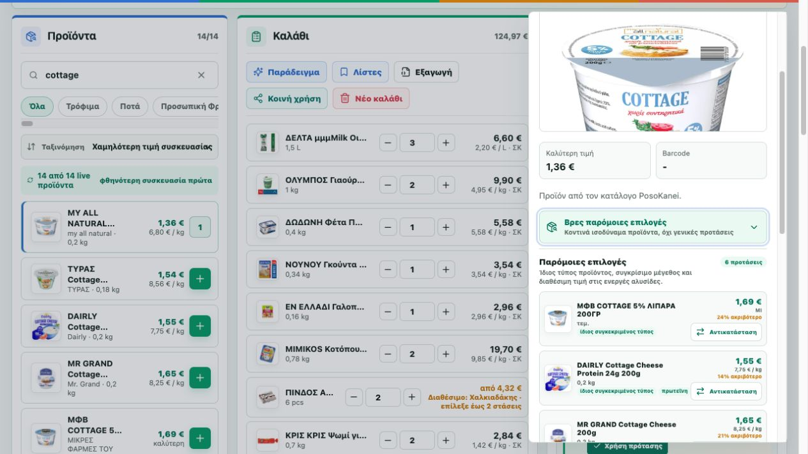

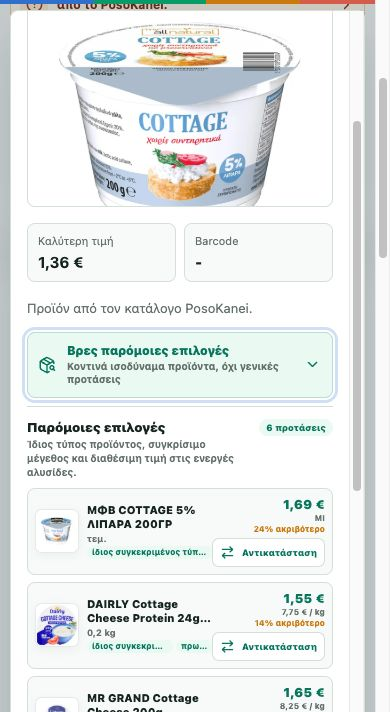

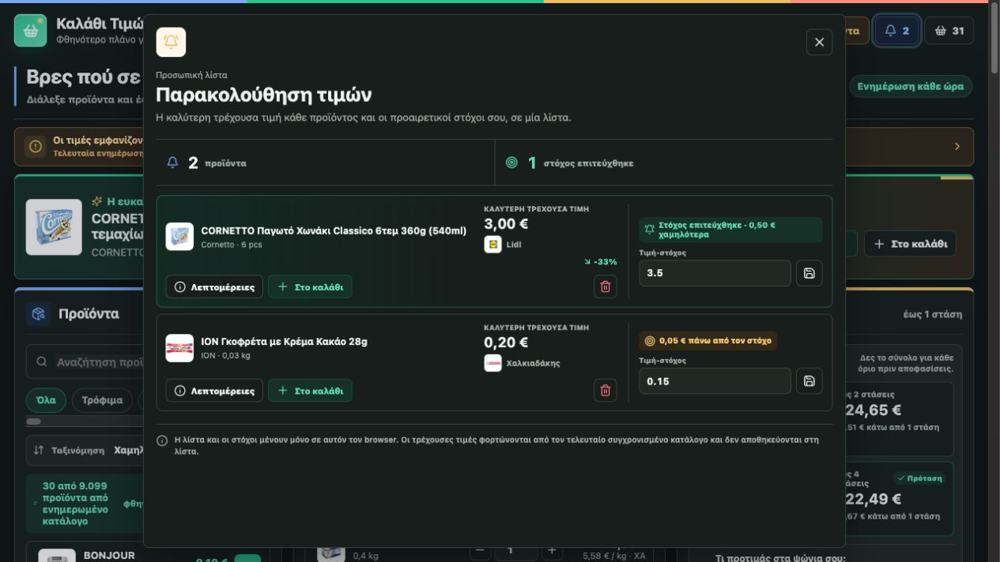

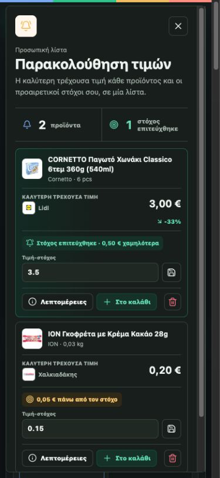

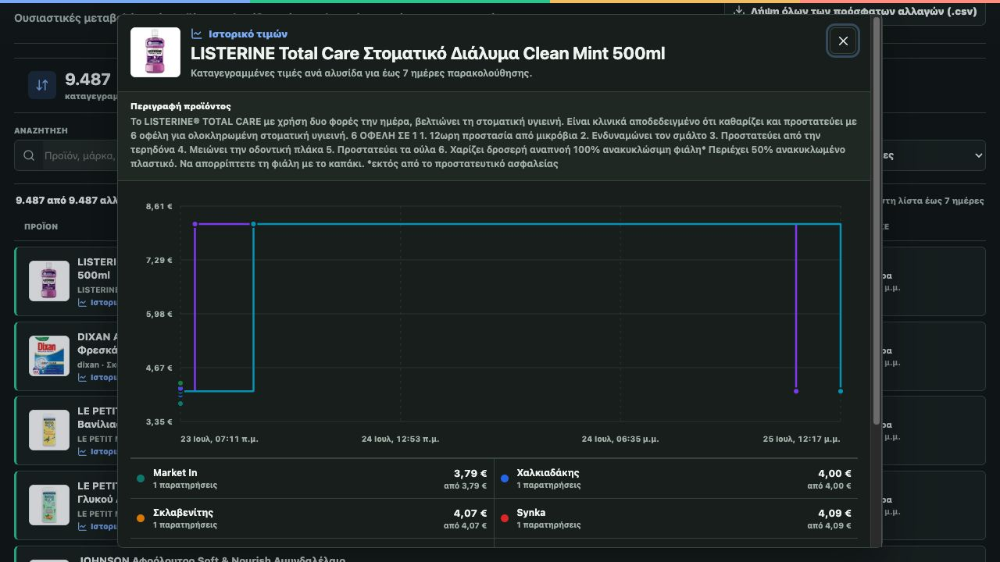

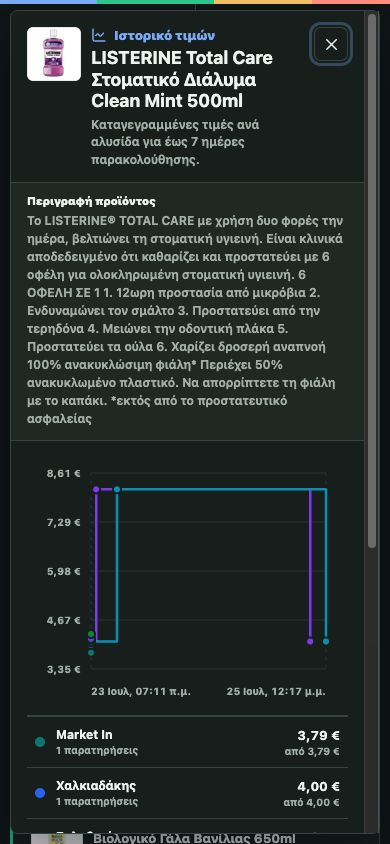

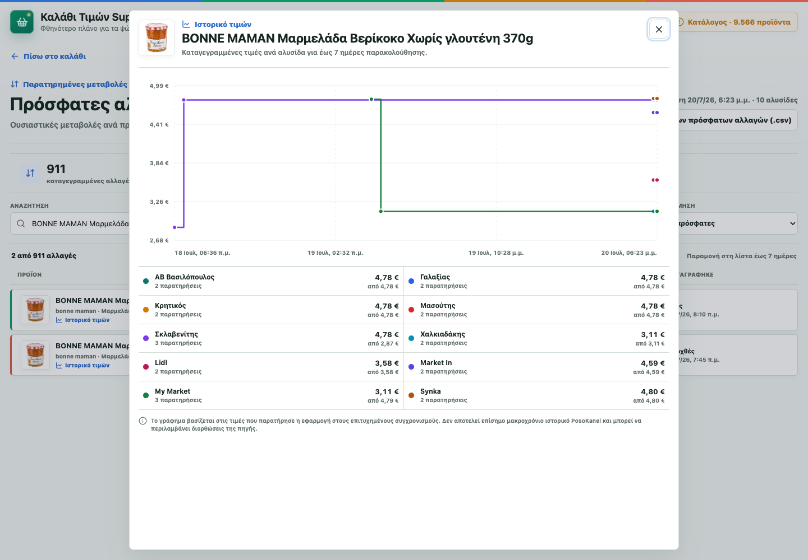

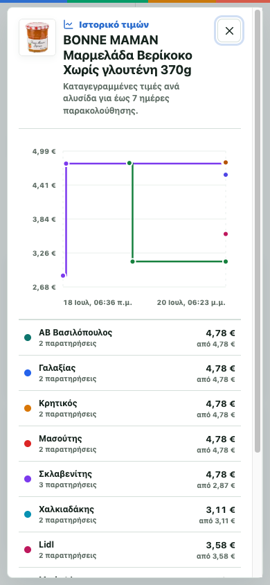

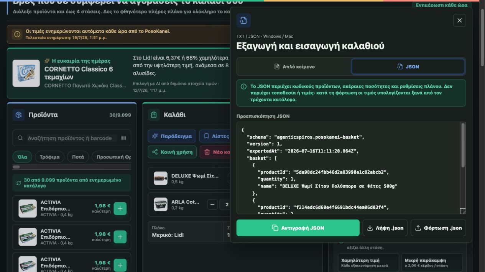


### Ανάλυση εξοικονόμησης

Κάτω από το επιλεγμένο πλάνο, η εφαρμογή δείχνει πλέον τα ακριβή προϊόντα που κάνουν τη διαφορά. Για κάθε προϊόν εμφανίζονται η τιμή του στο φθηνότερο πλήρες supermarket μίας στάσης, η τιμή και η αλυσίδα του επιλεγμένου πλάνου, καθώς και το καθαρό κέρδος. Οι ποσότητες του καλαθιού υπολογίζονται κανονικά, ενώ τα ονόματα προϊόντων παραμένουν ακριβώς όπως δημοσιεύονται από το PosoKanei και δεν μεταφράζονται αυτόματα.


### Γλώσσα και θέμα εμφάνισης

Η έκδοση `v0.5.0` προσθέτει πλήρη επιλογή ελληνικών ή αγγλικών απευθείας από την κορυφή της εφαρμογής. Μεταφράζονται όλες οι ενέργειες, οι καταστάσεις φόρτωσης και ενημέρωσης, οι επεξηγήσεις, τα στοιχεία προσβασιμότητας, οι ημερομηνίες, τα ποσά και το πλάνο αγορών που αντιγράφεται. Η προτίμηση αποθηκεύεται μόνο στον browser και παραμένει ενεργή μετά από ανανέωση της σελίδας. Τα ονόματα, οι κατηγορίες και οι περιγραφές προϊόντων παραμένουν όπως δημοσιεύονται από το PosoKanei, ώστε να μην αλλοιώνεται ο επίσημος κατάλογος.

Στην ίδια έκδοση υπάρχει επιλογή θέματος `Σύστημα`, `Φωτεινό` ή `Σκοτεινό`. Το `Σύστημα` ακολουθεί αυτόματα την τρέχουσα ρύθμιση του λειτουργικού, ακόμη κι αν αλλάξει όσο η εφαρμογή είναι ανοιχτή. Η επιλογή αποθηκεύεται ανεξάρτητα από τη γλώσσα και εφαρμόζεται πριν φορτώσει το React, αποφεύγοντας λευκό flash ή λάθος θέμα κατά την εκκίνηση, ιδιαίτερα στο Safari.


### Ανασχεδιασμός και mobile workspace

Η έκδοση `v0.10.0` διατηρεί την πυκνή, λειτουργική διάταξη σύγκρισης αλλά αφαιρεί περιττό οπτικό βάρος. Η εισαγωγή δεν εμφανίζεται πλέον σαν ξεχωριστή αιωρούμενη κάρτα, οι τρεις κύριες στήλες έχουν καθαρότερες επικεφαλίδες και αναλογίες, τα προϊόντα χωρούν έως δύο γραμμές τίτλου και το συνοπτικό αποτέλεσμα του καλαθιού εμφανίζεται ως μία ενιαία γραμμή με διαχωριστικά. Τα κουμπιά, τα πεδία, οι κάρτες αποτελεσμάτων και οι καταστάσεις hover/focus έχουν συνεπή αντίθεση σε φωτεινό και σκοτεινό θέμα.

Στο κινητό εμφανίζεται σταθερός επιλογέας «Προϊόντα / Καλάθι / Πλάνο» με τους αντίστοιχους μετρητές. Προβάλλεται μόνο η ενεργή ενότητα, οπότε ο χρήστης μετακινείται άμεσα από την αναζήτηση στη λίστα και στο αποτέλεσμα χωρίς μεγάλο scroll. Όταν υπάρχει καλάθι, η αρχική mobile προβολή είναι το πλάνο, ώστε η οικονομικότερη επιλογή να είναι άμεσα ορατή. Η ένδειξη ενημέρωσης καταλόγου έγινε συμπαγής και επεκτάσιμη: η τελευταία επιτυχής ώρα παραμένει πάντα ορατή, ενώ οι τεχνικές λεπτομέρειες ανοίγουν μόνο όταν χρειάζονται. Σε αποτυχία ενημέρωσης ανοίγει αυτόματα.

Η έκδοση `v0.11.0` μειώνει ακόμη περισσότερο τον χώρο πριν από το κύριο εργαλείο στο κινητό. Το GitHub και οι δευτερεύουσες ενέργειες χρησιμοποιούν αναγνωρίσιμα εικονίδια, η καθημερινή ευκαιρία κρατά μόνο τα στοιχεία που χρειάζονται για γρήγορη απόφαση και το «Νέο καλάθι» παραμένει καθαρά ορατό κάτω από τις συμπαγείς ενέργειες λίστας. Οι μπλε, πράσινες και πορτοκαλί λεπτομέρειες ξεχωρίζουν αντίστοιχα Προϊόντα, Καλάθι και Πλάνο χωρίς να αλλάζουν τη λειτουργική πυκνότητα της desktop διάταξης. Η σύντομη περιγραφή σκοπού εξηγεί πλέον άμεσα ότι το αποτέλεσμα αφορά ολόκληρο το καλάθι.

Η έκδοση `v0.14.0` κάνει το λειτουργικό workspace πιο ζεστό και ευχάριστο: προσθέτει πολυχρωματική αλλά συγκρατημένη παλέτα αγοράς, καλύτερη ανάδειξη φωτογραφιών και λογοτύπων, πιο απτές καταστάσεις hover/επιλογής και πιο πλούσια παρουσίαση της καθημερινής ευκαιρίας και του προτεινόμενου πλάνου. Το σκοτεινό θέμα μετακινείται από το μπλε-γκρι σε ουδέτερες πράσινες και ανθρακί επιφάνειες, διατηρώντας την αντίθεση. Όλες οι διαστάσεις παραμένουν σταθερές, η διάταξη έχει ελεγχθεί από `320px` έως μεγάλο desktop και οι κινήσεις σέβονται την προτίμηση προσβασιμότητας του λειτουργικού.


### Επιλογή αλυσίδων και πρακτικό πλάνο

Από την έκδοση `v0.4.0`, ο χρήστης μπορεί να ανοίξει την ενότητα «Αλυσίδες στον υπολογισμό» και να επιλέξει ποιες αλυσίδες θέλει πραγματικά να εξετάσει. Η κατάταξη, τα πλήρη καλάθια μίας στάσης και η βελτιστοποίηση έως τεσσάρων στάσεων υπολογίζονται αμέσως μόνο με τις επιλεγμένες αλυσίδες. Παραμένει πάντα ενεργή τουλάχιστον μία αλυσίδα και η επιλογή αποθηκεύεται τοπικά στον browser.

Μετά την προαιρετική ενεργοποίηση τοποθεσίας, η εφαρμογή αποκλείει αυτόματα από τον υπολογισμό τις αλυσίδες χωρίς αναγνωρισμένο υποκατάστημα μέσα στην τρέχουσα ακτίνα. Η σχετική ένδειξη εξηγεί πόσες κοντινές αλυσίδες συμμετέχουν, ενώ η λίστα επιλογής εμφανίζει μόνο αυτές. Ο χρήστης μπορεί να αφαιρέσει επιπλέον κοντινές αλυσίδες χειροκίνητα. Ο καθαρισμός της τοποθεσίας επαναφέρει όλες τις αλυσίδες. Η τοποθεσία δεν αποθηκεύεται στον σύνδεσμο ή στο καλάθι.

Το κουμπί «Αντιγραφή πλάνου» δημιουργεί έτοιμη λίστα αγορών ομαδοποιημένη ανά supermarket, με ποσότητες, υποσύνολα, συνολικό κόστος και αριθμό στάσεων. Έτσι το αποτέλεσμα της σύγκρισης μπορεί να χρησιμοποιηθεί πρακτικά μέσα στο κατάστημα ή να σταλεί ως απλό κείμενο.


### Λίστα αγορών και διαδρομή

Στην έκδοση `v0.7.0`, τα προϊόντα του πλάνου λειτουργούν ως λίστα αγορών. Ο χρήστης μπορεί να σημειώνει όσα αγόρασε, να βλέπει τη συνολική πρόοδο και να μηδενίζει τη λίστα από το σχετικό εικονίδιο. Η πρόοδος συνδέεται με τα συγκεκριμένα προϊόντα, τις ποσότητες και την ανάθεση ανά αλυσίδα, αποθηκεύεται μόνο στον browser και δεν περιλαμβάνεται σε κοινόχρηστους συνδέσμους.

Με ενεργή την τοποθεσία, η εφαρμογή επιλέγει το πλησιέστερο αναγνωρισμένο υποκατάστημα για κάθε αλυσίδα του πλάνου και προτείνει σειρά στάσεων ξεκινώντας από την τρέχουσα θέση. Το κουμπί «Άνοιγμα διαδρομής» στέλνει την αφετηρία και τα υποκαταστήματα στο Google Maps, το οποίο υπολογίζει την πραγματική οδική διαδρομή. Η εφαρμογή δεν αποθηκεύει την τοποθεσία ή τη διαδρομή.

Στην έκδοση `v0.8.0`, η γραμμή αγορών δείχνει πόσα προϊόντα και πόση αξία απομένουν. Η επιλογή «Υπόλοιπα» κρύβει όσα έχουν ήδη αγοραστεί, ενώ κάθε κάρτα αλυσίδας έχει δική της μπάρα προόδου και εικονίδιο για ολοκλήρωση ή επαναφορά ολόκληρης στάσης. Η διαδρομή ενημερώνεται από την ίδια πρόοδο: ολοκληρωμένες αλυσίδες παραλείπονται, η επόμενη στάση αναφέρεται καθαρά και, όταν ολοκληρωθεί όλη η λίστα, εμφανίζεται τελική επιβεβαίωση αντί για άχρηστη διαδρομή.


### Αποθηκευμένες λίστες

Στην έκδοση `v0.9.0`, το κουμπί «Λίστες» αποθηκεύει έως 12 καλάθια με όνομα στον συγκεκριμένο browser. Κάθε λίστα κρατά τους κωδικούς προϊόντων, τις ποσότητες, το όριο στάσεων, τις επιλεγμένες αλυσίδες και την προσωπική εκτίμηση κόστους επιπλέον στάσης. Η αποθήκευση με το ίδιο όνομα ενημερώνει την υπάρχουσα λίστα, ενώ η διαγραφή έχει ξεχωριστή επιβεβαίωση.

Όταν ανοίγει μια λίστα, η εφαρμογή αναζητά τα προϊόντα στον τρέχοντα κατάλογο και υπολογίζει ξανά τιμές, κατάταξη και φθηνότερο πλάνο. Δεν αποθηκεύεται παλιό στιγμιότυπο τιμών. Αν κάποιο προϊόν δεν υπάρχει πλέον, τα υπόλοιπα φορτώνονται κανονικά και εμφανίζεται σχετική ενημέρωση. Οι λίστες μένουν μόνο στον browser και δεν περιέχουν τοποθεσία, κοντινά υποκαταστήματα ή πρόοδο αγορών.


### Κοινόχρηστα καλάθια

Το κουμπί «Κοινή χρήση» δημιουργεί σύνδεσμο για το τρέχον καλάθι. Από την έκδοση `v0.4.0`, ο σύνδεσμος κρατά τα συγκεκριμένα προϊόντα, τις ποσότητες, το επιλεγμένο όριο `1` έως `4` στάσεων και τις αλυσίδες που συμμετέχουν στον υπολογισμό. Όταν τον ανοίξει κάποιος άλλος, η εφαρμογή φορτώνει τα αντίστοιχα προϊόντα από τον πιο πρόσφατο κατάλογο και υπολογίζει ξανά τις διαθέσιμες τιμές, την κατάταξη αλυσίδων και το φθηνότερο πλάνο. Έτσι ο σύνδεσμος μοιράζεται τη λίστα και τις προτιμήσεις αγορών, όχι ένα παλιό στιγμιότυπο τιμών. Οι σύνδεσμοι της έκδοσης `v0.3.0` παραμένουν συμβατοί και ανοίγουν με όλες τις αλυσίδες ενεργές.

Από την έκδοση `v0.18.0`, το παράθυρο δημιουργεί αυτόματα έναν πολύ μικρότερο σύνδεσμο στη μορφή `kalathitimon.com/s/AbCd123456`. Η λύση χρησιμοποιεί το hosting της εφαρμογής χωρίς εξωτερική δωρεάν υπηρεσία, API key, διαφημίσεις ή πρόσθετη συνδρομή. Ο ίδιος σύνδεσμος επιστρέφεται για το ίδιο καλάθι, ενώ browser και server cache αποφεύγουν περιττές εγγραφές. Αν η υπηρεσία δεν μπορέσει να αποθηκεύσει τον σύνδεσμο, η εφαρμογή χρησιμοποιεί εμφανώς τον πλήρη λειτουργικό σύνδεσμο.

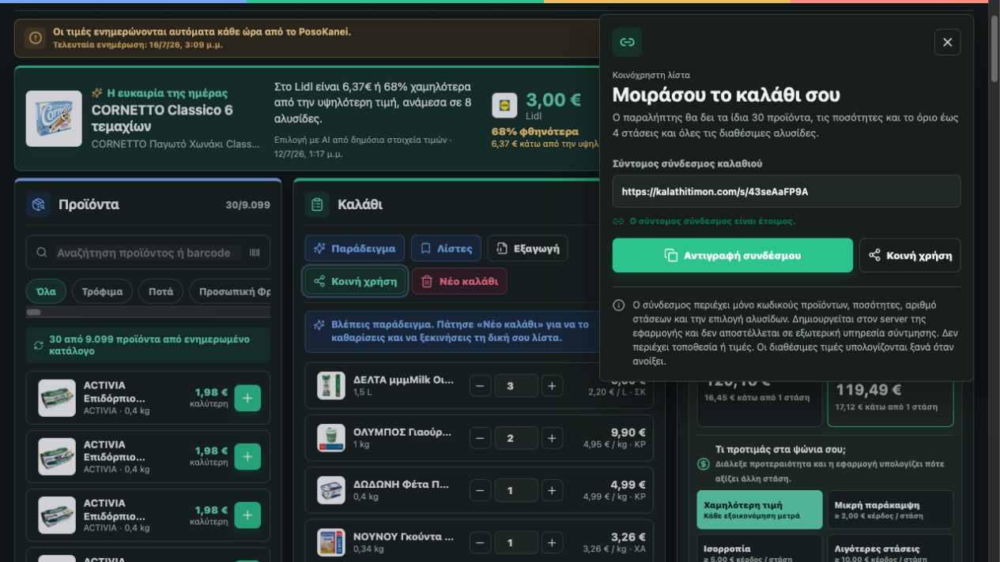

Η εισαγωγή είναι ανθεκτική σε αλλαγές καταλόγου: αν κάποιο προϊόν δεν υπάρχει πλέον, το υπόλοιπο καλάθι ανοίγει κανονικά και εμφανίζεται σαφής προειδοποίηση. Μετά την επιτυχημένη εισαγωγή, η παράμετρος αφαιρείται από τη γραμμή διεύθυνσης ώστε μια μελλοντική ανανέωση να μη γυρίσει τον χρήστη στην αρχική κοινόχρηστη έκδοση, ενώ το καλάθι συνεχίζει να αποθηκεύεται τοπικά όπως πριν.

Ο σύνδεσμος χρησιμοποιεί μικρό, versioned και ελεγμένο payload με έως 60 προϊόντα. Περιέχει μόνο κωδικούς προϊόντων, ποσότητες, αριθμό στάσεων και κωδικούς επιλεγμένων αλυσίδων: δεν περιέχει τοποθεσία, κοντινά καταστήματα, τιμές ή άλλα προσωπικά δεδομένα. Ο πλήρης σύνδεσμος αποθηκεύεται μόνο στο hosting της εφαρμογής ώστε ο σύντομος κωδικός να μπορεί να τον ανοίξει. Το same-origin `shorten.php` δέχεται αποκλειστικά συνδέσμους καλαθιού της εφαρμογής και δεν λειτουργεί ως γενικός public shortener. Το `products-by-ids` endpoint επιστρέφει μόνο τα προϊόντα του καλαθιού από το τελευταίο snapshot, αντί να αναγκάζει κάθε παραλήπτη να κατεβάζει ολόκληρο τον κατάλογο. Υποστηρίζονται αντιγραφή συνδέσμου, το native share sheet όπου διατίθεται και fallback επιλογής του συνδέσμου για αυστηρότερα περιβάλλοντα Safari/clipboard.

### Λίστα ως κείμενο

Το κουμπί «Εξαγωγή» και η επιλογή «Απλό κείμενο» δημιουργούν μία ευανάγνωστη έκδοση για μηνύματα, email ή εφαρμογές σημειώσεων. Η προεπισκόπηση περιλαμβάνει τη γενική λίστα, το αναλυτικό πλάνο αγορών και τον ίδιο σύντομο σύνδεσμο που ανοίγει ξανά το καλάθι, χωρίς να αλλάζει το καλάθι. Η λήψη `.txt` χρησιμοποιεί UTF-8 BOM και line endings `CRLF`, ώστε τα ελληνικά και η διάταξη να διατηρούνται σωστά σε σύγχρονο Windows Notepad, macOS TextEdit και άλλους text editors.

### Φορητό JSON

Η επιλογή «JSON» στο ίδιο παράθυρο προσφέρει αντιγραφή, λήψη `.json` και φόρτωση αρχείου. Το format έχει αναγνωριστικό `agenticspiros.posokanei-basket` και αριθμό έκδοσης schema, ώστε μελλοντικές ασύμβατες αλλαγές να απορρίπτονται καθαρά. Κάθε εισαγωγή περιορίζεται σε 60 προϊόντα και ελέγχει κωδικούς, ακέραιες ποσότητες `1` έως `999`, όριο `1` έως `4` στάσεων, έως 30 κωδικούς αλυσίδων και μία από τις υποστηριζόμενες εκτιμήσεις επιπλέον στάσης.

Τα ονόματα μέσα στο JSON είναι μόνο για να διαβάζεται ευκολότερα το αρχείο και αγνοούνται κατά την εισαγωγή. Η εφαρμογή εμπιστεύεται μόνο τους ελεγμένους κωδικούς και ζητά τα προϊόντα από τον τρέχοντα κατάλογο. Δεν εισάγονται τιμές, τοποθεσία, υποκαταστήματα ή πρόοδος αγορών. Το μέγιστο μέγεθος αρχείου είναι 256 KB.

### Ευκαιρία της ημέρας

Η «Ευκαιρία της ημέρας» προτείνει καθημερινά ένα προϊόν που μπορεί να αξίζει την προσοχή του χρήστη. Η κάρτα δείχνει το συγκεκριμένο προϊόν και τη φωτογραφία του, τη φθηνότερη αλυσίδα, την τρέχουσα τιμή, πόσο χαμηλότερη είναι από την υψηλότερη τρέχουσα τιμή στις υπόλοιπες αλυσίδες, σύνδεσμο λεπτομερειών και κουμπί προσθήκης στο καλάθι. Το νέο κουμπί «Περισσότερες ευκαιρίες» ανοίγει ξεχωριστή σελίδα με εννέα συνολικά καθημερινές επιλογές: την κεντρική πρόταση και οκτώ επιπλέον προϊόντα, όλα με λεπτομέρειες και άμεση προσθήκη στο ίδιο αποθηκευμένο καλάθι. Το ποσοστό είναι σύγκριση τιμών του ίδιου προϊόντος μεταξύ αλυσίδων την ίδια χρονική περίοδο, όχι ιστορική έκπτωση ή σύγκριση με προηγούμενη τιμή.

Ο κώδικας υπολογίζει πρώτα τις πραγματικές τιμές του ίδιου προϊόντος ανά αλυσίδα, τη διαφορά από τη φθηνότερη έως την ακριβότερη επιλογή και πόσες αλυσίδες συμμετέχουν. Στη συνέχεια το `gpt-5.6-sol`, με `high` reasoning και standard service speed, επιλέγει εννέα διαφορετικά προϊόντα από την ήδη επαληθευμένη λίστα και γράφει σύντομο ελληνικό editorial κείμενο. Το AI δεν υπολογίζει και δεν αλλάζει τιμές, δεν εφευρίσκει ιστορικό έκπτωσης και δεν λαμβάνει δεδομένα χρηστών. Πριν εμφανιστεί μια αποθηκευμένη επιλογή, ο browser ζητά ξανά τα επιλεγμένα IDs από τον τελευταίο συγχρονισμένο κατάλογο και επανυπολογίζει όλα τα αριθμητικά στοιχεία και την ορατή αιτιολόγηση τιμής, ώστε να μπορεί να διατηρηθεί η επιλογή χωρίς να διατηρούνται παλιές τιμές.

Η παραγωγή γίνεται μία φορά την ημέρα στο Mac που εκτελεί ήδη τον συγχρονισμό του καταλόγου. Στον Plesk ανεβαίνει μόνο το δημόσιο `data/daily-bargain.json`, μαζί με το όνομα, την εικόνα, τις επαληθευμένες τιμές και το κείμενο της πρότασης. Το `OPENAI_API_KEY` μένει στο ιδιωτικό περιβάλλον του Mac, δεν περιλαμβάνεται στο repository ή στο build και δεν στέλνεται ποτέ στον browser ή στον web server.

Ο κώδικας είναι δημόσιος στο GitHub: [github.com/spirosrap/posokanei-basket-demo](https://github.com/spirosrap/posokanei-basket-demo). Η εφαρμογή έχει και σύνδεσμο `GitHub` στην κορυφή της σελίδας, ώστε όποιος τη δοκιμάζει να μπορεί να δει άμεσα το repository.

Η εφαρμογή προσπαθεί πρώτα να διαβάσει live προϊόντα και τιμές μέσω μικρού PHP proxy, επειδή το επίσημο API δεν επιτρέπει απευθείας browser requests από τρίτα domains. Αν ο proxy μπλοκαριστεί, ο ίδιος PHP endpoint απαντά από τον πιο πρόσφατο συγχρονισμένο κατάλογο, σε μικρές σελίδες αποτελεσμάτων, ώστε ο browser να μη φορτώνει ολόκληρο το αρχείο. Οι φωτογραφίες προϊόντων ζητούνται πρώτα ως μικρά WebP από το edge cache του `images.weserv.nl`. Αν αυτό αποτύχει, κάθε εικόνα δοκιμάζει αυτόματα τον υπάρχοντα same-origin PHP proxy, ο οποίος με τη σειρά του μπορεί να χρησιμοποιήσει το PosoKanei ως τελικό fallback.

Τα λογότυπα των αλυσίδων διαβάζονται από τα retailer metadata του PosoKanei και χρησιμοποιούν την ίδια σειρά edge cache, same-origin proxy και ελεγμένων fallback URLs, ώστε το πλάνο να δείχνει πραγματικά supermarket logos αντί για αρχικά γραμμάτων.

Προαιρετικά, ο χρήστης μπορεί να πατήσει «Χρήση τοποθεσίας» για να περιορίσει τη σύγκριση σε κοντινές αλυσίδες και να δει αποστάσεις τύπου `57 μ. μακριά`. Η τοποθεσία ζητείται από τον browser μόνο μετά από ενέργεια του χρήστη, το app τη στέλνει στο δικό του `api/branches.php` endpoint με `no-store` cache, και το endpoint αναζητά supermarket στο OpenStreetMap/Overpass. Οι αποστάσεις είναι ευθεία γραμμή και βοηθητικές, όχι πλοήγηση με διαδρομή/κίνηση.

Με ενεργή την τοποθεσία, αλυσίδες χωρίς κοντινό υποκατάστημα δεν εμφανίζονται ούτε επηρεάζουν το φθηνότερο πλάνο. Ο χρήστης μπορεί να αλλάξει ακτίνα αναζήτησης (`2χλμ.`, `5χλμ.`, `10χλμ.`), να δει τα κοντινά υποκαταστήματα ανά επιλέξιμη αλυσίδα και να ανοίξει σύνδεσμο χάρτη. Επειδή τα στοιχεία καταστημάτων προέρχονται από το OpenStreetMap, η κάλυψη εξαρτάται από την πληρότητα και την ονομασία των καταχωρίσεων της περιοχής.

Στις 2026-06-23 ο upstream API είναι προσβάσιμος από ορισμένα περιβάλλοντα, αλλά ο Plesk server του demo παίρνει `HTTP 403` από `api.posokanei.gov.gr`. Δοκιμάστηκαν επίσης Vercel Node/Edge και Cloudflare Worker, και μπλοκαρίστηκαν με `HTTP 403`. Γι' αυτό το live demo χρησιμοποιεί αυτόματα ανανεωμένο κατάλογο από περιβάλλον που μπορεί να φτάσει το API, δείχνει την ώρα τελευταίας ενημέρωσης στην κορυφή, και σερβίρει αναζήτηση/σελίδες προϊόντων από PHP fallback.

Σημαντική λεπτομέρεια: το block δεν φαίνεται να είναι θέμα συσκευής ή MAC address. Ένας δημόσιος API server συνήθως δεν βλέπει MAC addresses. Ακόμα και συσκευές στο ίδιο τοπικό δίκτυο μπορούν να φαίνονται διαφορετικές προς το upstream λόγω διαφορετικού public egress IP, VPN/split tunnel, IPv4/IPv6 διαδρομής, CDN/WAF κανόνων ή TLS/client fingerprint. Γι' αυτό το refresh script υποστηρίζει trusted SSH runner: το κατέβασμα γίνεται από περιβάλλον που επιτρέπεται, ενώ τα deployment credentials μένουν τοπικά.

Ο συγχρονισμός του καταλόγου είναι πλέον ανθεκτικός σε διακοπές κατά το ανέβασμα. Το νέο μεγάλο αρχείο ανεβαίνει πρώτα με προσωρινό όνομα και αντικαθιστά τον προηγούμενο κατάλογο μόνο όταν έχει ολοκληρωθεί ολόκληρη η μεταφορά. Έτσι, όσο γίνεται η ωριαία ενημέρωση, οι επισκέπτες συνεχίζουν να βλέπουν τον τελευταίο πλήρη κατάλογο αντί για άδειο ή μισογραμμένο JSON. Αν υπάρξει προσωρινό σφάλμα δικτύου ή server, ο browser επαναλαμβάνει αυτόματα το request και μπορεί να ανακτήσει ξανά το snapshot μέσα στην ίδια συνεδρία, κάτι που καλύπτει και τα περιστασιακά blank/empty states του Safari.

Από την έκδοση `v0.9.0`, ένα συνηθισμένο `npm run live:deploy` ενημερώνει μόνο την εφαρμογή και τα PHP endpoints, διατηρώντας τα τρέχοντα αρχεία καταλόγου της παραγωγής. Οι τιμές ενημερώνονται ξεχωριστά με `npm run live:refresh`, ώστε μια έκδοση UI να μην αντικαταστήσει κατά λάθος νεότερο κατάλογο με παλιότερο build artifact. Μόνο το ρητό `DEPLOY_INCLUDE_DATA=1 npm run live:deploy` περιλαμβάνει το `dist/data/`, για αρχική εγκατάσταση ή ελεγχόμενη πλήρη επαναφορά.

Στην `v0.27.0`, κάθε refresh δημιουργεί και το `price-changes.json.gz`, το δημοσιεύει ατομικά μαζί με το κανονικό JSON και ελέγχει το [`api/price-changes.php`](https://kalathitimon.com/api/price-changes.php) ως μέρος της ίδιας γενιάς. Ο endpoint στέλνει την προ-συμπιεσμένη έκδοση όταν ο browser υποστηρίζει gzip και επιστρέφει στο απλό JSON όταν δεν υπάρχει συμπιεσμένο αρχείο. Δημιουργείται επίσης ένα `catalog-details.jsonl` με μία εγγραφή ανά προϊόν. Όταν ανοίγει το ιστορικό, το PHP διαβάζει γραμμή-γραμμή μόνο μέχρι να βρει το ζητούμενο προϊόν, επιστρέφοντας περιγραφή και πλήρη καταγεγραμμένη πορεία χωρίς να φορτώνει ολόκληρο τον πλήρη κατάλογο στη μνήμη. Το sidecar δημοσιεύεται και ελέγχεται και στα δύο domains σε κάθε επιτυχή refresh.

## English

**Live app:** [kalathitimon.com](https://kalathitimon.com/)

**Compatibility mirror:** [agenticspiros.com/demo/posokanei-basket](https://agenticspiros.com/demo/posokanei-basket/)

**Source code:** [github.com/spirosrap/posokanei-basket-demo](https://github.com/spirosrap/posokanei-basket-demo)

**Current version:** `v0.32.4`

> This is an unofficial app. It is not affiliated with PosoKanei or any supermarket chain.

This web app lets users build a supermarket basket from the PosoKanei catalogue and ranks Greek supermarket chains by the total price of the selected groceries.

The app is inspired by [posokanei.gov.gr](https://posokanei.gov.gr/), which compares supermarket product prices in Greece. The workflow is basket-first: choose the exact products and quantities, decide whether you can make `1`, `2`, `3`, or `4` supermarket stops, and see the cheapest complete buying plan.

### What It Does

- Search or filter products by category or barcode.
- Sort the full catalogue by lowest package price, best comparable price per `kg`, `L`, or item, or product name before pagination.
- See the best available unit price on each product row and the current basket quantity directly on its quick-add button.
- See notable recent price drops or increases for the exact supermarket behind a displayed price, including the percentage and previous value.
- Watch products with an optional target price and see which targets have been reached using current catalogue prices.
- Switch the complete interface between Greek and English, including dates, currency, accessibility labels, and copied shopping plans.
- Choose System, Light, or Dark appearance, with persistent preferences and live operating-system theme tracking.
- Start with a realistic weekly Greek-family basket that keeps several complete one-stop options and can be cleared in one click.
- Add products to a basket.
- Adjust whole-product quantities with integer steppers, including `kg` packages.
- Distinguish products available at another included chain from products covered by the selected stop plan, showing the best alternative chain, price, and complete stop limit.
- Include or exclude supermarket chains from every ranking and optimized plan.
- Automatically limit prices and plans to chains with a nearby branch after enabling location.
- Check off products while shopping, see remaining spend, and filter the plan to unfinished items.
- Track each supermarket stop independently and complete or restore a whole stop in one action.
- Open the nearest unfinished branches as one Google Maps route that updates with progress.
- Copy the optimized plan as a store-by-store shopping list with quantities and subtotals.
- Share the exact basket, quantities, selected stop limit, and supermarket selection with a compact link.
- Copy, natively share, or download a complete plain-text basket with a checklist, stop limit, store-by-store plan, prices, totals, and reopening link.
- Export or import a versioned machine-readable JSON basket that restores product IDs, whole quantities, stop settings, and chain selections against current catalogue prices.
- Restore a shared basket against the latest catalogue and recalculate current prices automatically.
- Save up to 12 named baskets locally and reopen them against the latest catalogue prices.
- Rank supermarket chains by total basket price.
- Show coverage and missing-item counts per chain.
- Highlight the cheapest complete one-stop basket.
- Optimize the basket for up to `1`, `2`, `3`, or `4` supermarket stops.
- Compare the cheapest complete totals for all four stop limits at the same time.
- Choose a plain-language shopping priority, from lowest price to fewer stops, without changing grocery prices.
- See total percentage savings and savings per extra supermarket, then apply the practical recommendation in one action.
- See which products create the saving against the cheapest complete one-stop basket, including any higher-price tradeoffs.
- Show which products to buy from each chain in a multi-stop plan.
- Show savings compared with the most expensive complete basket.
- Separate partial baskets from chains where you can buy everything.
- Open product detail with barcode, unit, description, a large product photo, and per-chain prices.
- Open up to six carefully matched alternatives for any catalogue or basket product, compare unit value and useful traits, and replace a basket item without losing its quantity.
- Receive critical app and catalogue files as precompressed assets, with a safe cached app shell for subsequent navigation between the basket, bargains, and price-change views.
- Load optimized, cacheable WebP product thumbnails directly from an edge image cache, with a same-origin proxy fallback and a separate high-resolution detail image.
- Show supermarket chain logos in rankings, multi-stop plans, and product price rows.
- Optionally request browser location and show nearby supermarket branches.
- Show nearest-branch distance labels, such as `57 μ. μακριά`, next to chains when location is enabled.
- Show a selected chain's nearby branch list with map links.
- Link from the app header to the public GitHub repository.
- Browse/search the official catalog with pagination instead of a fixed sample list.
- Show the last product/price update check in the UI.
- Publish one featured and eight additional daily AI-assisted bargains with exact product images, verified chain prices, price spreads, details, and add-to-basket actions.
- Provide scheduler-friendly update and snapshot refresh scripts.

### Stop Comparison and Practical Recommendation

Version `v0.6.0` shows the cheapest complete grocery total for `1`, `2`, `3`, and `4` stop limits together. Each selectable option includes its real product total and savings against one stop. These are “up to” limits: when the same cheapest plan uses fewer chains, the optimizer does not add an unnecessary visit. Selecting an option immediately updates the detailed route, basket assignment, and copied shopping plan.

Users can choose how much grocery saving is needed to make each extra supermarket worthwhile: `€0`, `€2`, `€5`, or `€10`. For example, at `€5`, another stop is recommended only when its lower grocery prices compensate for more than `€5` of extra time, fuel, or fares. The practical recommendation now states the number of additional stops and shows the calculation explicitly, while the basket continues to display only actual grocery prices. This personal estimate is stored locally, is not PosoKanei price data, and is deliberately excluded from shared basket links. The chosen stop limit is persistent as well.

Version `v0.6.1` renames and explains this control as “When is another stop worth it?” so its purpose is clear before the user chooses an amount.

Version `v0.6.2` turns enabled location into an eligibility filter: rankings, stop plans, product best-price labels, product detail prices, and the daily suggestion use only chains with a matched branch inside the selected radius.

Version `v0.7.0` turns the result into a practical shopping companion: every assigned product is checkable, progress is stored locally for the exact plan, and enabled location can generate one route through the nearest branch for each selected stop.

Version `v0.8.0` adds an in-store shopping mode with remaining spend, per-chain progress, whole-stop completion, an unfinished-items view, and a Google Maps route that automatically skips completed supermarkets.

Version `v0.11.0` makes the decision path faster to read and use. On mobile, the header, purpose copy, and daily bargain use less vertical space so the `Products / Basket / Plan` switcher and the actual result reach the first screen. The basket count stays beside the brand, secondary basket actions become compact, and Products, Basket, and Plan receive distinct visual identities. In the Plan panel, the practical recommendation now appears before optional location and supermarket settings.

Version `v0.12.0` replaces the abstract per-stop estimate with four understandable shopping priorities: `Lowest price`, `Small detour`, `Balanced`, and `Fewer stops`. The recommendation now states the total percentage saved, the saving per additional supermarket, and includes a one-action control for selecting the recommended plan. The underlying grocery totals and optimizer are unchanged, and the priority remains a local browser preference rather than PosoKanei price data.

Version `v0.13.0` explains where the selected plan's saving comes from. It compares each item with the cheapest complete one-stop basket, highlights the products that contribute most to the saving, and reconciles those amounts with the overall total. When a product costs more in the multi-stop plan, that tradeoff is shown separately so the comparison remains transparent.

Version `v0.14.0` refreshes the complete visual experience without changing prices or calculations. Blue, green, amber, and coral accents give navigation, basket, plan, and bargain states distinct identities. Product imagery, results, and selected controls gain clearer depth and more immediate feedback, while restrained motion automatically switches off when the user prefers reduced motion.

Version `v0.14.1` makes every basket quantity a whole number of products or packages. Quantity controls now move by `1`, including catalogue items whose unit is `kg`. Older saved lists and shared links containing fractional quantities are automatically normalized to the nearest integer.

Version `v0.14.2` separates catalogue availability from selected-plan coverage. When an item is not sold by the chain in a one-stop plan but is available from another included chain, the basket now shows its best alternative price, chain, and the stop limit needed for a complete basket. It no longer labels that case as “missing,” which could be mistaken for store-level stock information. PosoKanei supplies catalogue prices rather than live branch inventory.

Version `v0.14.3` makes product imagery substantially faster. Search results now request small compressed WebP thumbnails instead of full-size source photos, prioritize the first visible images, and lazy-load the rest. Product details retain a separate higher-resolution image. A colored product fallback remains visible while each photo loads, and versioned image responses receive long-lived browser caching.

Version `v0.15.0` adds a complete plain-text basket export. It includes a product and quantity checklist, the selected stop limit, a supermarket-by-supermarket plan with prices and totals, and a link that reopens the basket. When the selected limit cannot cover the full list, the export explains that limitation and includes the first available complete plan. Users can copy the text, open the native share sheet, or download a `.txt` file compatible with Windows Notepad and macOS TextEdit.

Version `v0.16.0` adds portable JSON export and import. The versioned file stores only product IDs, whole-number quantities, the stop limit, selected chains, and the extra-stop estimate. It never stores location or prices. On import, the app strictly validates the file, fetches those IDs from the current catalogue, and recalculates every price and plan. A basket can therefore be archived, sent, or moved to another browser without carrying stale price data.

Version `v0.17.0` automatically replaces the large basket URL with a compact link hosted alongside the app in the share and plain-text export dialogs. The shortening service requires no API key or subscription, sends no basket data to a third-party service, and immediately falls back to the complete URL if it is unavailable. Shortening begins only after the user opens one of those dialogs.

Version `v0.17.1` orders every product search from the lowest to the highest best available price. Catalogue ordering happens before pagination so the genuinely cheapest matches appear first, then the browser reconciles the visible order with the supermarket chains selected by the user or allowed by the active location filter. Products without an available price among those chains appear last.

Version `v0.18.0` launches the primary production app at the dedicated [kalathitimon.com](https://kalathitimon.com/) domain. The web app, PHP APIs, images, bargains, and compact basket links now run from the domain root with HTTPS, while the original `/demo/posokanei-basket/` installation remains available as a compatibility mirror. The hourly refresh atomically publishes the same verified catalogue to both targets so existing links keep working without creating separate price sources.

Version `v0.19.0` adds persistent product sorting by lowest package price, best comparable unit price per `kg`, `L`, or item, or product name. Package-price mode answers which product costs least right now; unit-price mode compares different pack sizes fairly. Sorting is applied to the catalogue before pagination and then reconciled in the browser with the chains currently enabled by the user or location filter. Product rows show both the best package and unit price, while the add control now performs a true quick add and displays the quantity already in the basket without opening product details.

Version `v0.20.0` focuses on speed and resilience. One snapshot-first bootstrap request now returns catalogue health, chains, categories, the first product page, and basket products without waiting for the known-blocked request-time upstream proxy. A compact runtime catalogue retains exactly the pricing fields used by the app and reduces request-time JSON from roughly `17 MB` to `6.7 MB`, while the complete public snapshot remains available. Short-lived browser caching deduplicates identical requests, stale slow responses can no longer replace newer search results, and a locally controlled search field keeps typing immediate with a `180 ms` request delay. Only four initial product images receive high priority, while stable loading skeletons reduce layout movement. Manual and scheduled refreshes now share a lock so two jobs cannot publish different file generations concurrently, and bounded verification waits for all public timestamps to converge. In a reference PHP benchmark, a sorted 30-product page completed in about `0.22 s` and a search in about `0.14 s`; production timings still depend on hosting and network conditions.

Version `v0.21.0` removes PHP from the critical first-screen path. A static startup catalogue of roughly `200 KB` (`~31 KB` with Brotli) begins downloading directly from the document `<head>` and contains metadata, the first page for all three sort modes, and the example-basket products. It is normally ready by the time React starts, while the previous PHP bootstrap remains a resilient fallback. Once the interface is stable, a low-priority Web Worker loads the compact runtime catalogue and performs subsequent searches, category filtering, sorting, and pagination locally without another network round trip. The `180 ms` typing delay remains, but the warmed-up catalogue calculation itself normally takes only a few milliseconds. Product images now use an explicit `IntersectionObserver`, so thumbnails lower in a scrollable product or basket list do not make any request until they approach the viewport. Removing the duplicate embedded copy of the 30 example products also reduces the production JavaScript from roughly `410 KB` to `371 KB` (`123.8 KB` to `112.5 KB` gzip).

Version `v0.22.0` nearly halves the first-screen JavaScript again. Components retain the React-compatible API, while production aliases it to the smaller `preact/compat` runtime, reducing the main bundle from `112.5 KB` to about `59.7 KB` gzip. The startup catalogue now keeps only metadata used by the interface while preserving all three sort modes and the complete example basket, reducing its Brotli transfer from about `33.4 KB` to `15.8 KB`. A lightweight HTML shell paints the workspace before JavaScript completes, large plan details render when the main thread is idle, and offscreen rows use `content-visibility`. Product and retailer images go directly to the edge image cache with the existing same-origin proxy retained as fallback. The versioned worker catalogue is reusable from browser cache and starts immediately on search focus or later during idle time.

Version `v0.22.1` fixes thumbnails that had already downloaded from browser cache but could remain hidden behind the product initials. The app now also detects an image that completed before its load handler was attached, while retaining the fallback path for genuinely failed images.

Version `v0.22.2` repairs the automatic sync after the compact startup catalogue was introduced. Each remote runner's temporary directory now receives the project's module configuration, allowing the healthy Node 18 runner to finish generating the `catalog`, `runtime`, and `bootstrap` artifacts instead of stopping after product download. The first successful complete build still wins, and every artifact is atomically published and verified on both domains.

Version `v0.22.3` fixes product photos in custom baskets after a page refresh. When current prices replaced a locally restored product object with another object carrying the same image URL, the thumbnail unnecessarily returned to its loading state without a second browser event. Image state now resets only when the URL actually changes, so personal, saved, and shared baskets retain their photos while prices are refreshed.

Version `v0.23.0` adds recent product-price movement per supermarket chain. Every successful catalogue refresh compares its new snapshot with the previously published generation and records only meaningful differences: at least `€0.10` and `3%`, or at least `€0.50` regardless of percentage. Green denotes a decrease and red an increase, with the percentage, previous price, and exact recorded time available in the interface. The marker follows the chain behind the displayed price across search results, personal baskets, and the per-chain product detail table. A change remains visible for up to seven days when later hourly snapshots keep the same price, but is cleared sooner when a newer small adjustment makes it inaccurate. This is application-observed history between successful refreshes, not an official long-term PosoKanei price-history service.

Version `v0.24.0` collects every active recent price movement from every supermarket chain in one CSV file. Each row includes the product, brand, category, chain, previous and current price, euro and percentage difference, direction, and observation timestamps. The file uses UTF-8 with a BOM and CRLF line endings so Greek text opens correctly in Excel and other spreadsheet tools. It is regenerated and published atomically with every successful hourly catalogue sync at the stable [`/data/price-changes.csv`](https://kalathitimon.com/data/price-changes.csv) URL.

Version `v0.25.0` adds the public [`/changes/`](https://kalathitimon.com/changes/) page for a readable view of the same movements. It provides change, product, drop, and rise totals; accent-insensitive Greek search; chain and direction filters; and sorting by time, percentage, euro difference, or product name. Each row shows the product and image, chain, previous and current price, signed euro and percentage movement, relative time, and exact recorded timestamp. The page loads a small, strictly validated `price-changes.json` artifact instead of the complete catalogue, while CSV remains available as the technical export. Both files are atomically published and verified for generation and row count during every refresh.

Version `v0.26.0` adds interactive history to every product on the Recent price changes page. Selecting the product opens an accessible popup with a step chart for every chain that currently has a price, exact observations, and the latest price per chain. Each successful sync retains compact points only when a price changes, plus the current line endpoint and one anchor immediately before the seven-day window. This avoids inventing hourly movement and keeps the payload small. The chart is strictly history observed by this application: existing active changes start with their previous and current prices, while richer paths accumulate over subsequent successful syncs. It is not an official long-term PosoKanei history service.

Version `v0.26.1` moves the persistent entry to the Recent price changes page beside the app introduction. The link now stays clearly visible on desktop and mobile regardless of whether the expandable catalogue-update notice is open or closed.

Version `v0.27.0` makes the Recent price changes page substantially faster without removing results from search or filters. The new format stores repeated product and retailer metadata once and, in the 25 July reference snapshot containing `9,487` movements, reduces `price-changes.json` from roughly `11.0 MB` to `2.32 MB` before transfer compression. In production, the same feed is precompressed to roughly `484 KB` and served through a same-origin endpoint, with the static JSON retained as an automatic fallback. The browser still processes the complete dataset but initially mounts only `120` rows and reveals more in batches, while memoized rows no longer rerender when the history popup opens or closes. A chart opens immediately from the available movement, then only the selected product lazily loads its richer recorded path, catalogue image, and the same product description shown in the main product detail view. Full-text results, totals, filters, and the CSV continue to cover every recorded movement. The hourly publisher now downloads the current public catalogue itself before comparing prices and stops before publication when that baseline cannot be verified, preventing stale metadata or a build copy from creating false movements.

Version `v0.27.1` fixes stale prices that could remain in Today's bargains when an AI selection came from an older catalogue. AI still selects the products, but before display the app fetches their current records from the latest synchronized catalogue and recomputes the cheapest chain, highest price, saving, percentage, and chain count. Product details and add-to-basket use that same refreshed product. If the current record cannot be confirmed, the suggestion is hidden instead of presenting an old price. The suggestion timestamp now clearly distinguishes the AI-assisted selection from the current catalogue-price time.

Version `v0.27.2` corrects stop-comparison labels when no single chain covers the complete basket. The first available complete plan is now identified as the “First complete option”, while a higher limit that reuses that plan reports its actual number of stops. “Same as one stop” is no longer shown when no one-stop plan exists.

Version `v0.28.0` adds a personal Price Watch for up to 40 products. A product can be watched from its detail view with an optional target price. Opening the list fetches current records from the latest synchronized catalogue, finds the best price among active chains, and shows whether the target has been reached or how far away it remains. Reached targets appear first, together with the chain, any recent meaningful movement, and direct product-detail or add-to-basket actions. The list stores only product IDs, optional targets, and timestamps in that browser; it stores no prices, names, location, or server-side personal data. It does not send push notifications: target status is checked inside the app when the list opens. The update-status fallback now reads the small synchronized metadata file instead of decoding the complete catalogue in PHP, avoiding hosting memory errors when the upstream API blocks the request. The final publication verification retry now also waits correctly, preventing a successful synchronization from being reported as failed before the mirror is updated.

Version `v0.29.0` adds Similar options to every product detail opened from either the main catalogue or the basket. The app returns no more than six alternatives from the same synchronized catalogue and ranks true equivalence before price: candidates must share the most specific catalogue category, use a compatible unit, and have a comparable pack size. Broad categories receive stricter family and format checks, preventing cottage cheese from being mixed with general cream cheese and sliced Gouda from being mixed with grated Gouda. Each result shows its best package and unit price among active chains, the percentage difference, and useful traits such as `light`, protein, organic, multiseed, or gluten free. When the source product is already in the basket, one action replaces it while preserving the selected quantity and recalculating every basket total and plan. Matching runs locally in the existing Web Worker, transmits no personal data, and deliberately returns no suggestions when a sufficiently close equivalent cannot be established.

Version `v0.30.0` is a performance release. Builds now create ready-to-serve Brotli and Gzip variants for hashed JavaScript/CSS, and the hourly catalogue refresh does the same for catalogue data. In this build, the main JavaScript falls from `258.5 KB` to `65.5 KB` with Brotli, CSS from `93 KB` to `13.8 KB`, the startup catalogue from `112 KB` to `14.8 KB`, and the runtime catalogue from `8.84 MB` to `622 KB`. The server negotiates Brotli, falls back to Gzip, and retains identity delivery. The bootstrap request starts earlier in the document `<head>`, while update status, the daily pick, and full search-index warming move behind the first useful render. The recent price-change page no longer downloads the unrelated startup catalogue, prefers the cacheable static feed over PHP, and reuses its five-minute browser cache. A small versioned Service Worker caches only the HTML app shell, making subsequent navigation between the basket, bargains, and price changes independent of the slower document TTFB; data, API, and short shared-basket URLs remain outside its interception scope.

Version `v0.31.0` makes internal transitions genuinely immediate: Home, Bargains, and Recent price changes now switch inside the already-running application, without another HTML request, a JavaScript restart, or loss of basket state. Browser back and forward navigation continues to work normally. The price-change page starts from a dedicated preview containing the `120` newest records; in the reference snapshot of `9,469` changes it is only `47 KB` raw or `7.7 KB` with Brotli, instead of `2.31 MB` raw or roughly `232 KB` with Brotli. The preview retains accurate global statistics and every supermarket chain. The complete change archive is requested only when the user searches, selects a filter or alternative sort, or asks for more rows. On capable connections the small preview is warmed while the browser is idle or when the pointer approaches the link, while Data Saver and slow connections opt out. The hourly synchronization now generates, compresses, publishes, and atomically verifies this preview alongside the other data files.

Version `v0.32.0` lowers the real opening cost again. The complete Recent price changes view, including its history chart and route-only icons, now lives in a separate `7.0 KB` Brotli on-demand bundle. This reduces the main application JavaScript from roughly `66.6 KB` to `61.3 KB` with Brotli, and the changes page is not downloaded at all unless it is needed. Pointer intent starts the route bundle and data in parallel; a direct `/changes/` visit starts its preview from the document `<head>`. The preview now contains the `80` newest records (`33 KB` raw or `5.6 KB` Brotli for the same `9,469`-change reference set), while search, filters, and Load more still obtain the complete archive. The heavier searchable catalogue no longer competes with first paint and product images: it starts immediately when search receives focus or much later during idle time. Duplicate per-store unit prices were also removed from the runtime catalogue, reducing the current Brotli payload from roughly `622 KB` to `566 KB` without changing displayed prices or sorting. The production build now fails automatically if either the main or route bundle exceeds its performance budget.

Version `v0.32.1` corrects the synchronization warning timestamp. The interface now distinguishes the latest failed attempt from the latest successful catalogue download and no longer presents an older timestamp from the blocked request-time proxy as the current catalogue date.

Version `v0.32.2` fully isolates the hourly catalogue refresh from production builds. Temporary catalogue artifacts now live under `.cache/catalog-refresh-output/` instead of `dist/data/`, so a concurrent Vite build cannot replace or delete them before atomic publication completes. The macOS LaunchAgent also uses a non-interactive shell and no longer depends on shell themes or prompt plugins.

The optional daily AI suggestion reads its OpenAI key either from the private environment or from the macOS Keychain service `posokanei-basket-openai-api-key`. The key value is never written to the repository, `.env.local`, logs, or the production server.

Version `v0.32.3` fixes large product images when the upstream image service only has an already cached thumbnail available. The detail view now tries the high-resolution image first and automatically uses the existing thumbnail instead of a placeholder when the larger variant fails.

Version `v0.32.4` fixes square product-image scaling inside the shorter detail frame. Images are now explicitly constrained on both axes, so the complete PosoKanei source file remains visible without vertical clipping.


### Savings Breakdown

Below the selected plan, the app now identifies the exact products that make the difference. Each row shows the item's price at the cheapest complete one-stop supermarket, its price and assigned chain in the selected plan, and the resulting saving. Basket quantities are included in the calculation. Product names remain exactly as PosoKanei publishes them and are deliberately not machine-translated.


### Language and Appearance

Version `v0.5.0` adds a persistent Greek/English selector to the app header. All app-owned controls, loading and freshness states, explanations, accessibility labels, dates, currency values, sharing text, and copied shopping plans follow the selected language. Product names, catalogue categories, and descriptions remain exactly as published by PosoKanei rather than being machine-translated.

The same release adds independent `System`, `Light`, and `Dark` appearance settings. `System` follows the operating-system colour preference live, while explicit Light or Dark choices override it. Both language and theme are saved locally in the browser. A small pre-render theme bootstrap applies the saved choice before React starts, preventing a mismatched flash and making startup more reliable in Safari.


### Redesign and Mobile Workspace

Version `v0.10.0` keeps the comparison interface dense and work-focused while
removing unnecessary visual weight. The introduction is no longer presented as a
floating card, the three main columns have clearer hierarchy and proportions,
product names can use two lines, action groups are easier to scan, and basket totals
form one continuous summary. Buttons, fields, result cards, hover states, and focus
treatments now use consistent contrast in both Light and Dark themes.

On phones, `Products`, `Basket`, and `Plan` are three immediate views controlled by
a sticky segmented selector with live counts. Only the selected panel is shown, so
users can move from search to basket to recommendation without scrolling through one
very long page. A basket opens on the Plan view by default, putting the cheapest
result first. Catalogue freshness is now a compact disclosure: the latest successful
timestamp stays visible, supporting details expand on demand, and a failed refresh
opens the disclosure automatically.

Version `v0.11.0` further reduces the distance between opening the app and reaching
the comparison. GitHub and secondary actions use concise icon controls on phones,
the featured bargain keeps only its decision-critical information, and the prominent
`New basket` action remains easy to find beneath the compact list controls. Blue,
green, and amber accents distinguish Products, Basket, and Plan while preserving the
dense desktop workspace. The shorter purpose copy now states directly that the app
finds the cheapest complete plan for the whole basket.

Version `v0.14.0` makes the operational workspace warmer and more enjoyable. It adds
a restrained multi-accent market palette, stronger product and retailer imagery,
more tactile hover and selection states, and richer presentation for the featured
bargain and recommended plan. Dark appearance moves away from blue-grey toward
neutral charcoal and green surfaces while preserving contrast. Dimensions remain
stable, layouts are checked from `320px` through large desktop, and every decorative
motion respects the operating system's reduced-motion preference.


### Supermarket Selection and Practical Plans

Version `v0.4.0` adds an `Αλυσίδες στον υπολογισμό` control for choosing which
supermarket chains should participate. One-stop rankings and multi-stop optimization
recalculate immediately using only those chains. At least one chain remains enabled,
and the preference is stored locally in the browser.

After the user explicitly enables location, the app automatically removes chains
without a matched branch inside the current search radius. The selector lists only
eligible nearby chains, and the user can still remove additional chains. Clearing
location restores the national chain list. The app never saves coordinates in the
basket or a share link.

The optimized result can now be copied as a practical store-by-store shopping plan,
including products, quantities, store subtotals, the full total, and the number of
stops.


### Shopping Checklist and Route

In `v0.7.0`, every product assigned to the selected plan becomes a checklist item.
The app shows overall progress and provides an icon control to reset it. Progress is
keyed to the exact products, quantities, and retailer assignments, stored only in
the current browser, and excluded from shared basket links.

With location enabled, the app chooses the nearest matched branch for each chain in
the plan and suggests an order starting from the current position. `Open route`
sends the origin and branch coordinates to Google Maps, which calculates the actual
road route. The app does not persist the location or route.

Version `v0.8.0` adds a remaining-spend total and an `All` / `Remaining` view. Each
chain card has its own progress bar and an icon control for completing or restoring
the entire stop. The route uses the same progress state, removes completed chains,
names the next stop, and is replaced by a completion confirmation when every item is
checked.


### Reusable Saved Lists

Version `v0.9.0` adds a `Lists` action for keeping up to 12 named baskets in the
current browser. A saved list preserves product IDs, quantities, the selected stop
limit, the participating supermarket chains, and the user's extra-stop estimate.
Saving the same name updates the existing entry, and deletion uses an inline
confirmation.

Opening a list fetches its products from the current catalogue and recalculates all
prices, rankings, and optimized plans. It does not restore an old price snapshot. If
a product is no longer available, the remaining products still load and the app
reports how many were omitted. Saved lists contain no location, nearby-branch data,
shopping progress, or stored prices, and they never leave the browser.


### Shareable Baskets

The basket toolbar includes a `Κοινή χρήση` action. Version `v0.4.0` share links
preserve product IDs, quantities, the selected one-to-four stop limit, and the
supermarket chains included in the calculation. Opening the link retrieves those
products from the latest catalogue and recalculates the chain ranking and cheapest
plan using the prices available at that time. The URL therefore shares grocery and
planning preferences, not a stale price quote. Version `v0.3.0` links remain
compatible and open with every chain enabled.

From `v0.18.0`, the dialog automatically creates a much smaller link in the form `kalathitimon.com/s/AbCd123456`. The implementation uses the app hosting without an external free service, API key, advertising, or additional subscription. The same basket receives the same link, while browser and server caching avoid unnecessary writes. If the service cannot store a link, the app visibly keeps using the complete working URL.


The import flow handles catalogue changes explicitly. Products that are no longer
available are omitted with a visible partial-import warning, while the rest of the
basket remains usable. After import, the token is removed from the address bar so a
later refresh does not unexpectedly restore the original shared version; normal
local basket persistence then continues.

The versioned and validated payload is capped at 60 products and contains only
product IDs, quantities, the stop count, and selected retailer IDs. It contains no
location, nearby-branch data, prices, or personal information. The complete URL is
stored only on the app's hosting so the short code can reopen it. The same-origin
`shorten.php` endpoint accepts only this app's basket links and cannot be used as a
general-purpose public shortener. A same-origin `products-by-ids` PHP endpoint
returns only the requested records from the latest snapshot, avoiding a full
catalogue download for every recipient. The dialog supports copy-to-clipboard,
the platform share sheet where available, and a manual-selection fallback for
stricter Safari or clipboard environments.

### Plain-Text Lists

The `Export` basket action and its `Plain text` mode create a clean version for messages, email, and note-taking apps without changing the basket. The preview includes the general list, the detailed shopping plan, and the same compact link that reopens the basket. Its `.txt` download uses a UTF-8 BOM and `CRLF` line endings so Greek product names and formatting remain intact in modern Windows Notepad, macOS TextEdit, and other text editors.

### Portable JSON

The same dialog's `JSON` mode can copy, download, or load a `.json` file. The format carries the `agenticspiros.posokanei-basket` identifier and a schema version so future incompatible files fail clearly. Every import is capped at 60 products and validates product IDs, whole quantities from `1` to `999`, a `1` to `4` stop limit, up to 30 retailer IDs, and one of the supported extra-stop estimates.

Names in the JSON exist only to make the file readable and are ignored during import. The app trusts only validated IDs and fetches those products from the current catalogue. Prices, location, branches, and shopping progress are never imported. Files are limited to 256 KB.

### Daily Product Suggestion

The app publishes one prominent `Ευκαιρία της ημέρας` card each day. Its new
`Περισσότερες ευκαιρίες` button opens the dedicated `/bargains/` view with the
featured product and eight more daily selections. Every card includes the exact
product and image, the cheapest current chain and price, the percentage difference
from the highest current chain price, product details, and an add-to-basket action.
The basket is shared with the main comparison page. This percentage is a
same-product, same-period comparison across chains; it is not presented as a
historical discount or previous-price claim.


The daily suggestion is intentionally split into deterministic price analysis and
a small editorial AI step:

- `scripts/generate-daily-bargain.mjs` reads the latest public PosoKanei snapshot.
- Code filters products with images and prices from at least five chains, rejects
  implausible extremes, calculates the cheapest, median, and highest current price,
  and sends only 30 compact public candidates to the model.
- `gpt-5.6-sol` with `high` reasoning and the default/standard service tier selects
  nine unique, category-diverse candidates in one daily request and writes a short
  Greek headline and editorial note for each using Structured Outputs. The visible
  current-price explanation remains deterministic. The request uses `store: false`.
- The script validates every returned product ID against the candidate list, rejects
  duplicate or missing IDs, and joins the model text with code-computed price
  evidence. The model cannot supply or modify the displayed prices or savings.
- On every page load, the selected IDs are hydrated from the latest synchronized
  catalogue and all displayed price evidence is recomputed. A selection is hidden
  when its current product record cannot be confirmed.
- The existing hourly LaunchAgent calls the generator after a successful catalogue
  refresh. Date and private attempt guards in the `Europe/Athens` time zone allow at
  most one automatic AI request per day. If the AI call fails, later hourly catalogue
  refreshes keep the previous successful set without repeating the paid request;
  `--force` remains available for an intentional manual retry.
- The OpenAI key stays in the Mac's private environment. Plesk and the browser receive
  only `data/daily-bargain.json`; no user basket, location, browser data, or personal
  information is sent to OpenAI.

Run or force the generator locally:

```bash
npm run bargain:daily
npm run bargain:daily -- --force
```

### Nearby Branches and Location

The app can optionally include proximity in the buying decision. This is useful when
the cheapest basket is split across multiple chains, but the user also wants to know
whether those chains have realistic nearby branches.

How it works:

- The user clicks `Χρήση τοποθεσίας`; the app does not request location on page load.
- The browser asks for geolocation permission.
- The user can choose a branch search radius of `2χλμ.`, `5χλμ.`, or `10χλμ.`.
- The app sends the approved latitude, longitude, and radius to the same-origin
  `api/branches.php` endpoint.
- `api/branches.php` uses `Cache-Control: no-store` and queries OpenStreetMap
  Overpass for nearby `shop=supermarket` places.
- The frontend matches nearby stores to supported chains by retailer name, brand,
  operator, and known Greek/Latin aliases.
- Rankings, multi-stop plans, product best-price labels, product detail prices, and
  the daily suggestion automatically exclude chains without a matched nearby branch.
- Rankings and multi-stop plans show nearest-branch labels like `57 μ. μακριά`.
- Selecting a chain shows nearby branches for that chain with Google Maps links.
- A complete location-aware plan orders its nearest branches from the user's position
  and can open all selected stops in one Google Maps directions link.

Important limitations:

- Distances are straight-line estimates, not driving/walking route distance.
- Branch data comes from OpenStreetMap, so coverage and naming can vary by area.
- Prices still come from the PosoKanei catalogue; location only determines which
  chains are eligible for the calculation.

### Live Target

The primary production app runs from the dedicated domain root:

```text
https://kalathitimon.com/
```

`npm run build` creates the root-domain build. `npm run build:legacy` remains available for the compatibility mirror at `https://agenticspiros.com/demo/posokanei-basket/`. `index.html` is served with no-store cache headers, while hashed JS/CSS assets can be cached immutably. The first screen and warmed catalogue search use synchronized static JSON files. Product hydration, image fallback, update status, compact links, and optional nearby-branch lookup use small PHP endpoints under `public/api/`, so production hosting must still execute PHP for those same-origin fallbacks and features.

### Screenshots

Version 0.29.0 strict equivalent-product matching and quantity-preserving basket replacement:


Version 0.27.0 faster recent changes and lazy catalogue details:


Version 0.22.0 smaller runtime, immediate loading shell, compact bootstrap, and edge-served images:


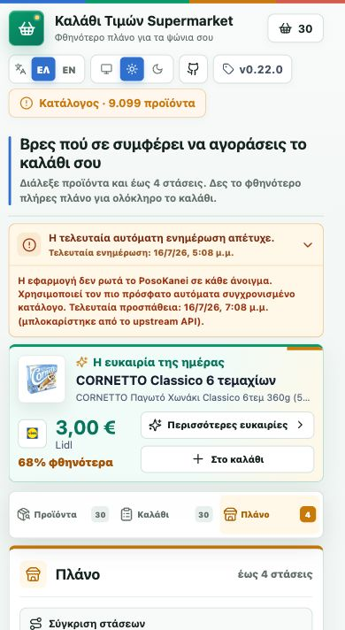

Version 0.21.0 static first paint, local warmed search, and deferred images:

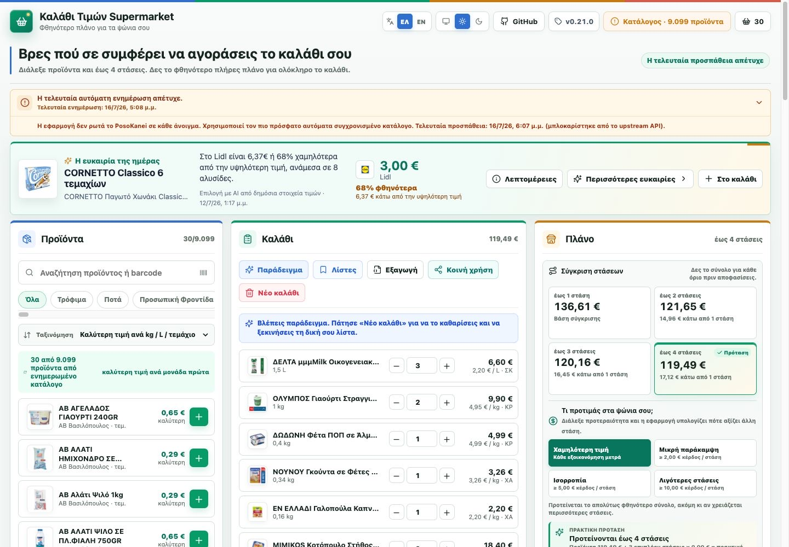

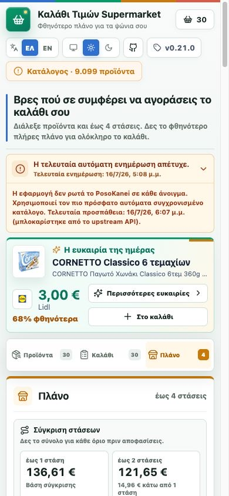

Version 0.20.0 performance-focused desktop and mobile interface:

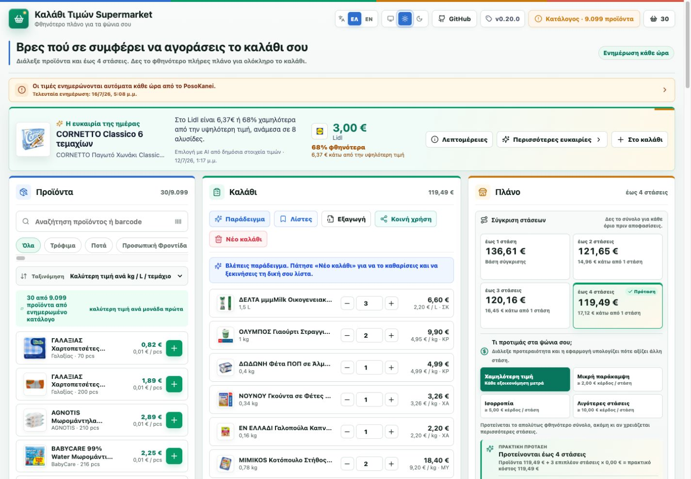

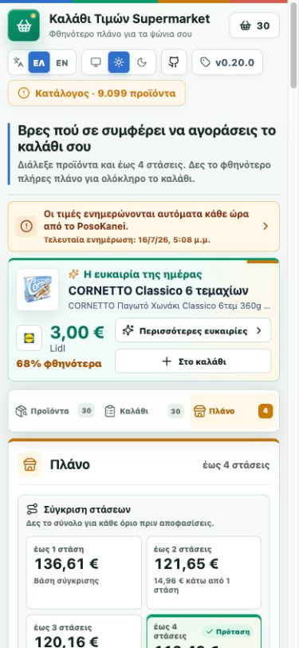

Version 0.19.0 value-aware product search and basket-aware quick add:

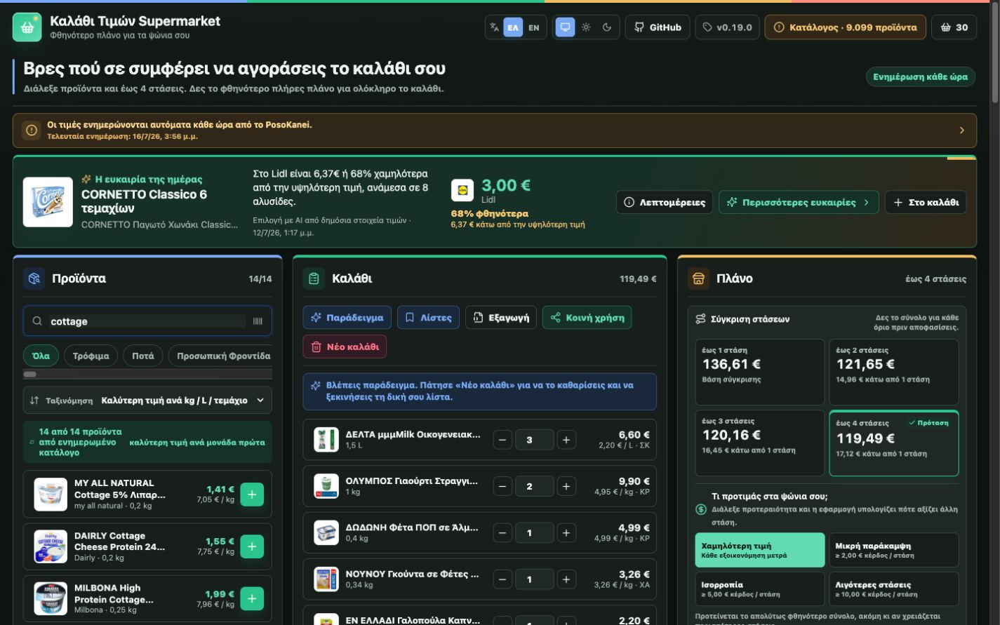

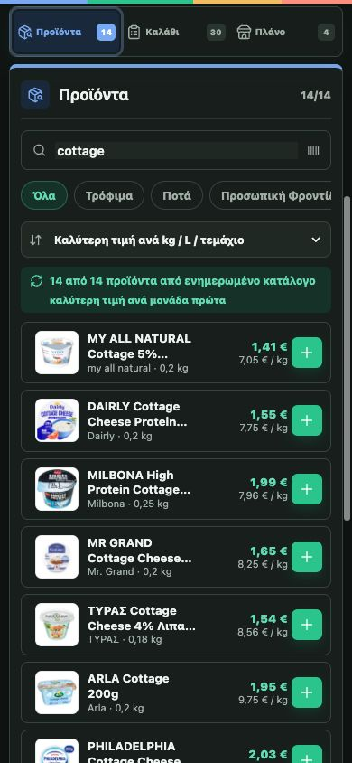

Version 0.18.0 on the new production domain:

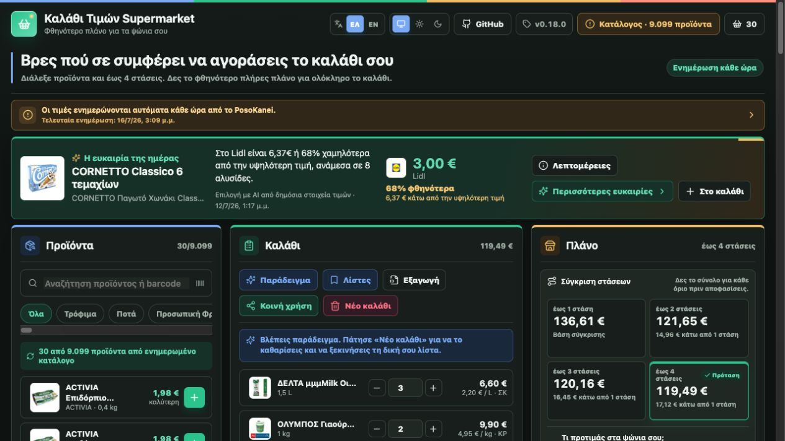

Compact self-hosted sharing on the new domain:


Product-level savings breakdown on desktop and mobile:


Stop-limit comparison with a practical recommendation:


Focused mobile plan view:


Redesigned English interface with Dark appearance:


Mobile English interface with Dark appearance:


Version 0.14.0 desktop workspace and featured daily product:


Version 0.14.0 mobile shopping-priority recommendation:


Expanded AI-assisted bargains on desktop and mobile:


Product detail, with a larger image for checking the exact product:


Shareable basket dialog:


Supermarket selection and grouped plan export:


Shopping checklist and combined nearby-stop route:


Shopping mode with remaining spend and unfinished-stop routing:


Reusable saved baskets with current-price restoration:


### Local Development

Requirements:

- Node.js 26+
- npm 11+

Install and run:

```bash
npm install
npm run dev
```

Open:

```text
http://127.0.0.1:5173/
```

### Build

```bash
npm run build
```

The static output is written to:

```text
dist/
```

### Validation

Core checks:

```bash
npm test
npm run lint
npm run build
npm audit --omit=dev
```

Browser QA covers:

- Desktop first viewport.
- Mobile 390px viewport.
- No horizontal overflow on mobile.
- Sticky Products/Basket/Plan mobile navigation, live counts, active-panel switching, and default Plan view.
- Compact catalogue freshness disclosure in collapsed and expanded states.
- Product-name wrapping, stable control dimensions, keyboard focus visibility, and Greek/English tab fit.
- No browser console errors.
- Greek/English interface switching and local preference persistence.
- Locale-aware dates, currency, accessibility labels, and copied plan text.
- System/Light/Dark theme switching, saved preference restoration, and system-theme resolution.
- Simultaneous one-to-four-stop total calculation and plan selection.
- Extra-stop estimate recommendation at `€0`, `€2`, `€5`, and `€10`.
- Persistence of the chosen stop limit and extra-stop estimate.
- Product add flow.
- Quantity update flow.
- Supermarket include/exclude filtering and local preference persistence.
- Automatic nearby-chain eligibility after location is enabled.
- Plan-specific shopping checklist persistence and reset behavior.
- Multi-stop Google Maps route generation from matched nearby branches.
- Remaining-spend calculation and All/Remaining checklist filtering.
- Per-chain completion controls and automatic removal of completed route stops.
- Grouped shopping-plan copy output.
- Share-link generation, copy feedback, and privacy explanation.
- Shared-basket restoration with quantities, selected stop limit, and retailer filter.
- Saved-list creation, same-name update, refresh persistence, current-catalogue restoration, and delete confirmation.
- Saved-list desktop/mobile layout, Greek/English copy, local-only privacy notice, and storage-failure feedback.
- Backward compatibility with version 1 share links.
- Invalid-link and missing-product handling.
- Product detail drawer open/close.
- Large product image in the detail drawer.
- Basket and catalog product thumbnails through the image proxy.
- Supermarket chain logos in desktop, mobile, and product-detail views.
- Optional location control in desktop and mobile layouts.
- Fake-geolocation QA for nearest-branch labels and selected-chain branch lists.
- Loading the official catalog.
- Live search for `γάλα`, including product photos.
- Adding an official live product to the basket and recalculating the plan.
- Update-status endpoint and scheduled-check script.

### PosoKanei API Discovery

The official PosoKanei web app is a Flutter application. Its compiled bundle references these backend routes:

- `POST https://api.posokanei.gov.gr/products/search`
- `GET https://api.posokanei.gov.gr/products/{id}?sort_retailers=asc&countries=GR&include_tax=true`
- `GET https://api.posokanei.gov.gr/products/barcode/{barcode}?countries=GR&include_tax=true`
- `GET https://api.posokanei.gov.gr/meta/categories`
- `GET https://api.posokanei.gov.gr/meta/categories/tree?include_counts=true&include_hidden=false`
- `GET https://api.posokanei.gov.gr/meta/retailers?countries=GR`
- `GET https://api.posokanei.gov.gr/meta/stats`

During development on 2026-06-18:

- `GET /meta/stats` returned live catalog counts around `8.8k` total products and `8.7k` active products.
- `GET /products?page=1&page_size=2&countries=GR` returned official product records with `image_url`, `price_stats`, `retailer_prices`, and category metadata.
- `POST /products/search` with `{ "title": "γάλα", "countries": ["GR"] }` returned `271` milk-related products.
- Product images are served from URLs like `https://api.posokanei.gov.gr/images/product/<id>?v=<version>`.

The official API does not allow the production site as a browser CORS origin, so direct `fetch()` calls from the static frontend are blocked. The app handles this with:

- A same-origin PHP proxy in `public/api/posokanei.php`.
- A cached update-status endpoint in `public/api/update-status.php`.
- A live catalog adapter in `src/posokaneiApi.js`.
- A server-side snapshot fallback that returns paginated/search JSON from `data/catalog.json` plus lightweight metadata from `data/catalog-meta.json`. This snapshot is script-built from PosoKanei API responses; it is not AI-generated.
- The snapshot and proxy preserve package and normalized unit prices separately, so `price_asc` and `unit_price` are genuinely different pre-pagination orderings.
- Snapshot stats are reconciled against the actual `catalog.json` product count so stale metadata does not show a different catalogue size from search results.
- A product-image proxy mode in `public/api/posokanei.php?resource=image`, used by thumbnails and the detail drawer.
- A retailer-logo proxy mode in `public/api/posokanei.php?resource=retailer-image`, used by rankings, route cards, and product detail price rows.
- A nearby-branch endpoint in `public/api/branches.php`, which accepts browser-approved coordinates and queries OpenStreetMap/Overpass for nearby `shop=supermarket` locations.
- A visible catalog and update-check status in the UI.
- Graceful fallback/status when the live proxy or upstream API fails.

Current production note, checked on 2026-06-23:

- `https://api.posokanei.gov.gr/meta/stats` returns `200` from allowed development/refresh environments.
- `https://kalathitimon.com/api/posokanei.php?resource=stats` returns `200` with `source: "snapshot"` because the PHP endpoint falls back to the refreshed catalogue when upstream rejects the Plesk server request.
- Vercel Node, Vercel Edge, and Cloudflare Worker probes also returned upstream `403`.
- The live app therefore uses `data/catalog.json` and `data/catalog-meta.json`, refreshed by an external scheduled sync from PosoKanei API data, and displays an amber notice with the latest catalogue update time.
- If a scheduled refresh attempt fails, `data/refresh-status.json` records the failed attempt time and reason. The UI then shows both the last successful catalogue update and the latest failed attempt, so stale data is visible instead of silent.
- The refresh script can also fetch through one SSH runner with `POSOKANEI_REFRESH_HOST`, or several fallback runners with `POSOKANEI_REFRESH_HOSTS=runner-a,runner-b`. This is useful when the deployment server or primary machine is blocked but another trusted environment can reach the public API.
- `data/catalog-meta.json` describes the last successful snapshot. `data/refresh-status.json` describes the last refresh attempt. Those timestamps can differ, and the UI is designed to make that distinction visible.

Why this can happen even on the same local network:

- Internet APIs generally cannot see a device MAC address; they see public egress, protocol, and request/client characteristics.
- Two machines on the same LAN can still use different public egress routes because of VPNs, split tunneling, IPv4 vs IPv6 routing, gateway rules, or ISP/CDN routing.
- WAF/CDN rules can also react differently to TLS/client fingerprints, for example macOS SecureTransport/LibreSSL versus Linux OpenSSL, even when the request path is the same.
- The workaround intentionally keeps upload credentials local: the SSH runner only builds the catalogue JSON, then the local refresh script pulls those files back and uploads them.

### Data Model

Products are normalized into this shape:

```js
{
  id: "milk-1l",
  gtin: "5201054020902",
  name: "Γάλα φρέσκο πλήρες 1L",
  brand: "Δέλτα",
  category: "Γαλακτοκομικά",
  unit: "τεμ.",
  unitQuantity: "1 L",
  imageUrl: "https://api.posokanei.gov.gr/images/product/...",
  prices: {
    sklavenitis: 1.74,
    ab_vasilopoulos: 1.82,
    lidl: 1.57
  }
}
```

Basket rankings are computed locally in `src/pricing.js`.

### Resilient Catalogue Publishing

Catalogue refreshes and complete deployments use atomic FTP publishing. Each
file is uploaded under a unique temporary name and is renamed over the public
destination only after the transfer succeeds. The previous complete catalogue
therefore remains available throughout the upload, avoiding the
temporary empty catalogue that can occur when PHP reads a partially written JSON
file.

Version 0.20.0 serves ordinary catalogue reads from the synchronized snapshot first,
so a known upstream `403` cannot add a failed network timeout to each visitor request.
The refresh pipeline publishes both the complete `catalog.json` source snapshot and
the smaller `catalog-runtime.json` used for request-time filtering. PHP reads the
compact file first and falls back to the complete snapshot if it is absent or invalid.
Small metadata requests read `catalog-meta.json` without decoding either product file.
An exclusive refresh lock skips overlapping hourly/manual runs, expires when stale,
and is always released after success or failure. Public verification retries a bounded
number of times and accepts a newer complete generation only when the full snapshot,
runtime snapshot, metadata, and successful status all carry the same timestamp.

Version 0.21.0 adds `catalog-bootstrap.json` to that atomic generation. The browser
starts fetching this small static payload from the document head, in parallel with
the hashed JavaScript and CSS, so the initial catalogue does not wait for PHP startup
or repeated JSON decoding. It contains the metadata, first 30 products for each sort
mode, and current example-basket products. The PHP bootstrap is retained as a fallback
for shared baskets and unavailable static data. Public refresh verification now
requires the full snapshot, runtime snapshot, startup catalogue, metadata, and status
to agree on the same generation timestamp before a refresh is accepted.

Version 0.22.0 keeps the same atomic files and generation checks while stripping the
startup payload to the 80 categories and Greek retailer fields the interface uses.
All three initial product sorts and every available example-basket product remain in
the file. The hourly refresh therefore regenerates the smaller bootstrap from the
same verified runtime catalogue rather than introducing a separate source of prices.

Version 0.27.0 also publishes `price-changes.json.gz` atomically and verifies the
same-generation [`api/price-changes.php`](https://kalathitimon.com/api/price-changes.php)
response on the primary domain and compatibility mirror. Browsers that accept gzip
receive the precompressed file, while the endpoint and app both retain an identity
JSON fallback. The refresh also publishes a line-delimited `catalog-details.jsonl`
sidecar. PHP scans only until it finds the requested product, returning its catalogue
description and richer observed history without decoding the complete catalogue into
memory. Both domains verify a real detail lookup after upload. Previous-catalogue
selection now fails closed: the publisher downloads and validates the production
catalogue itself before comparing prices, while a validated explicit previous
snapshot remains available for controlled history recovery.

Version 0.30.0 precompresses every production JavaScript/CSS asset and the startup
catalogue during `npm run build`. Each successful hourly refresh also writes Brotli
and Gzip companions for the full, runtime, metadata, bootstrap, price-change, CSV,
and daily-bargain files before publishing status. Apache content negotiation prefers
`.br`, uses `.gz` as a compatibility fallback, and keeps the original file available.
The compression-only command validates that local and public catalogue timestamps
match before it backfills only those companions:

```bash
npm run live:deploy:compression
```

The generated Service Worker caches only the versioned HTML shell and explicitly
leaves `/data/`, `/api/`, `/s/`, and all other non-app navigations to the network.
Its registration is delayed until after load and browser idle time, so installing
the repeat-navigation cache never competes with the first useful render.

After first paint, a module Web Worker loads `catalog-runtime.json` without blocking
the interface and builds three pre-sorted in-memory views. Once ready, product search,
barcode lookup, category filtering, sorting, and pagination run inside that worker;
the same PHP endpoints remain available before worker readiness or after a worker
failure. Product thumbnails add a viewport observer on top of native lazy loading,
which prevents rows clipped by the product and basket scroll containers from creating
requests prematurely.

The browser complements this with bounded retries for transient network, timeout,
rate-limit, and server failures. It tries the compact snapshot before the full
45-second fallback, removes failed snapshot promises from memory, and keeps a
45-second response cache that also deduplicates identical in-flight calls. The same
Safari or other browser session can therefore recover on a later action. The hourly macOS
LaunchAgent publishes refresh status last, retains the previous daily bargain if
its optional AI step fails, and keeps all FTP/OpenAI credentials on the local Mac.

`npm run live:deploy` publishes the root-domain build. `npm run live:deploy:mirror`
builds the legacy base path and publishes it with the separate `FTP_MIRROR_*`
settings. Both commands parse `.env.local` as data rather than sourcing it as a
shell script, so Keychain service labels may safely contain spaces and no secret
values need to be committed or printed.

For a narrowly scoped recovery, `npm run live:deploy:bootstrap` and
`npm run live:deploy:bootstrap:mirror` atomically publish only
`dist/data/catalog-bootstrap.json` and its matching `.br` and `.gz` files. This is useful when the application shell is
already live and the small first-paint payload has just been rebuilt from the
currently published runtime catalogue. It does not replace `npm run live:refresh`,
which remains responsible for generating and verifying a complete new catalogue
generation.

### Product/Price Update Checks

The app includes a lightweight update checker:

- `public/api/update-status.php` samples `meta/stats` plus a few representative product searches, fingerprints the result, and caches the status for 30 minutes.
- `npm run check:updates` calls the deployed endpoint with `?refresh=1` and writes the latest status to `.cache/posokanei-update-status.json`.
- `npm run catalog:snapshot` builds `public/data/catalog.json`, `public/data/catalog-meta.json`, the compact `public/data/catalog-runtime.json`, and the first-paint `public/data/catalog-bootstrap.json` from PosoKanei API responses. `npm run catalog:runtime` can regenerate only the compact file, while `npm run catalog:bootstrap` rebuilds the startup payload from an existing runtime catalogue.
- `npm run live:refresh` validates the last published catalogue, passes it to the selected refresh runner, and annotates notable per-chain price changes before generating the full, runtime, bootstrap, and metadata artifacts. Recent valid markers and compact per-chain history points are retained for seven days; no user, basket, or location data is involved.
- `npm run live:refresh` builds fresh full, metadata, runtime, startup, CSV price-change, compact JSON history, precompressed history, and line-delimited product-detail artifacts under the isolated `.cache/catalog-refresh-output/` staging directory, uploads them to the live FTP path, and verifies the public catalogue, price-change, rich-detail, and refresh-status generations.
- Catalogue and deployment files are uploaded to unique temporary FTP names and renamed into place only after each upload completes. Visitors therefore keep receiving the previous valid JSON during a refresh instead of a partially uploaded catalogue.
- After a successful snapshot build, `npm run live:refresh` runs the daily bargain date guard, uploads the staged `daily-bargain.json` when available, and verifies the published suggestion timestamp.
- When `npm run live:refresh` fails because the upstream API, SSH runner, or network route returns an error, it uploads the isolated staged `refresh-status.json` with `status: "failed"` so the deployed UI can show the latest failed attempt.
- `POSOKANEI_REFRESH_HOSTS` accepts a comma- or space-separated list of trusted SSH runners. The first successful runner wins, so the hourly refresh can continue if one host is asleep, offline, or temporarily blocked.
- The snapshot builder uses a browser-like request header by default because the upstream API can reject obvious automation `User-Agent` values with `HTTP 403`. `POSOKANEI_USER_AGENT` can override that header if the upstream rules change again.
- `npm run live:install-refresh` optionally installs a local hourly scheduler for environments that support macOS LaunchAgents. The job starts a non-interactive login shell; the refresh script reads the ignored `.env.local` itself, and the private OpenAI key is never uploaded.
- The UI reads `api/update-status.php` and shows the catalogue freshness in the amber status notice.
- Browser catalogue requests retry short network/server failures. The compact runtime snapshot is attempted first; the large full-snapshot fallback has a 45-second timeout and resets a failed cached request so Safari or another browser can recover without being trapped in an empty state.
- Product images are requested through `api/posokanei.php?resource=image&id=<product-id>&v=<version>&size=<pixels>` so the browser sees same-origin image URLs. The proxy requests size-appropriate WebP output from the image cache before falling back to the full upstream image. Search rows use `96px` thumbnails, compact rows use `72px`, and product details use `640px`. Versioned responses are immutable for one year in the browser cache. An explicit viewport observer prevents clipped, off-screen rows from creating requests until they are close to becoming visible.
- Retailer logos are requested through `api/posokanei.php?resource=retailer-image&id=<retailer-id>` and use the same fallback strategy.

For a cron job:

```bash
*/30 * * * * cd /path/to/posokanei-basket-demo && npm run check:updates
```

To refresh the fallback catalogue before deploying:

```bash
npm run catalog:snapshot
npm run build
```

To refresh only the live demo snapshot from an environment that can reach the API, configure `.env.local` from `.env.example`, then run:

```bash
npm run live:refresh
```

The refresh script reads deployment settings from environment variables or `.env.local`. Use either `FTP_PASS` or `FTP_KEYCHAIN_SERVICE` for FTP authentication.

Daily bargain generation additionally reads `OPENAI_API_KEY` from the private local
shell/LaunchAgent environment. It defaults to `OPENAI_BARGAIN_MODEL=gpt-5.6-sol`,
`OPENAI_BARGAIN_REASONING=high`, and `POSOKANEI_BARGAIN_TIME_ZONE=Europe/Athens`.
Do not put the key in Plesk, `public/`, `dist/`, committed files, or browser code.

If the current machine cannot reach `api.posokanei.gov.gr`, set `POSOKANEI_REFRESH_HOST` to a trusted SSH host that can reach it. The remote host only builds `catalog.json`, `catalog-meta.json`, and `catalog-runtime.json`; upload credentials stay local.

To install the hourly refresh job on macOS:

```bash
npm run live:install-refresh
```

The installer prints the scheduler and log paths for the local machine.

For Plesk Scheduled Tasks, a simple curl check is enough only when the Plesk server can reach the upstream API:

```bash
curl -fsS 'https://kalathitimon.com/api/update-status.php?refresh=1' >/dev/null
```

When Plesk is upstream-blocked, schedule `npm run live:refresh` on a machine, GitHub runner, or serverless worker that can reach `https://api.posokanei.gov.gr`.

### Deployment

See [DEPLOYMENT.md](DEPLOYMENT.md) for the Plesk/HostEurope upload path and
static artifact notes.

Short version:

```bash
npm run build
npm run live:deploy
```

`live:deploy` publishes the app and PHP endpoints but deliberately preserves the
current production `data/` directory. Update catalogue, freshness status, and daily
bargain data through the independently verified `npm run live:refresh` pipeline.
For a first installation or an intentional complete restore, opt in explicitly:

```bash
DEPLOY_INCLUDE_DATA=1 npm run live:deploy
```

### Limitations

- The live API adapter is best-effort because the PosoKanei API does not appear to have public documentation.
- As of 2026-06-23, request-time production proxies tested on Plesk, Vercel, and Cloudflare are upstream-blocked with `HTTP 403`; the live app therefore uses the latest script-built PosoKanei snapshot and serves ordinary reads from its compact `data/catalog-runtime.json`. The full `data/catalog.json` remains the source fallback. Both files are generated by the refresh script from public catalogue data, not generated by AI.
- The UI paginates the official catalogue; it does not render all products at once.
- The app can compare one-store baskets and multi-stop plans up to four chains.
- Multi-stop plans optimize product price within the location-eligible chains, but the optimizer does not yet include route time, parking, delivery fees, or road distance.
- It does not handle delivery fees, loyalty cards, substitutions, coupons, or in-store stock; geographic eligibility depends on OpenStreetMap branch coverage and naming.
- The daily bargain compares current prices across chains. The short app-observed history is not used as proof of a previous-price discount, so the suggestion must still be read as a current cross-chain comparison.
- A larger public deployment should add centralized error telemetry, request rate limiting, and an explicit policy check for upstream API usage.

### License

MIT
