# Καλάθι Τιμών Supermarket

## Ελληνικά

**Ζωντανή εφαρμογή:** [agenticspiros.com/demo/posokanei-basket](https://agenticspiros.com/demo/posokanei-basket/)

**Κώδικας:** [github.com/spirosrap/posokanei-basket-demo](https://github.com/spirosrap/posokanei-basket-demo)

**Τρέχουσα έκδοση:** `v0.14.0`

> Πρόκειται για ανεπίσημη εφαρμογή. Δεν συνδέεται επίσημα με το PosoKanei ή με κάποια αλυσίδα supermarket.

Το **Καλάθι Τιμών Supermarket** σε βοηθά να φτιάξεις μια λίστα με προϊόντα supermarket και να δεις πού συμφέρει να τα αγοράσεις συνολικά.

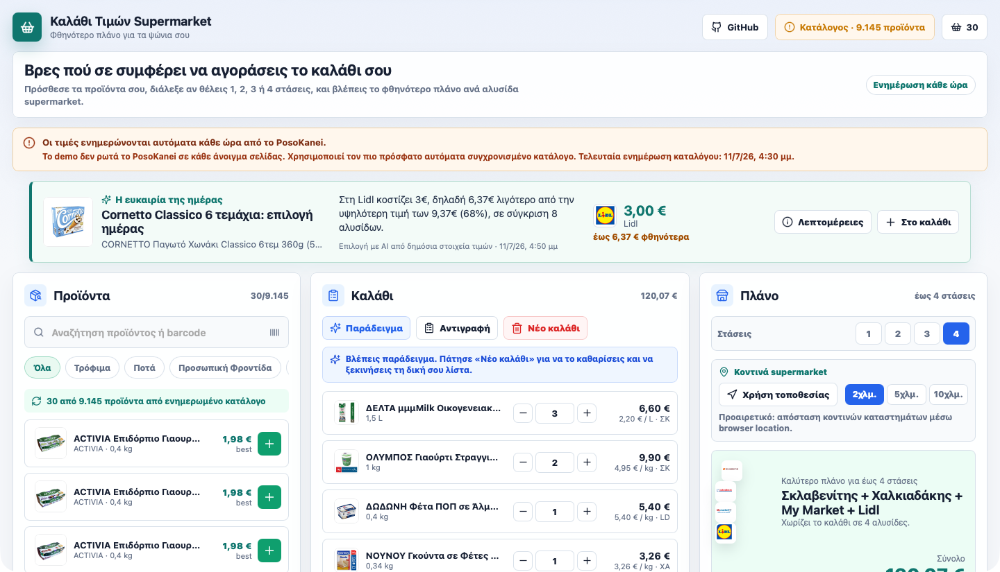

Η βασική ιδέα είναι απλή:

- Διαλέγεις προϊόντα από τον κατάλογο του PosoKanei.
- Προσθέτεις τις ποσότητες που θέλεις στο καλάθι.
- Επιλέγεις πόσες στάσεις είσαι διατεθειμένος να κάνεις: `1`, `2`, `3` ή `4` αλυσίδες.
- Η εφαρμογή βρίσκει το φθηνότερο πλήρες πλάνο για τη λίστα σου.
- Αν επιλέξεις περισσότερες από μία στάσεις, σου δείχνει τι αγοράζεις από κάθε αλυσίδα.

Για παράδειγμα, αν θέλεις να πας μόνο σε ένα supermarket, η εφαρμογή ταξινομεί τις αλυσίδες από τη φθηνότερη έως την ακριβότερη για ολόκληρο το καλάθι. Αν αντέχεις δύο ή τρεις στάσεις, υπολογίζει αν συμφέρει να χωριστεί η λίστα σε περισσότερες αλυσίδες.

Η εφαρμογή ανοίγει με καλάθι παραδείγματος, ώστε να φαίνεται αμέσως γιατί έχει νόημα η σύγκριση `1`, `2`, `3` ή `4` στάσεων. Το παράδειγμα είναι πιο ρεαλιστικό εβδομαδιαίο καλάθι ελληνικής οικογένειας, με γάλα, γιαούρτι, τυριά, αυγά, κοτόπουλο, ζυμαρικά, όσπρια, χυμούς, νερά, καθαριστικά και χαρτικά. Τα προϊόντα έχουν επιλεγεί ώστε να υπάρχουν αρκετές πλήρεις επιλογές και στο σενάριο της μίας στάσης, αλλά και να φαίνεται καθαρά πότε συμφέρει να μοιραστεί η λίστα σε δύο, τρεις ή τέσσερις αλυσίδες. Ο χρήστης μπορεί να πατήσει καθαρισμό και να ξεκινήσει δική του λίστα χωρίς να χρειάζεται να καταλάβει κάποιο ξεχωριστό demo mode.

### Σύγκριση στάσεων και πρακτική πρόταση

Η έκδοση `v0.6.0` εμφανίζει ταυτόχρονα το φθηνότερο πλήρες σύνολο για όριο `1`, `2`, `3` και `4` στάσεων. Κάθε επιλογή δείχνει την πραγματική τιμή των προϊόντων και την οικονομία σε σχέση με μία στάση. Τα όρια σημαίνουν «έως»: αν το ίδιο φθηνότερο πλάνο χρειάζεται λιγότερες αλυσίδες, ο optimizer δεν προσθέτει άσκοπη στάση. Ο χρήστης επιλέγει οποιοδήποτε αποτέλεσμα και το αναλυτικό πλάνο, το καλάθι και η αντιγραφή λίστας ενημερώνονται αμέσως.

Για πιο ρεαλιστική απόφαση, ο χρήστης μπορεί να επιλέξει πόση εξοικονόμηση χρειάζεται για να αξίζει κάθε επιπλέον supermarket: `0 €`, `2 €`, `5 €` ή `10 €`. Για παράδειγμα, με επιλογή `5 €`, μία ακόμη στάση προτείνεται μόνο αν η χαμηλότερη τιμή των προϊόντων καλύπτει πάνω από `5 €` επιπλέον χρόνου, καυσίμων ή εισιτηρίων. Η «Πρακτική πρόταση» δείχνει καθαρά τον αριθμό επιπλέον στάσεων και τον σχετικό υπολογισμό. Η εκτίμηση δεν αλλάζει ποτέ το σύνολο αγορών, δεν αποτελεί τιμή του PosoKanei και δεν αποστέλλεται σε κοινόχρηστους συνδέσμους. Η εκτίμηση και το επιλεγμένο όριο στάσεων αποθηκεύονται μόνο τοπικά στον browser.

Η έκδοση `v0.6.1` μετονομάζει και επεξηγεί αυτό το εργαλείο ως «Πότε αξίζει άλλη στάση;», ώστε η χρησιμότητά του να γίνεται άμεσα κατανοητή πριν ο χρήστης επιλέξει ποσό.

Η έκδοση `v0.6.2` κάνει την ενεργή τοποθεσία πραγματικό φίλτρο διαθεσιμότητας: οι τιμές, η κατάταξη, τα πλάνα στάσεων, οι καλύτερες τιμές προϊόντων και η καθημερινή πρόταση χρησιμοποιούν μόνο αλυσίδες με αναγνωρισμένο κοντινό υποκατάστημα μέσα στην επιλεγμένη ακτίνα.

Η έκδοση `v0.7.0` μετατρέπει το αποτέλεσμα σε πρακτικό εργαλείο αγορών: κάθε προϊόν του επιλεγμένου πλάνου έχει checkbox, η πρόοδος αποθηκεύεται τοπικά για το συγκεκριμένο πλάνο και, όταν είναι ενεργή η τοποθεσία, δημιουργείται κοινή διαδρομή προς τα πλησιέστερα υποκαταστήματα όλων των στάσεων.

Η έκδοση `v0.8.0` προσθέτει λειτουργία αγορών για χρήση μέσα στα καταστήματα: εμφανίζει το ποσό που απομένει, πρόοδο ανά αλυσίδα, γρήγορη ολοκλήρωση ολόκληρης στάσης και προβολή μόνο των προϊόντων που δεν έχουν αγοραστεί. Όταν ολοκληρωθεί μία αλυσίδα, αφαιρείται αυτόματα από τη διαδρομή των υπόλοιπων στάσεων.

Η έκδοση `v0.9.0` προσθέτει επαναχρησιμοποιούμενες αποθηκευμένες λίστες. Ο χρήστης μπορεί να δώσει όνομα στο τρέχον καλάθι, να το ανοίξει ξανά αργότερα και να πάρει νέο υπολογισμό με τις διαθέσιμες τιμές του πιο πρόσφατου καταλόγου.

Η έκδοση `v0.10.0` ανασχεδιάζει την καθημερινή χρήση της εφαρμογής. Στο κινητό, τα «Προϊόντα», «Καλάθι» και «Πλάνο» λειτουργούν ως τρεις άμεσες προβολές με σταθερό επιλογέα, αντί να εμφανίζονται διαδοχικά σε μία πολύ μεγάλη σελίδα. Σε desktop και mobile βελτιώνονται η οπτική ιεραρχία, η πυκνότητα, η ανάγνωση ονομάτων προϊόντων, οι ομάδες ενεργειών, τα σύνολα και οι καταστάσεις εστίασης.

Η έκδοση `v0.11.0` εστιάζει στην ταχύτερη κατανόηση και χρήση. Στο κινητό συμπτύσσονται η κεφαλίδα, η εισαγωγή και η καθημερινή ευκαιρία, ώστε ο επιλογέας «Προϊόντα / Καλάθι / Πλάνο» και το πραγματικό αποτέλεσμα να εμφανίζονται ήδη στην πρώτη οθόνη. Το πλήθος προϊόντων μένει δίπλα στον τίτλο, οι δευτερεύουσες ενέργειες του καλαθιού γίνονται πιο συμπαγείς και κάθε κύρια ενότητα αποκτά ξεχωριστή χρωματική ταυτότητα. Στο πλάνο, η πρακτική πρόταση εμφανίζεται πριν από τις προαιρετικές ρυθμίσεις τοποθεσίας και αλυσίδων.

Η έκδοση `v0.12.0` αντικαθιστά τη δυσνόητη αριθμητική εκτίμηση ανά στάση με τέσσερις κατανοητές προτεραιότητες: «Χαμηλότερη τιμή», «Μικρή παράκαμψη», «Ισορροπία» και «Λιγότερες στάσεις». Η πρακτική πρόταση δείχνει πλέον το συνολικό ποσοστό κέρδους, το κέρδος ανά επιπλέον supermarket και προσφέρει άμεσο κουμπί εφαρμογής του προτεινόμενου πλάνου.

Η έκδοση `v0.13.0` εξηγεί από πού προκύπτει η εξοικονόμηση του επιλεγμένου πλάνου. Συγκρίνει κάθε προϊόν με το φθηνότερο πλήρες καλάθι μίας στάσης, προβάλλει τα προϊόντα που συνεισφέρουν περισσότερο στο κέρδος και συμφωνεί το άθροισμά τους με τη συνολική οικονομία. Αν κάποιο προϊόν κοστίζει περισσότερο στο πλάνο πολλών στάσεων, εμφανίζει ξεχωριστά αυτό το αντιστάθμισμα ώστε το αποτέλεσμα να παραμένει διαφανές.

Η έκδοση `v0.14.0` ανανεώνει ολόκληρη την οπτική εμπειρία χωρίς να αλλάζει τιμές ή υπολογισμούς. Μπλε, πράσινες, κεχριμπαρένιες και κοραλλί λεπτομέρειες δίνουν ξεχωριστή ταυτότητα στην πλοήγηση, στο καλάθι, στο πλάνο και στις ευκαιρίες. Οι φωτογραφίες προϊόντων, τα αποτελέσματα και οι ενεργές επιλογές αποκτούν καθαρότερο βάθος και πιο άμεση ανάδραση, ενώ οι διακριτικές κινήσεις απενεργοποιούνται αυτόματα όταν ο χρήστης έχει ενεργό το `reduced motion`.

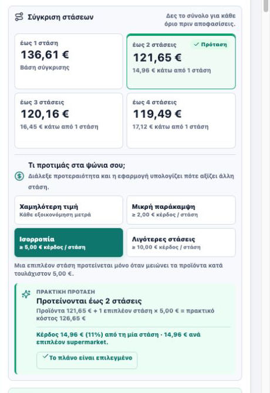

### Ανάλυση εξοικονόμησης

Κάτω από το επιλεγμένο πλάνο, η εφαρμογή δείχνει πλέον τα ακριβή προϊόντα που κάνουν τη διαφορά. Για κάθε προϊόν εμφανίζονται η τιμή του στο φθηνότερο πλήρες supermarket μίας στάσης, η τιμή και η αλυσίδα του επιλεγμένου πλάνου, καθώς και το καθαρό κέρδος. Οι ποσότητες του καλαθιού υπολογίζονται κανονικά, ενώ τα ονόματα προϊόντων παραμένουν ακριβώς όπως δημοσιεύονται από το PosoKanei και δεν μεταφράζονται αυτόματα.

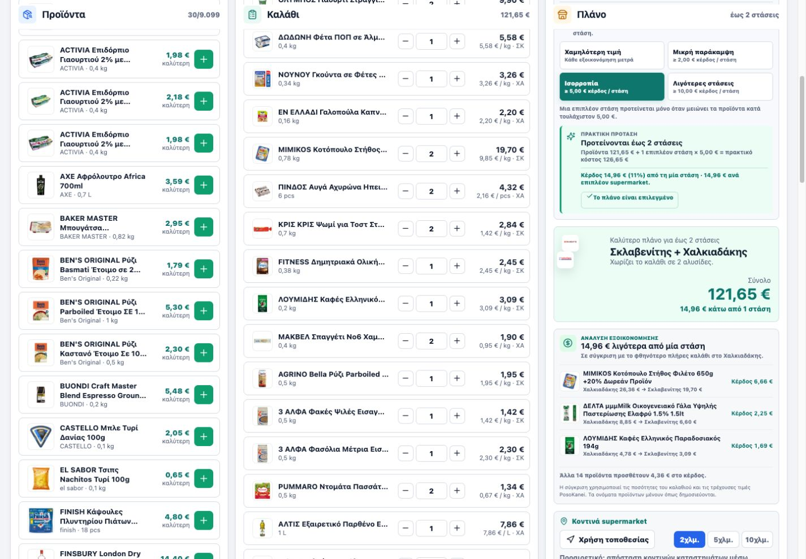

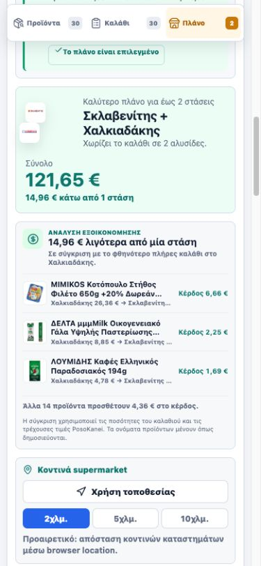

### Γλώσσα και θέμα εμφάνισης

Η έκδοση `v0.5.0` προσθέτει πλήρη επιλογή ελληνικών ή αγγλικών απευθείας από την κορυφή της εφαρμογής. Μεταφράζονται όλες οι ενέργειες, οι καταστάσεις φόρτωσης και ενημέρωσης, οι επεξηγήσεις, τα στοιχεία προσβασιμότητας, οι ημερομηνίες, τα ποσά και το πλάνο αγορών που αντιγράφεται. Η προτίμηση αποθηκεύεται μόνο στον browser και παραμένει ενεργή μετά από ανανέωση της σελίδας. Τα ονόματα, οι κατηγορίες και οι περιγραφές προϊόντων παραμένουν όπως δημοσιεύονται από το PosoKanei, ώστε να μην αλλοιώνεται ο επίσημος κατάλογος.

Στην ίδια έκδοση υπάρχει επιλογή θέματος `Σύστημα`, `Φωτεινό` ή `Σκοτεινό`. Το `Σύστημα` ακολουθεί αυτόματα την τρέχουσα ρύθμιση του λειτουργικού, ακόμη κι αν αλλάξει όσο η εφαρμογή είναι ανοιχτή. Η επιλογή αποθηκεύεται ανεξάρτητα από τη γλώσσα και εφαρμόζεται πριν φορτώσει το React, αποφεύγοντας λευκό flash ή λάθος θέμα κατά την εκκίνηση, ιδιαίτερα στο Safari.

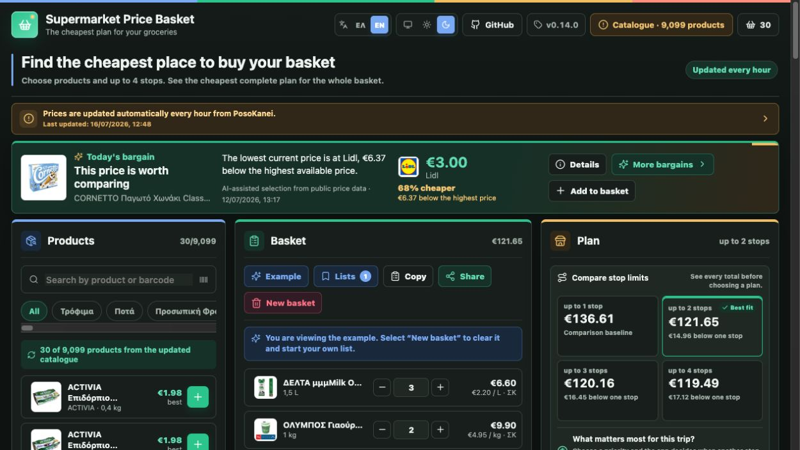

### Ανασχεδιασμός και mobile workspace

Η έκδοση `v0.10.0` διατηρεί την πυκνή, λειτουργική διάταξη σύγκρισης αλλά αφαιρεί περιττό οπτικό βάρος. Η εισαγωγή δεν εμφανίζεται πλέον σαν ξεχωριστή αιωρούμενη κάρτα, οι τρεις κύριες στήλες έχουν καθαρότερες επικεφαλίδες και αναλογίες, τα προϊόντα χωρούν έως δύο γραμμές τίτλου και το συνοπτικό αποτέλεσμα του καλαθιού εμφανίζεται ως μία ενιαία γραμμή με διαχωριστικά. Τα κουμπιά, τα πεδία, οι κάρτες αποτελεσμάτων και οι καταστάσεις hover/focus έχουν συνεπή αντίθεση σε φωτεινό και σκοτεινό θέμα.

Στο κινητό εμφανίζεται σταθερός επιλογέας «Προϊόντα / Καλάθι / Πλάνο» με τους αντίστοιχους μετρητές. Προβάλλεται μόνο η ενεργή ενότητα, οπότε ο χρήστης μετακινείται άμεσα από την αναζήτηση στη λίστα και στο αποτέλεσμα χωρίς μεγάλο scroll. Όταν υπάρχει καλάθι, η αρχική mobile προβολή είναι το πλάνο, ώστε η οικονομικότερη επιλογή να είναι άμεσα ορατή. Η ένδειξη ενημέρωσης καταλόγου έγινε συμπαγής και επεκτάσιμη: η τελευταία επιτυχής ώρα παραμένει πάντα ορατή, ενώ οι τεχνικές λεπτομέρειες ανοίγουν μόνο όταν χρειάζονται. Σε αποτυχία ενημέρωσης ανοίγει αυτόματα.

Η έκδοση `v0.11.0` μειώνει ακόμη περισσότερο τον χώρο πριν από το κύριο εργαλείο στο κινητό. Το GitHub και οι δευτερεύουσες ενέργειες χρησιμοποιούν αναγνωρίσιμα εικονίδια, η καθημερινή ευκαιρία κρατά μόνο τα στοιχεία που χρειάζονται για γρήγορη απόφαση και το «Νέο καλάθι» παραμένει καθαρά ορατό κάτω από τις συμπαγείς ενέργειες λίστας. Οι μπλε, πράσινες και πορτοκαλί λεπτομέρειες ξεχωρίζουν αντίστοιχα Προϊόντα, Καλάθι και Πλάνο χωρίς να αλλάζουν τη λειτουργική πυκνότητα της desktop διάταξης. Η σύντομη περιγραφή σκοπού εξηγεί πλέον άμεσα ότι το αποτέλεσμα αφορά ολόκληρο το καλάθι.

Η έκδοση `v0.14.0` κάνει το λειτουργικό workspace πιο ζεστό και ευχάριστο: προσθέτει πολυχρωματική αλλά συγκρατημένη παλέτα αγοράς, καλύτερη ανάδειξη φωτογραφιών και λογοτύπων, πιο απτές καταστάσεις hover/επιλογής και πιο πλούσια παρουσίαση της καθημερινής ευκαιρίας και του προτεινόμενου πλάνου. Το σκοτεινό θέμα μετακινείται από το μπλε-γκρι σε ουδέτερες πράσινες και ανθρακί επιφάνειες, διατηρώντας την αντίθεση. Όλες οι διαστάσεις παραμένουν σταθερές, η διάταξη έχει ελεγχθεί από `320px` έως μεγάλο desktop και οι κινήσεις σέβονται την προτίμηση προσβασιμότητας του λειτουργικού.


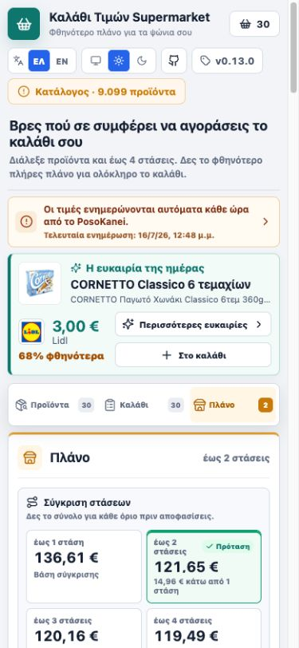

### Επιλογή αλυσίδων και πρακτικό πλάνο

Από την έκδοση `v0.4.0`, ο χρήστης μπορεί να ανοίξει την ενότητα «Αλυσίδες στον υπολογισμό» και να επιλέξει ποιες αλυσίδες θέλει πραγματικά να εξετάσει. Η κατάταξη, τα πλήρη καλάθια μίας στάσης και η βελτιστοποίηση έως τεσσάρων στάσεων υπολογίζονται αμέσως μόνο με τις επιλεγμένες αλυσίδες. Παραμένει πάντα ενεργή τουλάχιστον μία αλυσίδα και η επιλογή αποθηκεύεται τοπικά στον browser.

Μετά την προαιρετική ενεργοποίηση τοποθεσίας, η εφαρμογή αποκλείει αυτόματα από τον υπολογισμό τις αλυσίδες χωρίς αναγνωρισμένο υποκατάστημα μέσα στην τρέχουσα ακτίνα. Η σχετική ένδειξη εξηγεί πόσες κοντινές αλυσίδες συμμετέχουν, ενώ η λίστα επιλογής εμφανίζει μόνο αυτές. Ο χρήστης μπορεί να αφαιρέσει επιπλέον κοντινές αλυσίδες χειροκίνητα. Ο καθαρισμός της τοποθεσίας επαναφέρει όλες τις αλυσίδες. Η τοποθεσία δεν αποθηκεύεται στον σύνδεσμο ή στο καλάθι.

Το κουμπί «Αντιγραφή πλάνου» δημιουργεί έτοιμη λίστα αγορών ομαδοποιημένη ανά supermarket, με ποσότητες, υποσύνολα, συνολικό κόστος και αριθμό στάσεων. Έτσι το αποτέλεσμα της σύγκρισης μπορεί να χρησιμοποιηθεί πρακτικά μέσα στο κατάστημα ή να σταλεί ως απλό κείμενο.

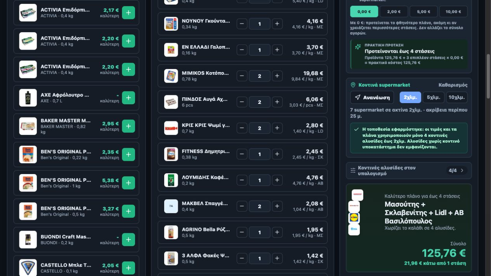

### Λίστα αγορών και διαδρομή

Στην έκδοση `v0.7.0`, τα προϊόντα του πλάνου λειτουργούν ως λίστα αγορών. Ο χρήστης μπορεί να σημειώνει όσα αγόρασε, να βλέπει τη συνολική πρόοδο και να μηδενίζει τη λίστα από το σχετικό εικονίδιο. Η πρόοδος συνδέεται με τα συγκεκριμένα προϊόντα, τις ποσότητες και την ανάθεση ανά αλυσίδα, αποθηκεύεται μόνο στον browser και δεν περιλαμβάνεται σε κοινόχρηστους συνδέσμους.

Με ενεργή την τοποθεσία, η εφαρμογή επιλέγει το πλησιέστερο αναγνωρισμένο υποκατάστημα για κάθε αλυσίδα του πλάνου και προτείνει σειρά στάσεων ξεκινώντας από την τρέχουσα θέση. Το κουμπί «Άνοιγμα διαδρομής» στέλνει την αφετηρία και τα υποκαταστήματα στο Google Maps, το οποίο υπολογίζει την πραγματική οδική διαδρομή. Η εφαρμογή δεν αποθηκεύει την τοποθεσία ή τη διαδρομή.

Στην έκδοση `v0.8.0`, η γραμμή αγορών δείχνει πόσα προϊόντα και πόση αξία απομένουν. Η επιλογή «Υπόλοιπα» κρύβει όσα έχουν ήδη αγοραστεί, ενώ κάθε κάρτα αλυσίδας έχει δική της μπάρα προόδου και εικονίδιο για ολοκλήρωση ή επαναφορά ολόκληρης στάσης. Η διαδρομή ενημερώνεται από την ίδια πρόοδο: ολοκληρωμένες αλυσίδες παραλείπονται, η επόμενη στάση αναφέρεται καθαρά και, όταν ολοκληρωθεί όλη η λίστα, εμφανίζεται τελική επιβεβαίωση αντί για άχρηστη διαδρομή.

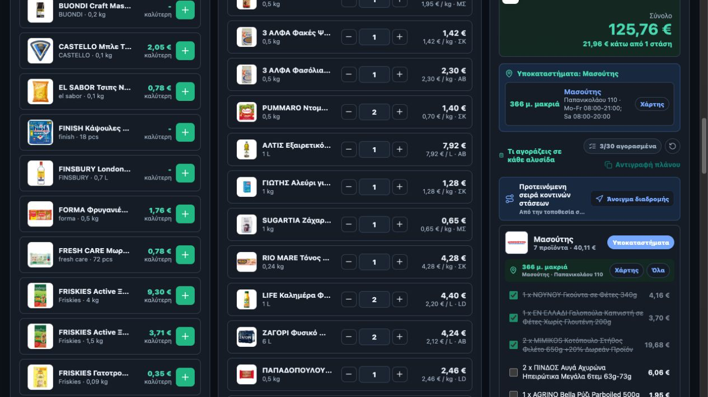

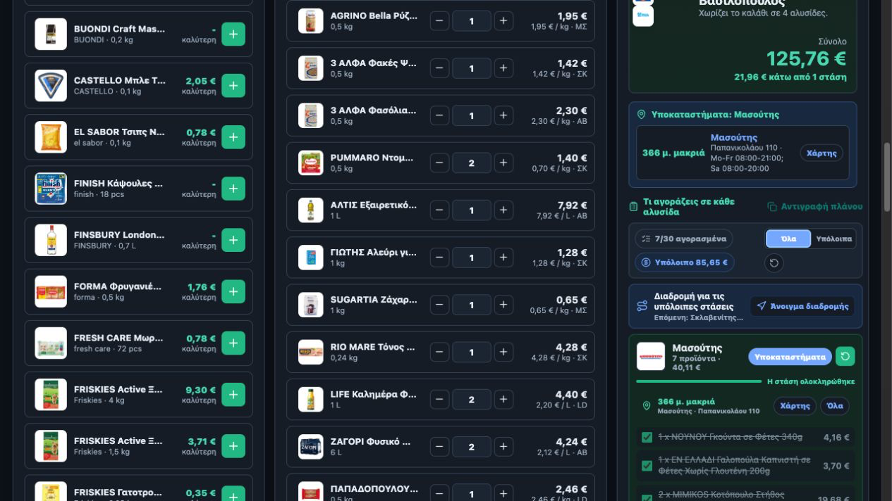

### Αποθηκευμένες λίστες

Στην έκδοση `v0.9.0`, το κουμπί «Λίστες» αποθηκεύει έως 12 καλάθια με όνομα στον συγκεκριμένο browser. Κάθε λίστα κρατά τους κωδικούς προϊόντων, τις ποσότητες, το όριο στάσεων, τις επιλεγμένες αλυσίδες και την προσωπική εκτίμηση κόστους επιπλέον στάσης. Η αποθήκευση με το ίδιο όνομα ενημερώνει την υπάρχουσα λίστα, ενώ η διαγραφή έχει ξεχωριστή επιβεβαίωση.

Όταν ανοίγει μια λίστα, η εφαρμογή αναζητά τα προϊόντα στον τρέχοντα κατάλογο και υπολογίζει ξανά τιμές, κατάταξη και φθηνότερο πλάνο. Δεν αποθηκεύεται παλιό στιγμιότυπο τιμών. Αν κάποιο προϊόν δεν υπάρχει πλέον, τα υπόλοιπα φορτώνονται κανονικά και εμφανίζεται σχετική ενημέρωση. Οι λίστες μένουν μόνο στον browser και δεν περιέχουν τοποθεσία, κοντινά υποκαταστήματα ή πρόοδο αγορών.

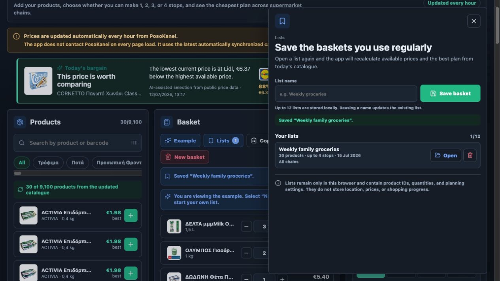

### Κοινόχρηστα καλάθια

Το κουμπί «Κοινή χρήση» δημιουργεί σύνδεσμο για το τρέχον καλάθι. Από την έκδοση `v0.4.0`, ο σύνδεσμος κρατά τα συγκεκριμένα προϊόντα, τις ποσότητες, το επιλεγμένο όριο `1` έως `4` στάσεων και τις αλυσίδες που συμμετέχουν στον υπολογισμό. Όταν τον ανοίξει κάποιος άλλος, η εφαρμογή φορτώνει τα αντίστοιχα προϊόντα από τον πιο πρόσφατο κατάλογο και υπολογίζει ξανά τις διαθέσιμες τιμές, την κατάταξη αλυσίδων και το φθηνότερο πλάνο. Έτσι ο σύνδεσμος μοιράζεται τη λίστα και τις προτιμήσεις αγορών, όχι ένα παλιό στιγμιότυπο τιμών. Οι σύνδεσμοι της έκδοσης `v0.3.0` παραμένουν συμβατοί και ανοίγουν με όλες τις αλυσίδες ενεργές.

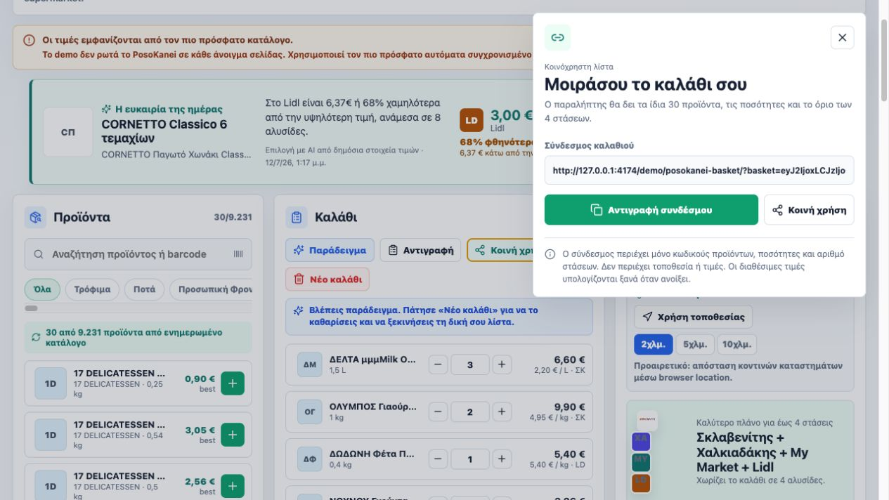

Η εισαγωγή είναι ανθεκτική σε αλλαγές καταλόγου: αν κάποιο προϊόν δεν υπάρχει πλέον, το υπόλοιπο καλάθι ανοίγει κανονικά και εμφανίζεται σαφής προειδοποίηση. Μετά την επιτυχημένη εισαγωγή, η παράμετρος αφαιρείται από τη γραμμή διεύθυνσης ώστε μια μελλοντική ανανέωση να μη γυρίσει τον χρήστη στην αρχική κοινόχρηστη έκδοση, ενώ το καλάθι συνεχίζει να αποθηκεύεται τοπικά όπως πριν.

Ο σύνδεσμος χρησιμοποιεί μικρό, versioned και ελεγμένο payload με έως 60 προϊόντα. Περιέχει μόνο κωδικούς προϊόντων, ποσότητες, αριθμό στάσεων και κωδικούς επιλεγμένων αλυσίδων: δεν περιέχει τοποθεσία, κοντινά καταστήματα, τιμές ή άλλα προσωπικά δεδομένα. Το same-origin `products-by-ids` endpoint επιστρέφει μόνο τα προϊόντα του καλαθιού από το τελευταίο snapshot, αντί να αναγκάζει κάθε παραλήπτη να κατεβάζει ολόκληρο τον κατάλογο. Υποστηρίζονται αντιγραφή συνδέσμου, το native share sheet όπου διατίθεται και fallback επιλογής του συνδέσμου για αυστηρότερα περιβάλλοντα Safari/clipboard.

### Ευκαιρία της ημέρας

Η «Ευκαιρία της ημέρας» προτείνει καθημερινά ένα προϊόν που μπορεί να αξίζει την προσοχή του χρήστη. Η κάρτα δείχνει το συγκεκριμένο προϊόν και τη φωτογραφία του, τη φθηνότερη αλυσίδα, την τρέχουσα τιμή, πόσο χαμηλότερη είναι από την υψηλότερη τρέχουσα τιμή στις υπόλοιπες αλυσίδες, σύνδεσμο λεπτομερειών και κουμπί προσθήκης στο καλάθι. Το νέο κουμπί «Περισσότερες ευκαιρίες» ανοίγει ξεχωριστή σελίδα με εννέα συνολικά καθημερινές επιλογές: την κεντρική πρόταση και οκτώ επιπλέον προϊόντα, όλα με λεπτομέρειες και άμεση προσθήκη στο ίδιο αποθηκευμένο καλάθι. Το ποσοστό είναι σύγκριση τιμών του ίδιου προϊόντος μεταξύ αλυσίδων την ίδια χρονική περίοδο, όχι ιστορική έκπτωση ή σύγκριση με προηγούμενη τιμή.

Ο κώδικας υπολογίζει πρώτα τις πραγματικές τιμές του ίδιου προϊόντος ανά αλυσίδα, τη διαφορά από τη φθηνότερη έως την ακριβότερη επιλογή και πόσες αλυσίδες συμμετέχουν. Στη συνέχεια το `gpt-5.6-sol`, με `high` reasoning και standard service speed, επιλέγει εννέα διαφορετικά προϊόντα από την ήδη επαληθευμένη λίστα και γράφει μία σύντομη ελληνική αιτιολόγηση για το καθένα. Το AI δεν υπολογίζει και δεν αλλάζει τιμές, δεν εφευρίσκει ιστορικό έκπτωσης και δεν λαμβάνει δεδομένα χρηστών.

Η παραγωγή γίνεται μία φορά την ημέρα στο Mac που εκτελεί ήδη τον συγχρονισμό του καταλόγου. Στον Plesk ανεβαίνει μόνο το δημόσιο `data/daily-bargain.json`, μαζί με το όνομα, την εικόνα, τις επαληθευμένες τιμές και το κείμενο της πρότασης. Το `OPENAI_API_KEY` μένει στο ιδιωτικό περιβάλλον του Mac, δεν περιλαμβάνεται στο repository ή στο build και δεν στέλνεται ποτέ στον browser ή στον web server.

Ο κώδικας είναι δημόσιος στο GitHub: [github.com/spirosrap/posokanei-basket-demo](https://github.com/spirosrap/posokanei-basket-demo). Η εφαρμογή έχει και σύνδεσμο `GitHub` στην κορυφή της σελίδας, ώστε όποιος τη δοκιμάζει να μπορεί να δει άμεσα το repository.

Η εφαρμογή προσπαθεί πρώτα να διαβάσει live προϊόντα, φωτογραφίες και τιμές μέσω μικρού PHP proxy, επειδή το επίσημο API δεν επιτρέπει απευθείας browser requests από τρίτα domains. Αν ο proxy μπλοκαριστεί, ο ίδιος PHP endpoint απαντά από τον πιο πρόσφατο συγχρονισμένο κατάλογο, σε μικρές σελίδες αποτελεσμάτων, ώστε ο browser να μη φορτώνει ολόκληρο το αρχείο. Οι φωτογραφίες προϊόντων περνούν επίσης από same-origin proxy, για να εμφανίζονται σταθερά σε Safari και σε browsers που μπλοκάρουν ή απορρίπτουν τα direct image requests.

Τα λογότυπα των αλυσίδων διαβάζονται από τα retailer metadata του PosoKanei και περνούν από το ίδιο same-origin proxy, ώστε το πλάνο να δείχνει πραγματικά supermarket logos αντί για αρχικά γραμμάτων. Για λίγες αλυσίδες υπάρχουν fallback logo URLs από επίσημες ή δημόσιες πηγές, αν η upstream εικόνα δεν φορτώσει.

Προαιρετικά, ο χρήστης μπορεί να πατήσει «Χρήση τοποθεσίας» για να περιορίσει τη σύγκριση σε κοντινές αλυσίδες και να δει αποστάσεις τύπου `57 μ. μακριά`. Η τοποθεσία ζητείται από τον browser μόνο μετά από ενέργεια του χρήστη, το app τη στέλνει στο δικό του `api/branches.php` endpoint με `no-store` cache, και το endpoint αναζητά supermarket στο OpenStreetMap/Overpass. Οι αποστάσεις είναι ευθεία γραμμή και βοηθητικές, όχι πλοήγηση με διαδρομή/κίνηση.

Με ενεργή την τοποθεσία, αλυσίδες χωρίς κοντινό υποκατάστημα δεν εμφανίζονται ούτε επηρεάζουν το φθηνότερο πλάνο. Ο χρήστης μπορεί να αλλάξει ακτίνα αναζήτησης (`2χλμ.`, `5χλμ.`, `10χλμ.`), να δει τα κοντινά υποκαταστήματα ανά επιλέξιμη αλυσίδα και να ανοίξει σύνδεσμο χάρτη. Επειδή τα στοιχεία καταστημάτων προέρχονται από το OpenStreetMap, η κάλυψη εξαρτάται από την πληρότητα και την ονομασία των καταχωρίσεων της περιοχής.

Στις 2026-06-23 ο upstream API είναι προσβάσιμος από ορισμένα περιβάλλοντα, αλλά ο Plesk server του demo παίρνει `HTTP 403` από `api.posokanei.gov.gr`. Δοκιμάστηκαν επίσης Vercel Node/Edge και Cloudflare Worker, και μπλοκαρίστηκαν με `HTTP 403`. Γι' αυτό το live demo χρησιμοποιεί αυτόματα ανανεωμένο κατάλογο από περιβάλλον που μπορεί να φτάσει το API, δείχνει την ώρα τελευταίας ενημέρωσης στην κορυφή, και σερβίρει αναζήτηση/σελίδες προϊόντων από PHP fallback.

Σημαντική λεπτομέρεια: το block δεν φαίνεται να είναι θέμα συσκευής ή MAC address. Ένας δημόσιος API server συνήθως δεν βλέπει MAC addresses. Ακόμα και συσκευές στο ίδιο τοπικό δίκτυο μπορούν να φαίνονται διαφορετικές προς το upstream λόγω διαφορετικού public egress IP, VPN/split tunnel, IPv4/IPv6 διαδρομής, CDN/WAF κανόνων ή TLS/client fingerprint. Γι' αυτό το refresh script υποστηρίζει trusted SSH runner: το κατέβασμα γίνεται από περιβάλλον που επιτρέπεται, ενώ τα deployment credentials μένουν τοπικά.

Ο συγχρονισμός του καταλόγου είναι πλέον ανθεκτικός σε διακοπές κατά το ανέβασμα. Το νέο μεγάλο αρχείο ανεβαίνει πρώτα με προσωρινό όνομα και αντικαθιστά τον προηγούμενο κατάλογο μόνο όταν έχει ολοκληρωθεί ολόκληρη η μεταφορά. Έτσι, όσο γίνεται η ωριαία ενημέρωση, οι επισκέπτες συνεχίζουν να βλέπουν τον τελευταίο πλήρη κατάλογο αντί για άδειο ή μισογραμμένο JSON. Αν υπάρξει προσωρινό σφάλμα δικτύου ή server, ο browser επαναλαμβάνει αυτόματα το request και μπορεί να ανακτήσει ξανά το snapshot μέσα στην ίδια συνεδρία, κάτι που καλύπτει και τα περιστασιακά blank/empty states του Safari.

Από την έκδοση `v0.9.0`, ένα συνηθισμένο `npm run live:deploy` ενημερώνει μόνο την εφαρμογή και τα PHP endpoints, διατηρώντας τα τρέχοντα αρχεία καταλόγου της παραγωγής. Οι τιμές ενημερώνονται ξεχωριστά με `npm run live:refresh`, ώστε μια έκδοση UI να μην αντικαταστήσει κατά λάθος νεότερο κατάλογο με παλιότερο build artifact. Μόνο το ρητό `DEPLOY_INCLUDE_DATA=1 npm run live:deploy` περιλαμβάνει το `dist/data/`, για αρχική εγκατάσταση ή ελεγχόμενη πλήρη επαναφορά.

## English

**Live app:** [agenticspiros.com/demo/posokanei-basket](https://agenticspiros.com/demo/posokanei-basket/)

**Source code:** [github.com/spirosrap/posokanei-basket-demo](https://github.com/spirosrap/posokanei-basket-demo)

**Current version:** `v0.14.0`

> This is an unofficial app. It is not affiliated with PosoKanei or any supermarket chain.

This React app lets users build a supermarket basket from the PosoKanei catalogue and ranks Greek supermarket chains by the total price of the selected groceries.

The app is inspired by [posokanei.gov.gr](https://posokanei.gov.gr/), which compares supermarket product prices in Greece. The workflow is basket-first: choose the exact products and quantities, decide whether you can make `1`, `2`, `3`, or `4` supermarket stops, and see the cheapest complete buying plan.

### What It Does

- Search or filter products by category or barcode.
- Switch the complete interface between Greek and English, including dates, currency, accessibility labels, and copied shopping plans.
- Choose System, Light, or Dark appearance, with persistent preferences and live operating-system theme tracking.
- Start with a realistic weekly Greek-family basket that keeps several complete one-stop options and can be cleared in one click.
- Add products to a basket.
- Adjust quantities with steppers, including `kg` products.
- Include or exclude supermarket chains from every ranking and optimized plan.
- Automatically limit prices and plans to chains with a nearby branch after enabling location.
- Check off products while shopping, see remaining spend, and filter the plan to unfinished items.
- Track each supermarket stop independently and complete or restore a whole stop in one action.
- Open the nearest unfinished branches as one Google Maps route that updates with progress.
- Copy the optimized plan as a store-by-store shopping list with quantities and subtotals.
- Share the exact basket, quantities, selected stop limit, and supermarket selection with a compact link.
- Restore a shared basket against the latest catalogue and recalculate current prices automatically.
- Save up to 12 named baskets locally and reopen them against the latest catalogue prices.
- Rank supermarket chains by total basket price.
- Show coverage and missing-item counts per chain.
- Highlight the cheapest complete one-stop basket.
- Optimize the basket for up to `1`, `2`, `3`, or `4` supermarket stops.
- Compare the cheapest complete totals for all four stop limits at the same time.
- Choose a plain-language shopping priority, from lowest price to fewer stops, without changing grocery prices.
- See total percentage savings and savings per extra supermarket, then apply the practical recommendation in one action.
- See which products create the saving against the cheapest complete one-stop basket, including any higher-price tradeoffs.
- Show which products to buy from each chain in a multi-stop plan.
- Show savings compared with the most expensive complete basket.
- Separate partial baskets from chains where you can buy everything.
- Open product detail with barcode, unit, description, a large product photo, and per-chain prices.
- Load official product photos through a same-origin image proxy with fallback handling.
- Show supermarket chain logos in rankings, multi-stop plans, and product price rows.
- Optionally request browser location and show nearby supermarket branches.
- Show nearest-branch distance labels, such as `57 μ. μακριά`, next to chains when location is enabled.
- Show a selected chain's nearby branch list with map links.
- Link from the app header to the public GitHub repository.
- Browse/search the official catalog with pagination instead of a fixed sample list.
- Show the last product/price update check in the UI.
- Publish one featured and eight additional daily AI-assisted bargains with exact product images, verified chain prices, price spreads, details, and add-to-basket actions.
- Provide scheduler-friendly update and snapshot refresh scripts.

### Stop Comparison and Practical Recommendation

Version `v0.6.0` shows the cheapest complete grocery total for `1`, `2`, `3`, and `4` stop limits together. Each selectable option includes its real product total and savings against one stop. These are “up to” limits: when the same cheapest plan uses fewer chains, the optimizer does not add an unnecessary visit. Selecting an option immediately updates the detailed route, basket assignment, and copied shopping plan.

Users can choose how much grocery saving is needed to make each extra supermarket worthwhile: `€0`, `€2`, `€5`, or `€10`. For example, at `€5`, another stop is recommended only when its lower grocery prices compensate for more than `€5` of extra time, fuel, or fares. The practical recommendation now states the number of additional stops and shows the calculation explicitly, while the basket continues to display only actual grocery prices. This personal estimate is stored locally, is not PosoKanei price data, and is deliberately excluded from shared basket links. The chosen stop limit is persistent as well.

Version `v0.6.1` renames and explains this control as “When is another stop worth it?” so its purpose is clear before the user chooses an amount.

Version `v0.6.2` turns enabled location into an eligibility filter: rankings, stop plans, product best-price labels, product detail prices, and the daily suggestion use only chains with a matched branch inside the selected radius.

Version `v0.7.0` turns the result into a practical shopping companion: every assigned product is checkable, progress is stored locally for the exact plan, and enabled location can generate one route through the nearest branch for each selected stop.

Version `v0.8.0` adds an in-store shopping mode with remaining spend, per-chain progress, whole-stop completion, an unfinished-items view, and a Google Maps route that automatically skips completed supermarkets.

Version `v0.11.0` makes the decision path faster to read and use. On mobile, the header, purpose copy, and daily bargain use less vertical space so the `Products / Basket / Plan` switcher and the actual result reach the first screen. The basket count stays beside the brand, secondary basket actions become compact, and Products, Basket, and Plan receive distinct visual identities. In the Plan panel, the practical recommendation now appears before optional location and supermarket settings.

Version `v0.12.0` replaces the abstract per-stop estimate with four understandable shopping priorities: `Lowest price`, `Small detour`, `Balanced`, and `Fewer stops`. The recommendation now states the total percentage saved, the saving per additional supermarket, and includes a one-action control for selecting the recommended plan. The underlying grocery totals and optimizer are unchanged, and the priority remains a local browser preference rather than PosoKanei price data.

Version `v0.13.0` explains where the selected plan's saving comes from. It compares each item with the cheapest complete one-stop basket, highlights the products that contribute most to the saving, and reconciles those amounts with the overall total. When a product costs more in the multi-stop plan, that tradeoff is shown separately so the comparison remains transparent.

Version `v0.14.0` refreshes the complete visual experience without changing prices or calculations. Blue, green, amber, and coral accents give navigation, basket, plan, and bargain states distinct identities. Product imagery, results, and selected controls gain clearer depth and more immediate feedback, while restrained motion automatically switches off when the user prefers reduced motion.


### Savings Breakdown

Below the selected plan, the app now identifies the exact products that make the difference. Each row shows the item's price at the cheapest complete one-stop supermarket, its price and assigned chain in the selected plan, and the resulting saving. Basket quantities are included in the calculation. Product names remain exactly as PosoKanei publishes them and are deliberately not machine-translated.


### Language and Appearance

Version `v0.5.0` adds a persistent Greek/English selector to the app header. All app-owned controls, loading and freshness states, explanations, accessibility labels, dates, currency values, sharing text, and copied shopping plans follow the selected language. Product names, catalogue categories, and descriptions remain exactly as published by PosoKanei rather than being machine-translated.

The same release adds independent `System`, `Light`, and `Dark` appearance settings. `System` follows the operating-system colour preference live, while explicit Light or Dark choices override it. Both language and theme are saved locally in the browser. A small pre-render theme bootstrap applies the saved choice before React starts, preventing a mismatched flash and making startup more reliable in Safari.


### Redesign and Mobile Workspace

Version `v0.10.0` keeps the comparison interface dense and work-focused while
removing unnecessary visual weight. The introduction is no longer presented as a
floating card, the three main columns have clearer hierarchy and proportions,
product names can use two lines, action groups are easier to scan, and basket totals
form one continuous summary. Buttons, fields, result cards, hover states, and focus
treatments now use consistent contrast in both Light and Dark themes.

On phones, `Products`, `Basket`, and `Plan` are three immediate views controlled by
a sticky segmented selector with live counts. Only the selected panel is shown, so
users can move from search to basket to recommendation without scrolling through one
very long page. A basket opens on the Plan view by default, putting the cheapest
result first. Catalogue freshness is now a compact disclosure: the latest successful
timestamp stays visible, supporting details expand on demand, and a failed refresh
opens the disclosure automatically.

Version `v0.11.0` further reduces the distance between opening the app and reaching
the comparison. GitHub and secondary actions use concise icon controls on phones,
the featured bargain keeps only its decision-critical information, and the prominent
`New basket` action remains easy to find beneath the compact list controls. Blue,
green, and amber accents distinguish Products, Basket, and Plan while preserving the
dense desktop workspace. The shorter purpose copy now states directly that the app
finds the cheapest complete plan for the whole basket.

Version `v0.14.0` makes the operational workspace warmer and more enjoyable. It adds
a restrained multi-accent market palette, stronger product and retailer imagery,
more tactile hover and selection states, and richer presentation for the featured
bargain and recommended plan. Dark appearance moves away from blue-grey toward
neutral charcoal and green surfaces while preserving contrast. Dimensions remain
stable, layouts are checked from `320px` through large desktop, and every decorative
motion respects the operating system's reduced-motion preference.


### Supermarket Selection and Practical Plans

Version `v0.4.0` adds an `Αλυσίδες στον υπολογισμό` control for choosing which
supermarket chains should participate. One-stop rankings and multi-stop optimization
recalculate immediately using only those chains. At least one chain remains enabled,
and the preference is stored locally in the browser.

After the user explicitly enables location, the app automatically removes chains
without a matched branch inside the current search radius. The selector lists only
eligible nearby chains, and the user can still remove additional chains. Clearing
location restores the national chain list. The app never saves coordinates in the
basket or a share link.

The optimized result can now be copied as a practical store-by-store shopping plan,
including products, quantities, store subtotals, the full total, and the number of
stops.


### Shopping Checklist and Route

In `v0.7.0`, every product assigned to the selected plan becomes a checklist item.
The app shows overall progress and provides an icon control to reset it. Progress is
keyed to the exact products, quantities, and retailer assignments, stored only in
the current browser, and excluded from shared basket links.

With location enabled, the app chooses the nearest matched branch for each chain in
the plan and suggests an order starting from the current position. `Open route`
sends the origin and branch coordinates to Google Maps, which calculates the actual
road route. The app does not persist the location or route.

Version `v0.8.0` adds a remaining-spend total and an `All` / `Remaining` view. Each
chain card has its own progress bar and an icon control for completing or restoring
the entire stop. The route uses the same progress state, removes completed chains,
names the next stop, and is replaced by a completion confirmation when every item is
checked.


### Reusable Saved Lists

Version `v0.9.0` adds a `Lists` action for keeping up to 12 named baskets in the
current browser. A saved list preserves product IDs, quantities, the selected stop
limit, the participating supermarket chains, and the user's extra-stop estimate.
Saving the same name updates the existing entry, and deletion uses an inline
confirmation.

Opening a list fetches its products from the current catalogue and recalculates all
prices, rankings, and optimized plans. It does not restore an old price snapshot. If
a product is no longer available, the remaining products still load and the app
reports how many were omitted. Saved lists contain no location, nearby-branch data,
shopping progress, or stored prices, and they never leave the browser.


### Shareable Baskets

The basket toolbar includes a `Κοινή χρήση` action. Version `v0.4.0` share links
preserve product IDs, quantities, the selected one-to-four stop limit, and the
supermarket chains included in the calculation. Opening the link retrieves those
products from the latest catalogue and recalculates the chain ranking and cheapest
plan using the prices available at that time. The URL therefore shares grocery and
planning preferences, not a stale price quote. Version `v0.3.0` links remain
compatible and open with every chain enabled.


The import flow handles catalogue changes explicitly. Products that are no longer
available are omitted with a visible partial-import warning, while the rest of the
basket remains usable. After import, the token is removed from the address bar so a
later refresh does not unexpectedly restore the original shared version; normal
local basket persistence then continues.

The versioned and validated payload is capped at 60 products and contains only
product IDs, quantities, the stop count, and selected retailer IDs. It contains no
location, nearby-branch data, prices, or personal information. A same-origin `products-by-ids` PHP endpoint
returns only the requested records from the latest snapshot, avoiding a full
catalogue download for every recipient. The dialog supports copy-to-clipboard,
the platform share sheet where available, and a manual-selection fallback for
stricter Safari or clipboard environments.

### Daily Product Suggestion

The app publishes one prominent `Ευκαιρία της ημέρας` card each day. Its new
`Περισσότερες ευκαιρίες` button opens the dedicated `/bargains/` view with the
featured product and eight more daily selections. Every card includes the exact
product and image, the cheapest current chain and price, the percentage difference
from the highest current chain price, product details, and an add-to-basket action.
The basket is shared with the main comparison page. This percentage is a
same-product, same-period comparison across chains; it is not presented as a
historical discount or previous-price claim.

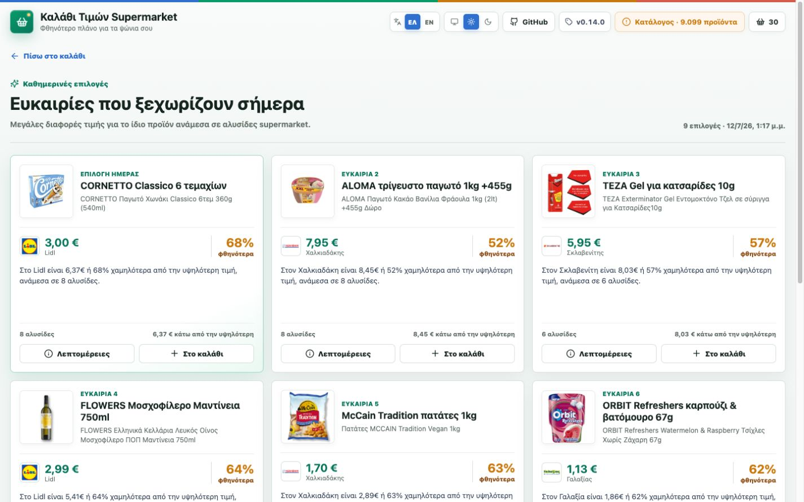

The daily suggestion is intentionally split into deterministic price analysis and
a small editorial AI step:

- `scripts/generate-daily-bargain.mjs` reads the latest public PosoKanei snapshot.
- Code filters products with images and prices from at least five chains, rejects
  implausible extremes, calculates the cheapest, median, and highest current price,
  and sends only 30 compact public candidates to the model.
- `gpt-5.6-sol` with `high` reasoning and the default/standard service tier selects
  nine unique, category-diverse candidates in one daily request and writes a short
  Greek headline and explanation for each using Structured Outputs. The request
  uses `store: false`.
- The script validates every returned product ID against the candidate list, rejects
  duplicate or missing IDs, and joins the model text with code-computed price
  evidence. The model cannot supply or modify the displayed prices or savings.
- The existing hourly LaunchAgent calls the generator after a successful catalogue
  refresh. Date and private attempt guards in the `Europe/Athens` time zone allow at
  most one automatic AI request per day. If the AI call fails, later hourly catalogue
  refreshes keep the previous successful set without repeating the paid request;
  `--force` remains available for an intentional manual retry.
- The OpenAI key stays in the Mac's private environment. Plesk and the browser receive
  only `data/daily-bargain.json`; no user basket, location, browser data, or personal
  information is sent to OpenAI.

Run or force the generator locally:

```bash
npm run bargain:daily
npm run bargain:daily -- --force
```

### Nearby Branches and Location

The app can optionally include proximity in the buying decision. This is useful when
the cheapest basket is split across multiple chains, but the user also wants to know
whether those chains have realistic nearby branches.

How it works:

- The user clicks `Χρήση τοποθεσίας`; the app does not request location on page load.
- The browser asks for geolocation permission.
- The user can choose a branch search radius of `2χλμ.`, `5χλμ.`, or `10χλμ.`.
- The app sends the approved latitude, longitude, and radius to the same-origin
  `api/branches.php` endpoint.
- `api/branches.php` uses `Cache-Control: no-store` and queries OpenStreetMap
  Overpass for nearby `shop=supermarket` places.
- The frontend matches nearby stores to supported chains by retailer name, brand,
  operator, and known Greek/Latin aliases.
- Rankings, multi-stop plans, product best-price labels, product detail prices, and
  the daily suggestion automatically exclude chains without a matched nearby branch.
- Rankings and multi-stop plans show nearest-branch labels like `57 μ. μακριά`.
- Selecting a chain shows nearby branches for that chain with Google Maps links.
- A complete location-aware plan orders its nearest branches from the user's position
  and can open all selected stops in one Google Maps directions link.

Important limitations:

- Distances are straight-line estimates, not driving/walking route distance.
- Branch data comes from OpenStreetMap, so coverage and naming can vary by area.
- Prices still come from the PosoKanei catalogue; location only determines which
  chains are eligible for the calculation.

### Live Target

The app is built to run as a subpath deployment:

```text
https://agenticspiros.com/demo/posokanei-basket/
```

The production React build uses the absolute subpath base `/demo/posokanei-basket/` in `vite.config.js`, so Safari and other browsers load the correct JS/CSS even if the URL is opened without relying on relative asset resolution. `index.html` is served with no-store cache headers, while hashed JS/CSS assets can be cached immutably. The live catalog, product images, retailer logos, update status, and optional nearby-branch lookup use small PHP endpoints under `public/api/`, so production hosting must be able to execute PHP for the same-origin proxy calls.

### Screenshots

Product-level savings breakdown on desktop and mobile:


Stop-limit comparison with a practical recommendation:


Focused mobile plan view:

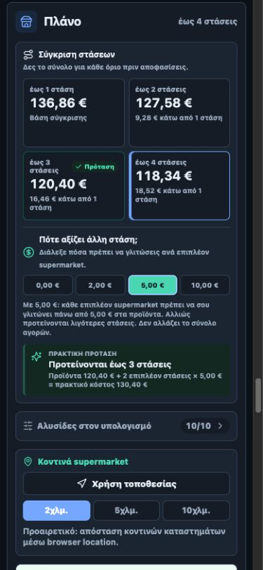

Redesigned English interface with Dark appearance:


Mobile English interface with Dark appearance:

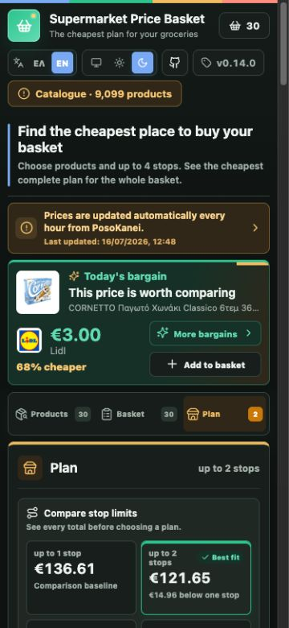

Version 0.14.0 desktop workspace and featured daily product:


Version 0.14.0 mobile shopping-priority recommendation:


Expanded AI-assisted bargains on desktop and mobile:


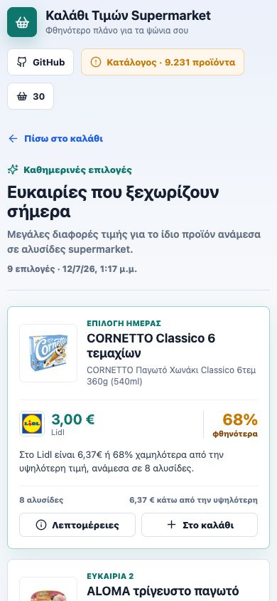

Product detail, with a larger image for checking the exact product:

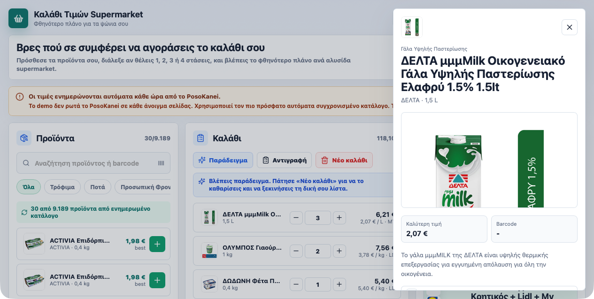

Shareable basket dialog:


Supermarket selection and grouped plan export:


Shopping checklist and combined nearby-stop route:


Shopping mode with remaining spend and unfinished-stop routing:


Reusable saved baskets with current-price restoration:


### Local Development

Requirements:

- Node.js 26+
- npm 11+

Install and run:

```bash
npm install
npm run dev
```

Open:

```text
http://127.0.0.1:5173/
```

### Build

```bash
npm run build
```

The static output is written to:

```text
dist/
```

### Validation

Core checks:

```bash
npm test
npm run lint
npm run build
npm audit --omit=dev
```

Browser QA covers:

- Desktop first viewport.
- Mobile 390px viewport.
- No horizontal overflow on mobile.
- Sticky Products/Basket/Plan mobile navigation, live counts, active-panel switching, and default Plan view.
- Compact catalogue freshness disclosure in collapsed and expanded states.
- Product-name wrapping, stable control dimensions, keyboard focus visibility, and Greek/English tab fit.
- No browser console errors.
- Greek/English interface switching and local preference persistence.
- Locale-aware dates, currency, accessibility labels, and copied plan text.
- System/Light/Dark theme switching, saved preference restoration, and system-theme resolution.
- Simultaneous one-to-four-stop total calculation and plan selection.
- Extra-stop estimate recommendation at `€0`, `€2`, `€5`, and `€10`.
- Persistence of the chosen stop limit and extra-stop estimate.
- Product add flow.
- Quantity update flow.
- Supermarket include/exclude filtering and local preference persistence.
- Automatic nearby-chain eligibility after location is enabled.
- Plan-specific shopping checklist persistence and reset behavior.
- Multi-stop Google Maps route generation from matched nearby branches.
- Remaining-spend calculation and All/Remaining checklist filtering.
- Per-chain completion controls and automatic removal of completed route stops.
- Grouped shopping-plan copy output.
- Share-link generation, copy feedback, and privacy explanation.
- Shared-basket restoration with quantities, selected stop limit, and retailer filter.
- Saved-list creation, same-name update, refresh persistence, current-catalogue restoration, and delete confirmation.
- Saved-list desktop/mobile layout, Greek/English copy, local-only privacy notice, and storage-failure feedback.
- Backward compatibility with version 1 share links.
- Invalid-link and missing-product handling.
- Product detail drawer open/close.
- Large product image in the detail drawer.
- Basket and catalog product thumbnails through the image proxy.
- Supermarket chain logos in desktop, mobile, and product-detail views.
- Optional location control in desktop and mobile layouts.
- Fake-geolocation QA for nearest-branch labels and selected-chain branch lists.
- Loading the official catalog.
- Live search for `γάλα`, including product photos.
- Adding an official live product to the basket and recalculating the plan.
- Update-status endpoint and scheduled-check script.

### PosoKanei API Discovery

The official PosoKanei web app is a Flutter application. Its compiled bundle references these backend routes:

- `POST https://api.posokanei.gov.gr/products/search`
- `GET https://api.posokanei.gov.gr/products/{id}?sort_retailers=asc&countries=GR&include_tax=true`
- `GET https://api.posokanei.gov.gr/products/barcode/{barcode}?countries=GR&include_tax=true`
- `GET https://api.posokanei.gov.gr/meta/categories`
- `GET https://api.posokanei.gov.gr/meta/categories/tree?include_counts=true&include_hidden=false`
- `GET https://api.posokanei.gov.gr/meta/retailers?countries=GR`
- `GET https://api.posokanei.gov.gr/meta/stats`

During development on 2026-06-18:

- `GET /meta/stats` returned live catalog counts around `8.8k` total products and `8.7k` active products.
- `GET /products?page=1&page_size=2&countries=GR` returned official product records with `image_url`, `price_stats`, `retailer_prices`, and category metadata.
- `POST /products/search` with `{ "title": "γάλα", "countries": ["GR"] }` returned `271` milk-related products.
- Product images are served from URLs like `https://api.posokanei.gov.gr/images/product/<id>?v=<version>`.

The official API does not allow `https://agenticspiros.com` as a browser CORS origin, so direct `fetch()` calls from a static frontend are blocked. The app handles this with:

- A same-origin PHP proxy in `public/api/posokanei.php`.
- A cached update-status endpoint in `public/api/update-status.php`.
- A live catalog adapter in `src/posokaneiApi.js`.
- A server-side snapshot fallback that returns paginated/search JSON from `data/catalog.json` plus lightweight metadata from `data/catalog-meta.json`. This snapshot is script-built from PosoKanei API responses; it is not AI-generated.
- Snapshot stats are reconciled against the actual `catalog.json` product count so stale metadata does not show a different catalogue size from search results.
- A product-image proxy mode in `public/api/posokanei.php?resource=image`, used by thumbnails and the detail drawer.
- A retailer-logo proxy mode in `public/api/posokanei.php?resource=retailer-image`, used by rankings, route cards, and product detail price rows.
- A nearby-branch endpoint in `public/api/branches.php`, which accepts browser-approved coordinates and queries OpenStreetMap/Overpass for nearby `shop=supermarket` locations.
- A visible catalog and update-check status in the UI.
- Graceful fallback/status when the live proxy or upstream API fails.

Current production note, checked on 2026-06-23:

- `https://api.posokanei.gov.gr/meta/stats` returns `200` from allowed development/refresh environments.
- `https://agenticspiros.com/demo/posokanei-basket/api/posokanei.php?resource=stats` returns `200` with `source: "snapshot"` because the PHP endpoint now falls back to the refreshed catalogue when upstream rejects the Plesk server request.
- Vercel Node, Vercel Edge, and Cloudflare Worker probes also returned upstream `403`.
- The live app therefore uses `data/catalog.json` and `data/catalog-meta.json`, refreshed by an external scheduled sync from PosoKanei API data, and displays an amber notice with the latest catalogue update time.
- If a scheduled refresh attempt fails, `data/refresh-status.json` records the failed attempt time and reason. The UI then shows both the last successful catalogue update and the latest failed attempt, so stale data is visible instead of silent.
- The refresh script can also fetch through one SSH runner with `POSOKANEI_REFRESH_HOST`, or several fallback runners with `POSOKANEI_REFRESH_HOSTS=runner-a,runner-b`. This is useful when the deployment server or primary machine is blocked but another trusted environment can reach the public API.
- `data/catalog-meta.json` describes the last successful snapshot. `data/refresh-status.json` describes the last refresh attempt. Those timestamps can differ, and the UI is designed to make that distinction visible.

Why this can happen even on the same local network:

- Internet APIs generally cannot see a device MAC address; they see public egress, protocol, and request/client characteristics.
- Two machines on the same LAN can still use different public egress routes because of VPNs, split tunneling, IPv4 vs IPv6 routing, gateway rules, or ISP/CDN routing.
- WAF/CDN rules can also react differently to TLS/client fingerprints, for example macOS SecureTransport/LibreSSL versus Linux OpenSSL, even when the request path is the same.
- The workaround intentionally keeps upload credentials local: the SSH runner only builds the catalogue JSON, then the local refresh script pulls those files back and uploads them.

### Data Model

Products are normalized into this shape:

```js
{
  id: "milk-1l",
  gtin: "5201054020902",
  name: "Γάλα φρέσκο πλήρες 1L",
  brand: "Δέλτα",
  category: "Γαλακτοκομικά",
  unit: "τεμ.",
  unitQuantity: "1 L",
  imageUrl: "https://api.posokanei.gov.gr/images/product/...",
  prices: {
    sklavenitis: 1.74,
    ab_vasilopoulos: 1.82,
    lidl: 1.57
  }
}
```

Basket rankings are computed locally in `src/pricing.js`.

### Resilient Catalogue Publishing

Catalogue refreshes and complete deployments use atomic FTP publishing. Each
file is uploaded under a unique temporary name and is renamed over the public
destination only after the transfer succeeds. The previous complete catalogue
therefore remains available throughout the roughly 18 MB upload, avoiding the
temporary empty catalogue that can occur when PHP reads a partially written JSON
file.

The browser complements this with bounded retries for transient network, timeout,
rate-limit, and server failures. The full snapshot fallback allows 45 seconds for
slow transfers, and a failed snapshot promise is removed from memory so the same
Safari or other browser session can recover on a later action. The hourly macOS
LaunchAgent publishes refresh status last, retains the previous daily bargain if
its optional AI step fails, and keeps all FTP/OpenAI credentials on the local Mac.

### Product/Price Update Checks

The app includes a lightweight update checker:

- `public/api/update-status.php` samples `meta/stats` plus a few representative product searches, fingerprints the result, and caches the status for 30 minutes.
- `npm run check:updates` calls the deployed endpoint with `?refresh=1` and writes the latest status to `.cache/posokanei-update-status.json`.
- `npm run catalog:snapshot` builds `public/data/catalog.json` and `public/data/catalog-meta.json` from PosoKanei API responses, creating a same-origin fallback catalogue used when the hosted PHP proxy is blocked by the upstream API.
- `npm run live:refresh` builds a fresh script-created snapshot into `dist/data/catalog.json`, writes `dist/data/catalog-meta.json`, uploads the data files to the live FTP path, and verifies the public `catalog`, `metadata`, and `refresh-status` timestamps.
- Catalogue and deployment files are uploaded to unique temporary FTP names and renamed into place only after each upload completes. Visitors therefore keep receiving the previous valid JSON during a refresh instead of a partially uploaded 18 MB catalogue.
- After a successful snapshot build, `npm run live:refresh` runs the daily bargain date guard, uploads `dist/data/daily-bargain.json` when available, and verifies the published suggestion timestamp.
- When `npm run live:refresh` fails because the upstream API, SSH runner, or network route returns an error, it uploads `dist/data/refresh-status.json` with `status: "failed"` so the deployed UI can show the latest failed attempt.
- `POSOKANEI_REFRESH_HOSTS` accepts a comma- or space-separated list of trusted SSH runners. The first successful runner wins, so the hourly refresh can continue if one host is asleep, offline, or temporarily blocked.
- The snapshot builder uses a browser-like request header by default because the upstream API can reject obvious automation `User-Agent` values with `HTTP 403`. `POSOKANEI_USER_AGENT` can override that header if the upstream rules change again.
- `npm run live:install-refresh` optionally installs a local hourly scheduler for environments that support macOS LaunchAgents. The job starts an interactive login shell so the existing private local OpenAI environment is available to the once-daily bargain step; the key is never uploaded.
- The UI reads `api/update-status.php` and shows the catalogue freshness in the amber status notice.
- Browser catalogue requests retry short network/server failures. The large snapshot fallback has a 45-second timeout and resets a failed cached request so Safari or another browser can recover without being trapped in an empty state.
- Product images are requested through `api/posokanei.php?resource=image&id=<product-id>&v=<version>` so the browser sees same-origin image URLs. The proxy caches successful image responses and can fall back to an image-resizing proxy if the direct upstream image request is rejected.
- Retailer logos are requested through `api/posokanei.php?resource=retailer-image&id=<retailer-id>` and use the same fallback strategy.

For a cron job:

```bash
*/30 * * * * cd /path/to/posokanei-basket-demo && npm run check:updates
```

To refresh the fallback catalogue before deploying:

```bash
npm run catalog:snapshot
npm run build
```

To refresh only the live demo snapshot from an environment that can reach the API, configure `.env.local` from `.env.example`, then run:

```bash
npm run live:refresh
```

The refresh script reads deployment settings from environment variables or `.env.local`. Use either `FTP_PASS` or `FTP_KEYCHAIN_SERVICE` for FTP authentication.

Daily bargain generation additionally reads `OPENAI_API_KEY` from the private local
shell/LaunchAgent environment. It defaults to `OPENAI_BARGAIN_MODEL=gpt-5.6-sol`,
`OPENAI_BARGAIN_REASONING=high`, and `POSOKANEI_BARGAIN_TIME_ZONE=Europe/Athens`.
Do not put the key in Plesk, `public/`, `dist/`, committed files, or browser code.

If the current machine cannot reach `api.posokanei.gov.gr`, set `POSOKANEI_REFRESH_HOST` to a trusted SSH host that can reach it. The remote host only builds `catalog.json` and `catalog-meta.json`; upload credentials stay local.

To install the hourly refresh job on macOS:

```bash
npm run live:install-refresh
```

The installer prints the scheduler and log paths for the local machine.

For Plesk Scheduled Tasks, a simple curl check is enough only when the Plesk server can reach the upstream API:

```bash
curl -fsS 'https://agenticspiros.com/demo/posokanei-basket/api/update-status.php?refresh=1' >/dev/null
```

When Plesk is upstream-blocked, schedule `npm run live:refresh` on a machine, GitHub runner, or serverless worker that can reach `https://api.posokanei.gov.gr`.

### Deployment

See [DEPLOYMENT.md](DEPLOYMENT.md) for the Plesk/HostEurope upload path and
static artifact notes.

Short version:

```bash
npm run build
npm run live:deploy
```

`live:deploy` publishes the app and PHP endpoints but deliberately preserves the
current production `data/` directory. Update catalogue, freshness status, and daily
bargain data through the independently verified `npm run live:refresh` pipeline.
For a first installation or an intentional complete restore, opt in explicitly:

```bash
DEPLOY_INCLUDE_DATA=1 npm run live:deploy
```

### Limitations

- The live API adapter is best-effort because the PosoKanei API does not appear to have public documentation.
- As of 2026-06-23, request-time production proxies tested on Plesk, Vercel, and Cloudflare are upstream-blocked with `HTTP 403`; the live demo uses the latest script-built `data/catalog.json` snapshot from PosoKanei API data and shows that state in the UI. This means generated by the refresh script, not AI-generated.
- The UI paginates the official catalog; it does not render all 8k+ products at once.
- The app can compare one-store baskets and multi-stop plans up to four chains.
- Multi-stop plans optimize product price within the location-eligible chains, but the optimizer does not yet include route time, parking, delivery fees, or road distance.
- It does not handle delivery fees, loyalty cards, substitutions, coupons, or in-store stock; geographic eligibility depends on OpenStreetMap branch coverage and naming.
- The daily bargain compares current prices across chains; without historical price data it must not be interpreted as proof of a previous-price discount.
- Production use should add caching, API rate limiting, error telemetry, and an explicit policy check for upstream API usage.

### License

MIT
